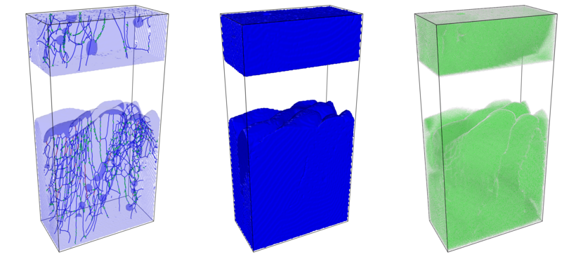
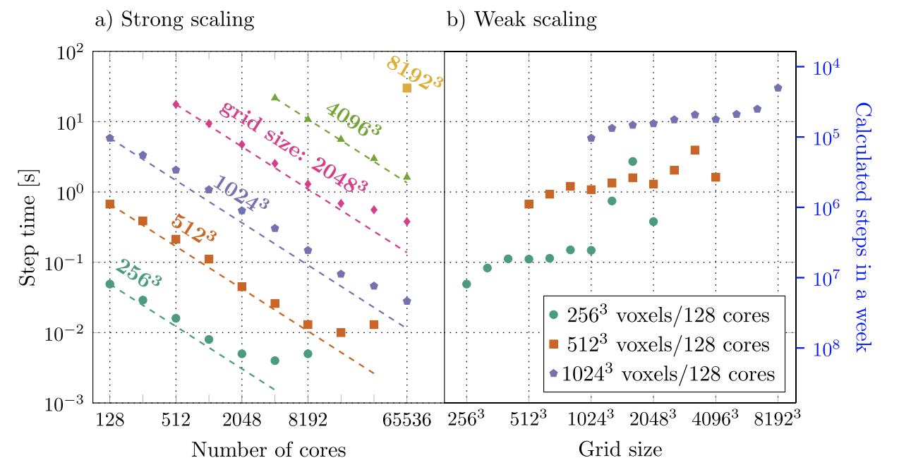
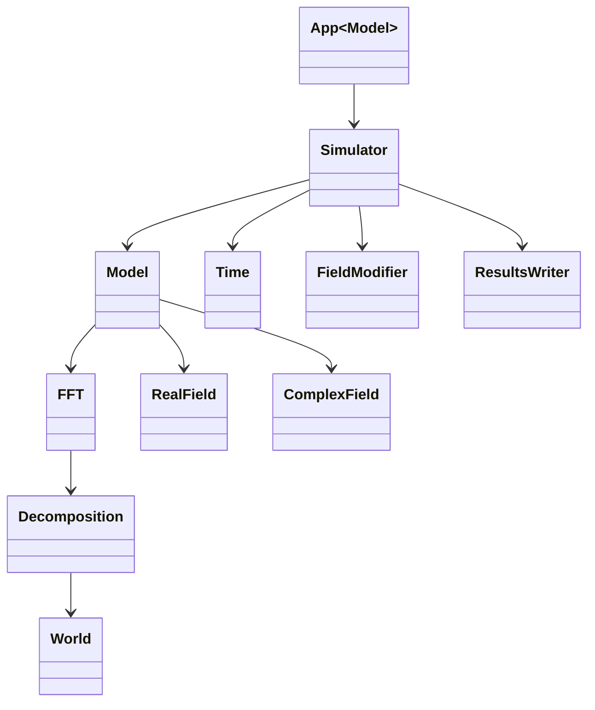

# OpenPFC

[![][doi-badge-img]][doi-badge-url]
[![][docs-dev-img]][docs-dev-url]
[![][releases-img]][releases-url]
[![][GHA-img]][GHA-url]
[![][license-img]][license-url]



Phase field crystal (PFC) is a semi-atomistic technique, containing atomic
resolution information of crystalline structures while operating on diffusive
time scales. PFC can simulate solidification and elastic-plastic material
response, coupled with a wide range of phenomena, including formation and
co-evolution of microstructural defects such as dislocations and stacking
faults, voids, defect formation in epitaxial growth, displacive phase
transitions, and electromigration.

The image above shows a simulation of a rapidly solidifying tungsten block
approximately 50 x 100 x 200 nm in size, using MovingBC boundary conditions. The
rightmost section depicts the pure atomic structure of the tungsten, the middle
section highlights the surface of the entire object and the leftmost section
provides a transparent view of the surface, revealing the lattice defects that
formed during the simulation. This visualization aids in understanding the
atomic arrangement, surface features, and internal defects of the tungsten
block.

## Scalability and Performance

OpenPFC is an open-source framework for high-performance 3D phase field crystal
simulations. It is designed to scale up from a single laptop to exascale class
supercomputers. OpenPFC has successfully been used to simulate a domain of size
8192 x 8192 x 4096 on CSC Mahti. 200 computing nodes were used, where each node
contained 128 cores, thus total of 25600 cores were used. During the simulation,
25 TB of memory was utilized. The central part of the solver is the Fast Fourier
Transform with time complexity of O(N log N), and there are no known limiting
bottlenecks, why larger models could not be calculated as well.



The graph above demonstrates the remarkable scalability and performance of the
simulation framework. In the strong scaling analysis (panel a), the step time
significantly decreases as the number of cores increases for various grid sizes,
from 256³ to 8192³. This indicates efficient parallelization, though the rate of
decrease diminishes at higher core counts.

In the weak scaling analysis (panel b), the step time remains relatively
constant as the grid size increases while maintaining a fixed number of voxels
per core. This stability illustrates excellent weak scaling performance,
highlighting the framework's capability to efficiently manage larger problems by
proportionally increasing computational resources. The right Y-axis projects the
number of time steps calculable in a week, emphasizing the framework's
suitability for extensive simulations on supercomputers. Notably, these
simulations were conducted using the LUMI supercomputer, further showcasing the
framework's capability to leverage top-tier computational resources for
high-performance simulations.

T. Pinomaa, J. Aho, J. Suviranta, P. Jreidini, N. Provatas, and A. Laukkanen, *“OpenPFC: an open-source framework for high performance 3D phase field crystal simulations”*, Modelling Simul. Mater. Sci. Eng., Feb. 2024, doi: 10.1088/1361-651X/ad269e. [(link)](https://iopscience.iop.org/article/10.1088/1361-651X/ad269e)

## Documentation

The project documentation can be found from
<https://vtt-propertune.github.io/OpenPFC/dev/>.

## Features

- scales up to tens of thousands of cores, demonstrably
- modern c++17 header-only framework, easy to use

## Installing

### Using singularity

- Todo

### Compiling from source

Requirements:

- Compiler supporting C++17 standard. C++17 features [are
  available](https://gcc.gnu.org/projects/cxx-status.html) since GCC 5. Check
  your version number with `g++ --version`. The default compiler might be
  relatively old, and a more recent version needs to be loaded with `module load
  gcc`. Do not try to compile with GCC 4.8.5. It will not work. At least GCC
  versions 9.4.0 (coming with Ubuntu 20.04) and 11.2 are working.
- [OpenMPI](https://www.open-mpi.org/). All recent versions should work. Tested
  with OpenMPI version 2.1.3. Again, you might need to load the proper OpenMPI
  version with `module load openmpi/2.1.3`, for instance. Additionally, if CMake
  is not able to find proper OpenMPI installation, assistance might be needed by
  setting `MPI_ROOT`, e.g. `export MPI_ROOT=/share/apps/OpenMPI/2.1.3`.
- FFTW. Probably all versions will work. Tested with FFTW versions 3.3.2 and
  3.3.10. Again, CMake might need some assistance to find the libraries, which
  can be controlled with the environment variable `FFTW_ROOT`. Depending on how
  FFTW is installed in the system, it might be in a non-standard location, and
  `module load fftw` is needed. You can use commands like `whereis fftw` or
  `ldconfig -p | grep fftw` to locate your FFTW installation, if needed.

Typically in clusters, these are already installed and can be loaded with an
on-liner

```bash
module load gcc openmpi fftw
```

For local Linux machines (or WSL2), packages usually can be installed from
repositories, e.g. in the case of Ubuntu, the following should work:

```bash
sudo apt-get install -y gcc openmpi fftw
```

Some OpenPFC applications use JSON files to provide initial data for
simulations. In principle, applications can also be built to receive initial
data in other ways, but as a widely known file format, we recommend using JSON.
The choice for the JSON package is [JSON for Modern C++](https://json.nlohmann.me/).
There exist packages for certain Linux distributions (`nlohmann-json3-dev` for
Ubuntu, `json-devel` for Centos) for easy installation. If the system-wide installation
is not found, the library is downloaded from GitHub during the configuration.

The last and most important dependency to use OpenPFC is
[HeFFTe](https://icl.utk.edu/fft/), which is our choice for parallel FFT
implementation. The instructions to install HeFFTe can be found from
[here](https://icl-utk-edu.github.io/heffte/md_doxygen_installation.html).
HeFFTe can be downloaded from <https://github.com/icl-utk-edu/heffte>. Your
typical workflow to install HeFFTe would be something like this:

```bash
cmake -S heffte-2.4.0-src -B heffte-2.4.0-build \
    -DCMAKE_INSTALL_PREFIX=/opt/heffte/2.4.0 \
    -DCMAKE_BUILD_TYPE=Release -D Heffte_ENABLE_FFTW=ON
cmake --build heffte-2.4.0-build
cmake --install heffte-2.4.0-build
```

If HeFFTe is installed in some non-standard location, CMake is unable to find it
when configuring OpenPFC. To overcome this problem, the install path of HeFFTe
can be set into the environment variable `CMAKE_PREFIX_PATH`. For example, if HeFFe
is installed to `$HOME/opt/heffte/2.3`, the following is making CMake to find
HeFFTe successfully:

```bash
export CMAKE_PREFIX_PATH=$HOME/opt/heffte/2.3:$CMAKE_PREFIX_PATH
```

During the configuration, OpenPFC prefers local installations, thus if HeFFTe is
already installed and found, it will be used. For convenience, there is a
fallback method to fetch HeFFTe sources from the internet and build it concurrently
with OpenPFC. In general, however, it is better to build and install programs
one at a time. So, make sure you have HeFFTe installed and working on your
system before continuing.

OpenPFC uses [cmake](https://cmake.org/) to automate software building. First,
the source code must be downloaded to some appropriate place. Head to the
[releases](https://github.com/VTT-ProperTune/OpenPFC/releases) page and pick the
newest release and unzip it somewhere. Alternatively, if you are planning to
develop the project itself or are just interested in the bleeding-edge
features, you might be interested in cloning the repository to your local machine.
A GitHub account is needed to clone the project.

```bash
git clone https://github.com/VTT-ProperTune/OpenPFC.git
# git clone git@github.com:VTT-ProperTune/OpenPFC.git  # if you prefer ssh instead
cd OpenPFC
```

The next step is to configure the project. One might consider at least setting an option
`CMAKE_BUILD_TYPE` to `Debug` or `Release`. For large-scale simulations, make
sure to use `Release` as it turns on compiler optimizations.

```bash
cmake -DCMAKE_BUILD_TYPE=Release -S . -B build
```

Keep in mind, that the configuration will download HeFFTe if the local installation
is not found. To use local installation instead, add HeFFTe path to the environment
variable `CMAKE_PREFIX_PATH` or add `Heffte_DIR` option to point where HeFFTe
configuration files are installed. A typical configuration command in a cluster
environment is something like

```bash
module load gcc openmpi fftw
export CMAKE_PREFIX_PATH=$HOME/opt/heffte/2.3:$CMAKE_PREFIX_PATH
cmake -DCMAKE_BUILD_TYPE=Release \
      -DCMAKE_INSTALL_PREFIX=$HOME/opt/openpfc \
      -S . -B build
```

Then, building can be done with the command  `cmake --build build`. After the build
finishes, one should find example codes from `./build/examples` and apps from
`./build/apps`. Installation to a path defined by `CMAKE_INSTALL_PREFIX` can be
done with `cmake --install build`.

## Structure of the application



The OpenPFC framework aims to simplify the development of highly scalable
applications for solving partial differential equations using spectral methods.
It provides a modular application structure that users can customize by
inheriting and overriding specific classes. When examining the class diagram
from bottom to top, we first encounter classes such as `World`, `Decomposition`,
and `FFT`. These classes form a low-level layer responsible for domain
decomposition and performing FFT using the HeFFTe library. These details might
not be of general interest from an implementation perspective, except for the
framework developers themselves.

Next, we have classes such as `Model`, `FieldModifier`, and `ResultsWriter`. The
`Model` class is of particular interest as it describes the physics of the
model, including the partial differential equation (PDE) itself. Inside the
`Model` class, there is a function called `step` that needs to be overridden.
Currently, users are free to choose whichever time integration method they are
comfortable with. However, in the future, we may abstract the time integration
method away from the model and create a separate class to approach the problem
using "The Method of Lines" view. The `Model` class consists of one or several
different "fields" which can be real or complex-valued. These fields are updated
during time stepping. The `FieldModifier` class does exactly what the name
implies – it modifies these fields. In more detail, initial and boundary
conditions serve as field modifiers and are often also of interest, although
some already implemented ones exist. Lastly, we should mention the
`ResultsWriter`, which implements a way to store results during certain periods.
We have some existing implementations such as raw binary format and vti
format, but nothing is preventing us from implementing, for example, the storage
of results in hdf5 format, which is currently under planning.

In the third level, we have the `Simulator`, which assembles and runs the actual
simulation. It's a simple container-like class that calls lower-level objects in
a stepper to ensure that everything is called in time. Typically, there should
be no need to override this, but it is still possible to do so.

The top level is `App`, which handles the user interface. Since the simulations
are usually run on supercomputers, we don't have anything fancy like a graphical
user interface or interactive control of the simulation. Instead, we input user
parameters in an input file, preferably in JSON format. After reading the model
parameters, the simulator starts. This type of user interface is very basic, but
it works well in high-performance computing (HPC) environments where there are
no displays available. Typically, a batch script (e.g. Slurm) is created to run
the application in the chosen HPC environment's queue.

## Getting started

OpenPFC is a [software framework][software framework]. It doesn't give you
ready-made solutions, but a platform on which you can start building your own
scalable PFC code. We will familiarize ourselves with the construction of the
model with the help of a simple diffusion model in a later stage of the
documentation. However, let's give a tip already at this stage, how to start the
development work effectively. Our "hello world" code is as follows:

```cpp
#include <iostream>
#include <openpfc/openpfc.hpp>

using namespace std;
using namespace pfc;

int main() {
  World world({32, 32, 32});
  cout << world << endl;
}
```

To compile, `CMakeLists.txt` is needed. Minimal `CMakeLists.txt` is:

```cmake
cmake_minimum_required(VERSION 3.15)
project(helloworld)
find_package(OpenPFC REQUIRED)
add_executable(main main.cpp)
target_link_libraries(main OpenPFC)
```

With the help of `CMakeLists.txt`, build and compilation of the application is
straightforward:

```bash
cmake -S . -B build
cmake --build build
./build/main
```

There are also some examples in [examples][examples-url] directory, which can be
used as a base for your codes.

## Example: Cahill-Hilliard equation

The Cahn-Hilliard equation is a fundamental model in materials science used to
describe the phase separation process in binary mixtures. It models how the
concentration field evolves over time to minimize the free energy of the system.
The equation is particularly useful in understanding the dynamics of spinodal
decomposition and coarsening processes.

Spectral methods, combined with the Fast Fourier Transform (FFT), are highly
efficient for solving partial differential equations (PDEs) like the
Cahn-Hilliard equation. The FFT allows us to transform differential operators
into algebraic ones in the frequency domain, significantly simplifying the
computation. This approach is particularly advantageous for problems involving
periodic boundary conditions and large-scale simulations, where the efficiency
and accuracy of the FFT are paramount.

Exponential time integration is well-suited for stiff PDEs like the
Cahn-Hilliard equation. Traditional explicit methods require very small time
steps to maintain stability, which can be computationally expensive. Exponential
integrators, however, handle the stiff linear part of the equation exactly,
allowing for larger time steps without sacrificing stability. This makes the
integration process more efficient and stable, especially for long-term
simulations.

Starting with the Cahn-Hilliard equation:

$$
\frac{\partial c}{\partial t} = D \nabla^{2} \left( c^{3} - c - \gamma \nabla^{2} c \right)
$$

### Fourier Transform

Applying the Fourier transform to the equation converts the spatial differential
operators into algebraic forms:

$$
\frac{\partial \hat{c}}{\partial t} = D \left[ -k^2 \left( \hat{c^3} - \hat{c} - \gamma (-k^2 \hat{c}) \right) \right]
$$

Simplifying the right-hand side:

$$
\frac{\partial \hat{c}}{\partial t} = D \left[ -k^2 \hat{c^3} + k^2 \hat{c} + \gamma k^4 \hat{c} \right]
$$

$$
\frac{\partial \hat{c}}{\partial t} = D \left[ -k^2 \hat{c^3} + (k^2 + \gamma k^4) \hat{c} \right]
$$

### Discretization in Time

Using an exponential integrator, we handle the linear part exactly and integrate
the non-linear part explicitly:

$$
\hat{c}(t + \Delta t) = \exp(DL \Delta t) \hat{c}(t) + \int_t^{t + \Delta t} \exp(DL (t + \Delta t - s)) (-Dk^2 \hat{c^3}(s)) \, \mathrm{d}s
$$

Here, $L = k^2 + \gamma k^4$.

Assuming $\hat{c}$ is approximately constant over the small interval $\Delta t$,
we approximate the integral:

$$
\hat{c}(t + \Delta t) \approx \exp(D (k^2 + \gamma k^4) \Delta t) \hat{c}(t) + \left( \frac{ \exp(D (k^2 + \gamma k^4) \Delta t) - 1 }{D (k^2 + \gamma k^4)} \right) (-Dk^2 \hat{c^3}(t))
$$

### Final Time-Stepping Formula

Combining the terms, we obtain the discrete update rule for $\hat{c}$:

$$
\hat{c}_{n+1} = \exp(D (k^2 + \gamma k^4) \Delta t) \hat{c}_n + \frac{\exp(D (k^2 + \gamma k^4) \Delta t) - 1}{D (k^2 + \gamma k^4)} (-Dk^2 \hat{c^3}_n)
$$

Simplify the coefficient for the non-linear term:

$$
\hat{c}_{n+1} = \exp(D (k^2 + \gamma k^4) \Delta t) \hat{c}_n - \frac{\exp(D (k^2 + \gamma k^4) \Delta t) - 1}{k^2 + \gamma k^4} k^2 \hat{c^3}_n
$$

### Linear and Non-Linear Operators

The linear and non-linear operators can be defined as follows:

$$
\begin{align}
\text{opL} &= \exp(D (k^2 + \gamma k^4) \Delta t) \\
\text{opN} &= \frac{\exp(D (k^2 + \gamma k^4) \Delta t) - 1}{k^2 + \gamma k^4} k^2
\end{align}
$$

These operators are used to update the concentration field $c$ in the
Fourier domain efficiently, leveraging the FFT for computational efficiency.
This method allows for stable and accurate integration of the Cahn-Hilliard
equation over time, making it suitable for large-scale simulations of phase
separation processes.

Below is the code snippet for the Cahn-Hilliard model in OpenPFC:

```cpp
class CahnHilliard : public Model {
private:
  std::vector<double> opL, opN, c;             // Define operators and field c
  std::vector<std::complex<double>> c_F, c_NF; // Define (complex) psi
  double gamma = 1.0e-2;                       // Surface tension
  double D = 1.0;                              // Diffusion coefficient

public:
  void initialize(double dt) override {
    FFT &fft = get_fft();
    const Decomposition &decomp = get_decomposition();

    // Allocate space for the main variable and it's fourier transform
    c.resize(fft.size_inbox());
    c_F.resize(fft.size_outbox());
    c_NF.resize(fft.size_outbox());
    opL.resize(fft.size_outbox());
    opN.resize(fft.size_outbox());
    add_real_field("concentration", c);

    // prepare operators
    World w = get_world();
    std::array<int, 3> o_low = decomp.outbox.low;
    std::array<int, 3> o_high = decomp.outbox.high;
    size_t idx = 0;
    double pi = std::atan(1.0) * 4.0;
    double fx = 2.0 * pi / (w.dx * w.Lx);
    double fy = 2.0 * pi / (w.dy * w.Ly);
    double fz = 2.0 * pi / (w.dz * w.Lz);
    for (int k = o_low[2]; k <= o_high[2]; k++) {
      for (int j = o_low[1]; j <= o_high[1]; j++) {
        for (int i = o_low[0]; i <= o_high[0]; i++) {
          // Laplacian operator -k^2
          double ki = (i <= w.Lx / 2) ? i * fx : (i - w.Lx) * fx;
          double kj = (j <= w.Ly / 2) ? j * fy : (j - w.Ly) * fy;
          double kk = (k <= w.Lz / 2) ? k * fz : (k - w.Lz) * fz;
          double kLap = -(ki * ki + kj * kj + kk * kk);
          double L = kLap * (-D - D * gamma * kLap);
          opL[idx] = std::exp(L * dt);
          opN[idx] = (L != 0.0) ? (opL[idx] - 1.0) / L * kLap : 0.0;
          idx++;
        }
      }
    }
  }

  void step(double) override {
    // Calculate cₙ₊₁ = opL * cₙ + opN * cₙ³
    FFT &fft = get_fft();
    fft.forward(c, c_F);
    for (auto &elem : c) elem = D * elem * elem * elem;
    fft.forward(c, c_NF);
    for (size_t i = 0; i < c_F.size(); i++) {
      c_F[i] = opL[i] * c_F[i] + opN[i] * c_NF[i];
    }
    fft.backward(c_F, c);
  }
};
```


The full code can be found from [examples](/examples/12_cahn_hilliard.cpp).

## Troubleshooting and debugging

Here are some common problems and their solutions.

### FindOpenPFC.cmake not found

During the configuration step (`cmake -S. -B build`), you might end up with the
following error message:

```text
CMake Error at CMakeLists.txt:3 (find_package):
By not providing "FindOpenPFC.cmake" in CMAKE_MODULE_PATH this project has
asked CMake to find a package configuration file provided by "OpenPFC", but
CMake did not find one.
```

The error message is trying to say the command in `CMakeLists.txt` (line 3) fails:

```cmake
find_package(OpenPFC REQUIRED)  # <-- this is failing
```

The reason why this happens is that CMake is not able to find the package. By
default, CMake finds packages by looking at a file which is called
`Find<package_name>.cmake` from a couple of standard locations. For example, in
Ubuntu, one of these locations is `/usr/lib/cmake`, where the files are
installed when doing a global install of some package with root rights. When
working with supercomputers, users, in general, don't have rights to make global
installations, thus packages are almost always installed to some non-default
locations. Thus, one needs to give some hints to CMake where the file could be
found. This can be done (at least) in two different ways.

The first way is to set up an environment variable indicating any extra
locations for the files. One option is to use `CMAKE_PREFIX_PATH` environment
variable, like before. For example, if `OpenPFC` is installed to `/opt/OpenPFC`,
one can give that information before starting the configuration:

 ```bash
 export CMAKE_PREFIX_PATH=/opt/OpenPFC:$CMAKE_PREFIX_PATH
 cmake -S . -B build
 # rest of the things ...
 ```

 Another option is to hardcode the choice inside the `CMakeLists.txt` file
 directly. Just keep in mind, that this option is not very portable as users
 tends to install software to several different locations and there is no any
 general rule on how it should be done. So, instead of defining `CMAKE_PREFIX_PATH`
 before doing configuration, the following change in `CMakeLists.txt` is
 equivalent:

 ```cmake
cmake_minimum_required(VERSION 3.15)
project(helloworld)
# find_package(OpenPFC REQUIRED)                                     #  <-- Replace this command ...
find_package(OpenPFC REQUIRED PATHS /opt/OpenPFC/lib/cmake/OpenPFC)  #  <-- ... with this one
add_executable(main main.cpp)
target_link_libraries(main OpenPFC)
```

This way, CMake knows to search for necessary files from the path given above.

### NaNs in the simulation

There might be various reasons why the simulation returns NaNs. Despite the
reason, it usually makes sense to stop simulation as it doesn't do anything
useful. OpenPFC does not currently have a built-in JSON validator, which would
check that simulation parameters are valid. Thus, it is possible to give invalid
parameters to the simulation, which might lead to NaNs. If some model parameters
that should be defined are undefined and thus zero, there might be a zero
division problem.

There is a schema file for the input file, which can be used to validate the JSON
file using an external validator like `check-jsonchema`:

 ```bash
 check-jsonschema --schemafile apps/schema.json input.json
 ```

OpenPFC implements NaN check, which is enabled by default when compiling with a
debug build type:

```bash
cmake -DCMAKE_BUILD_TYPE=Debug -S . -B build
```

Another way to enable NaN check is to use compile option `NAN_CHECK_ENABLED`. In `CMakeLists.txt`, add the following line:

```cmake
add_compile_definitions(NAN_CHECK_ENABLED)
```

Or, when configuring a project with CMake, the following is equivalent:

```bash
cmake -DNAN_CHECK_ENABLED=ON -S . -B build
```

Or another, quick and dirty solution might be to simply add the following to the
source file:

```cpp
#define NAN_CHECK_ENABLED
```

Then, at the code level, there's a macro `CHECK_AND_ABORT_IF_NANS`, which can be
used to check if there are any NaNs in the simulation. The macro is defined in
`openpfc/utils/nancheck.hpp`. This is a zero overhead when compiling with
release build type. At the moment, a user must explicitly call the macro, but in
the future, it might be called automatically in some situations. Example usage is
(see also [this][tungsten-nan-check] example):

```cpp
std::vector<double> psi = {1.0, 2.0, 3.0, 4.0, 5.0, 6.0};
CHECK_AND_ABORT_IF_NANS(psi);
psi[0] = std::numeric_limits<double>::quiet_NaN();
CHECK_AND_ABORT_IF_NANS(psi);
```

[tungsten-nan-check]: https://github.com/VTT-ProperTune/OpenPFC/blob/master/apps/tungsten.cpp#L220

## Citing

```bibtex
@article{pinomaa2024openpfc,
  title={OpenPFC: an open-source framework for high performance 3D phase field crystal simulations},
  author={Pinomaa, Tatu and Aho, Jukka and Suviranta, Jaarli and Jreidini, Paul and Provatas, Nikolaos and Laukkanen, Anssi},
  journal={Modelling and Simulation in Materials Science and Engineering},
  year={2024}
}
```

[docs-dev-img]: https://img.shields.io/badge/docs-dev-blue.svg
[docs-dev-url]: https://vtt-propertune.github.io/OpenPFC/dev/
[releases-img]: https://img.shields.io/github/v/release/VTT-ProperTune/OpenPFC
[releases-url]: https://github.com/VTT-ProperTune/OpenPFC/releases/latest
[license-img]: https://img.shields.io/github/license/VTT-ProperTune/OpenPFC
[license-url]: https://github.com/VTT-ProperTune/OpenPFC/blob/master/LICENSE
[GHA-img]: https://github.com/VTT-ProperTune/OpenPFC/workflows/CI/badge.svg
[GHA-url]: https://github.com/VTT-ProperTune/OpenPFC/actions?query=workflows/CI
[doi-badge-img]: https://zenodo.org/badge/DOI/10.5281/zenodo.10799936.svg
[doi-badge-url]: https://zenodo.org/doi/10.5281/zenodo.10799935
[examples-url]: https://github.com/VTT-ProperTune/OpenPFC/tree/master/examples
[software framework]: https://en.wikipedia.org/wiki/Software_framework
