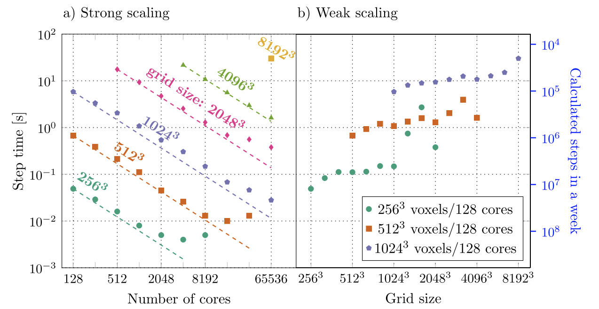

<!--
SPDX-FileCopyrightText: 2026 VTT Technical Research Centre of Finland Ltd
SPDX-License-Identifier: AGPL-3.0-or-later
-->

# OpenPFC

[![DOI][doi-badge-img]][doi-badge-url]
[![Documentation][docs-site-img]][docs-site-url]
[![Release][releases-img]][releases-url]
[![CI][ci-badge-img]][ci-badge-url]
[![Documentation build][docs-badge-img]][docs-badge-url]
[![Coverage][coverage-badge-img]][coverage-badge-url]
[![License][license-img]][license-url]


OpenPFC is an open-source C++20 framework for high-performance phase-field
crystal and related spectral phase-field simulations on structured grids. It
combines MPI domain decomposition with HeFFTe-based distributed FFTs and can be
used either as a library or through the configuration-driven applications
shipped under `apps/`.

OpenPFC is intended for research workflows that need atomic-resolution
microstructure information on diffusive time scales, including solidification,
defect evolution, elastic-plastic response, epitaxial growth, phase
transformations, and related coupled phenomena.

## Start here

Choose the shortest path that matches your goal:

| Goal | Start with |
|------|------------|
| Build and run one MPI example | [15-minute start](docs/start_here_15_minutes.md) |
| Run a shipped JSON or TOML application | [Quick start](docs/quickstart.md) |
| Choose a sequenced path by role | [Learning paths](docs/learning_paths.md) |
| Decide whether OpenPFC fits the problem | [When not to use OpenPFC](docs/when_not_to_use_openpfc.md) |
| Install dependencies and toolchains | [Installation guide](INSTALL.md) |
| Run on a cluster or GPU | [HPC operator guide](docs/hpc/operator_guide.md) |
| Add a model, application, or writer | [Extension guide](docs/extending_openpfc/README.md) |
| Look up classes and function signatures | [Integrated C++ API reference][api-url] |

The complete source documentation index is [docs/README.md](docs/README.md).
The published site combines tutorials, configuration, cluster operation,
architecture, and generated C++ declarations in one navigation tree and search
index.

## Capabilities

- distributed-memory simulations using MPI and HeFFTe;
- CPU spectral execution through FFTW;
- CUDA and HIP execution paths when built with matching GPU toolchains and
  HeFFTe backends;
- configuration-driven applications with JSON and TOML input;
- parameter validation with actionable startup diagnostics;
- binary, VTK, PNG, and application-specific result workflows;
- extension points for models, field modifiers, coordinate systems, writers,
  and application wiring;
- examples, tutorials, recipes, testing guidance, and HPC runbooks maintained
  alongside the source.

See the [CMake option reference](docs/reference/build_options.md) for the exact
build switches supported by the current checkout.

## Build and run

OpenPFC requires a consistent compiler, MPI, and HeFFTe stack. Follow the
[installation guide](INSTALL.md), then use the minimal first-run sequence:

```bash
cmake -DCMAKE_BUILD_TYPE=Release -S . -B build
cmake --build build -j"$(nproc)"
cd build
mpirun -n 1 ./examples/05_simulator
```

Increase the rank count after the single-rank run succeeds and your local MPI
or scheduler allocation provides the requested slots.

## Use the installed library

An installed OpenPFC package exports `OpenPFC::openpfc`. The minimal downstream
CMake project enables both C and C++ because the package resolves MPI C and C++
components:

```cmake
cmake_minimum_required(VERSION 3.21)
project(my_sim LANGUAGES C CXX)

find_package(OpenPFC REQUIRED)

add_executable(my_sim main.cpp)
target_link_libraries(my_sim PRIVATE OpenPFC::openpfc)
```

Set `CMAKE_PREFIX_PATH` or `OpenPFC_DIR` to the OpenPFC installation prefix.
The longer walkthrough is in
[docs/getting_started/01-basics/README.md](docs/getting_started/01-basics/README.md).

## Scalability

OpenPFC has been exercised on domains up to `8192 x 8192 x 4096` using 25,600
CPU cores and approximately 25 TB of memory. The spectral solver is dominated
by distributed FFT work with `O(N log N)` complexity.



For experiment context, assumptions, and current performance guidance, use the
[performance profiling guide](docs/hpc/performance_profiling.md) and the
[scalability analysis plan](docs/hpc/scalability_analysis_plan.md) rather than
treating the landing page as a benchmark specification.

## Documentation and quality checks

Documentation changes are checked for relative-link integrity, example-catalog
consistency, shell syntax, Doxygen XML warnings, and strict Sphinx rendering.
Contributor instructions are in [CONTRIBUTING.md](CONTRIBUTING.md) and
[docs/development/contributing-docs.md](docs/development/contributing-docs.md).

The development documentation follows the repository default branch. For
reproducible simulations, record the OpenPFC commit or release tag together
with the HeFFTe and MPI versions; see
[documentation versioning](docs/development/documentation_versioning.md).

## Citation

If OpenPFC contributes to published work, cite:

> T. Pinomaa, J. Aho, J. Suviranta, P. Jreidini, N. Provatas, and
> A. Laukkanen, “OpenPFC: an open-source framework for high performance 3D
> phase field crystal simulations,” *Modelling and Simulation in Materials
> Science and Engineering*, 2024. DOI: 10.1088/1361-651X/ad269e.

```bibtex
@article{pinomaa2024openpfc,
  title   = {OpenPFC: an open-source framework for high performance 3D phase field crystal simulations},
  author  = {Pinomaa, Tatu and Aho, Jukka and Suviranta, Jaarli and Jreidini, Paul and Provatas, Nikolaos and Laukkanen, Anssi},
  journal = {Modelling and Simulation in Materials Science and Engineering},
  year    = {2024},
  doi     = {10.1088/1361-651X/ad269e}
}
```

[doi-badge-img]: https://zenodo.org/badge/DOI/10.5281/zenodo.10799936.svg
[doi-badge-url]: https://zenodo.org/doi/10.5281/zenodo.10799935
[docs-site-img]: https://img.shields.io/badge/docs-Sphinx-blue.svg
[docs-site-url]: https://vtt-propertune.github.io/OpenPFC/
[api-url]: https://vtt-propertune.github.io/OpenPFC/api/
[releases-img]: https://img.shields.io/github/v/release/VTT-ProperTune/OpenPFC
[releases-url]: https://github.com/VTT-ProperTune/OpenPFC/releases/latest
[ci-badge-img]: https://github.com/VTT-ProperTune/OpenPFC/actions/workflows/ci.yml/badge.svg
[ci-badge-url]: https://github.com/VTT-ProperTune/OpenPFC/actions/workflows/ci.yml
[docs-badge-img]: https://github.com/VTT-ProperTune/OpenPFC/actions/workflows/docs.yml/badge.svg
[docs-badge-url]: https://github.com/VTT-ProperTune/OpenPFC/actions/workflows/docs.yml
[coverage-badge-img]: https://github.com/VTT-ProperTune/OpenPFC/actions/workflows/coverage.yml/badge.svg
[coverage-badge-url]: https://github.com/VTT-ProperTune/OpenPFC/actions/workflows/coverage.yml
[license-img]: https://img.shields.io/github/license/VTT-ProperTune/OpenPFC
[license-url]: https://github.com/VTT-ProperTune/OpenPFC/blob/master/LICENSE.md
