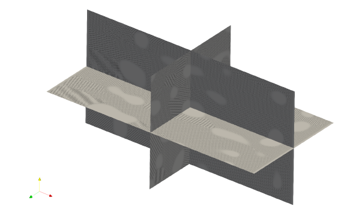

# OpenPFC

[![][docs-dev-img]][docs-dev-url]
[![][releases-img]][releases-url]
[![][GHA-img]][GHA-url]
[![][license-img]][license-url]



Phase field crystal (PFC) is a semi-atomistic technique, containing atomic
resolution information of crystalline structures while operating on diffusive
time scales. PFC has an ability to simulate solidification and elastic-plastic
material response, coupled to a wide range of phenomena, including formation and
co-evolution of microstructural defects such as dislocations and stacking
faults, voids, defect formation in epitaxial growth, displacive phase
transitions, and electromigration.

OpenPFC is an open-source framework for high performance 3D phase field crystal
simulations. It is designed to scale up from a single laptop to exascale class
supercomputers. OpenPFC has succesfully used to simulate domain of size 8192 x
8192 x 4096 on CSC Mahti. 200 computing nodes were used, where each node
contains 128 cores, thus total 25600 cores were used. During the simulation, 25
TB of memory was utilized. The central part of the solver is Fast Fourier
Transform with time complexity of O(N log N), and there are no known limiting
bottlenecks, why larger models could not be calculated as well.

The project documentation can be found from
<https://vtt-propertune.github.io/OpenPFC/dev/>.

## Features

- scales up to tens of thousands of cores, demonstrably
- modern c++17 header only framework, easy to use

## Installing

### Using singularity

- Todo

### Compiling from source

Requirements:

- Compiler supporting C++17 standard. C++17 features [are
  available](https://gcc.gnu.org/projects/cxx-status.html) since GCC 5. Check
  your version number with `g++ --version`. The default compiler might be
  relatively old, and more recent version needs to be loaded with `module load
  gcc`. Do not try to compile with GCC 4.8.5. It will not work. At least GCC
  versions 9.4.0 (coming with Ubuntu 20.04) and 11.2 are working.
- [OpenMPI](https://www.open-mpi.org/). All recent versions should work. Tested
  with OpenMPI version 2.1.3. Again, you might need to load proper OpenMPI
  version with `module load openmpi/2.1.3`, for instance. Additionally, if cmake
  is not able to find proper OpenMPI installation, assistance might be needed by
  setting `MPI_ROOT`, e.g. `export MPI_ROOT=/share/apps/OpenMPI/2.1.3`.
- FFTW. Probably all versions will work. Tested with FFTW versions 3.3.2 and
  3.3.10. Again, cmake might need some assistance to find the libraries, which
  can be controlled with environment variable `FFTW_ROOT`. Depending how FFTW is
  installed to system, it might be in non-standard location and `module load
  fftw` is needed. You can use commands like `whereis fftw` or `ldconfig -p |
  grep fftw` to locate your FFTW installation, if needed.

Typically in clusters, these are already installed and can be loaded with an
on-liner

```bash
module load gcc openmpi fftw
```

For local Linux machines (or WSL2), packages usually can be installed from
repositories, e.g. in case of Ubuntu, the following should work:

```bash
sudo apt-get install -y gcc openmpi fftw
```

Some OpenPFC applications uses json files to provide initial data for
simulations. In principle, applications can also be built to receive initial
data in other ways, but as a widely known file format, we recommend to use json.
The choice for json package is [JSON for Modern C++](https://json.nlohmann.me/).
There exists packages for certain Linux distributions (`nlohmann-json3-dev` for
Ubuntu, `json-devel` for Centos) for easy install. If the system-wide installation
is not found, the library is downloaded from GitHub during the configuration.

The last and most important dependency in order to use OpenPFC is
[HeFFTe](https://icl.utk.edu/fft/), which is our choice for parallel FFT
implementation. The instructions to install HeFFTe can be found from
[here](https://mkstoyanov.bitbucket.io/heffte/md_doxygen_installation.html).
HeFFTe can be downloaded from <https://bitbucket.org/icl/heffte/downloads/>.

If HeFFTe is installed to some non-standard location, cmake is unable to find it
when configuring OpenPFC. To overcome this problem, the install path of HeFFTe
can be set into environment variable `CMAKE_PREFIX_PATH`. For example, if HeFFe
is installed to `$HOME/opt/heffte/2.3`, the following is making cmake to find
HeFFTe succesfully:

```bash
export CMAKE_PREFIX_PATH=$HOME/opt/heffte/2.3:$CMAKE_PREFIX_PATH
```

During the configuration, OpenPFC prefers local installations, thus if HeFFTe is
already installed and founded, it will be used. For convenience, there is a
fallback method to fetch HeFFTe sources from internet and build it concurrently
with OpenPFC. In general, however, it is better to build and install programs
one at a time. So, make sure you have HeFFTe installed and working on your
system before continuing.

OpenPFC uses [cmake](https://cmake.org/) to automate software building. First
the source code must be downloaded to some appropriate place. Head to the
[releases](https://github.com/VTT-ProperTune/OpenPFC/releases) page and pick the
newest release and unzip is somewhere. Alternatively, if you are planning to
develop the project itself of are just interested about the bleeding edge
features, you might be interested to clone the repository to your local machine.
GitHub account is needed to clone the project.

```bash
git clone https://github.com/VTT-ProperTune/OpenPFC.git
# git clone git@github.com:VTT-ProperTune/OpenPFC.git  # if you prefer ssh instead
cd OpenPFC
```

Next step is to configure project. One might consider at least setting option
`CMAKE_BUILD_TYPE` to `Debug` or `Release`. For large scale simulations, make
sure to use `Release` as it turns on compiler optimizations.

```bash
cmake -DCMAKE_BUILD_TYPE=Release -S . -B build
```

Keep on mind, that configuration will download HeFFTe if the local installation
is not found. To use local installation instead, add HeFFTe path to environment
variable `CMAKE_PREFIX_PATH` or add `Heffte_DIR` option to point where HeFFTe
configuration files are installed. Typical configuration command in cluster
environment is something like

```bash
module load gcc openmpi fftw
export CMAKE_PREFIX_PATH=$HOME/opt/heffte/2.3:$CMAKE_PREFIX_PATH
cmake -DCMAKE_BUILD_TYPE=Release \
      -DCMAKE_INSTALL_PREFIX=$HOME/opt/openpfc \
      -S . -B build
```

Then, building can be done with command  `cmake --build build`. After build
finishes, one should find example codes from `./build/examples` and apps from
`./build/apps`. Installation to path defined by `CMAKE_INSTALL_PREFIX` can be
done with `cmake --install build`.

## Getting started

OpenPFC is a [software framework][software framework]. It doesn't give you
ready-made solutions, but a platform on which you can start building your own
scalable PFC code. We will familiarize ourselves with the construction of the
model with the help of a simple diffusion model in a later stage of the
documentation. However, let's give a tip already at this stage, how to start the
development work effectively. Our "hello world" code is as follows:

```cpp
#include <iostream>
#include <openpfc/openpfc.hpp>

using namespace std;
using namespace pfc;

int main() {
  World world({32, 32, 32});
  cout << world << endl;
}
```

To compile, `CMakeLists.txt` is needed. Minimal `CMakeLists.txt` is:

```cmake
cmake_minimum_required(VERSION 3.15)
project(helloworld)
find_package(OpenPFC REQUIRED)
add_executable(main main.cpp)
target_link_libraries(main OpenPFC)
```

With the help of `CMakeLists.txt`, build and compilation of application is
straightforward:

```bash
cmake -S . -B build
cmake --build build
./build/main
```

There is also some examples in [examples][examples-url] directory, which can be
used as a base for your own codes.

## Troubleshooting and debugging

Here's some common problems and their solutions.

### FindOpenPFC.cmake not found

During the configuration step (`cmake -S. -B build`), you might end up to the
following error message:

```text
CMake Error at CMakeLists.txt:3 (find_package):
By not providing "FindOpenPFC.cmake" in CMAKE_MODULE_PATH this project has
asked CMake to find a package configuration file provided by "OpenPFC", but
CMake did not find one.
```

The error message is trying to say command in `CMakeLists.txt` (line 3) fails:

```cmake
find_package(OpenPFC REQUIRED)  # <-- this is failing
```

The reason why this happens is that cmake is not able to find the package. By
default, cmake finds packages by looking a file which is called
`Find<package_name>.cmake` from couple of standard locations. For example, in
Ubuntu, one of these locations is `/usr/lib/cmake`, where the files are
installed when doing a global install of some package with root rights. When
working with supercomputers, users in general doesn't have rights to make global
installations, thus packages are almost always installed to some non-default
locations. Thus, one needs to give some hints to cmake where the file could be
found. This can be done (at least) two different ways.

The first way is to set up an environment variable indicating any extra
locations for the files. One option is to use `CMAKE_PREFIX_PATH` environment
variable, like before. For example, if `OpenPFC` is installed to `/opt/OpenPFC`,
one can give that information before starting configuration:

 ```bash
 export CMAKE_PREFIX_PATH=/opt/OpenPFC:$CMAKE_PREFIX_PATH
 cmake -S . -B build
 # rest of the things ...
 ```

 Another option is to hard code the choise inside the `CMakeLists.txt` file
 directly. Just keep in mind, that this option is not very portable as users
 tends to install software to several different locations and there is no any
 general rule how it should be done. So, instead of defining `CMAKE_PREFIX_PATH`
 before doing configuration, the following change in `CMakeLists.txt` is
 equivalent:

 ```cmake
cmake_minimum_required(VERSION 3.15)
project(helloworld)
# find_package(OpenPFC REQUIRED)                                     #  <-- Replace this command ...
find_package(OpenPFC REQUIRED PATHS /opt/OpenPFC/lib/cmake/OpenPFC)  #  <-- ... with this one
add_executable(main main.cpp)
target_link_libraries(main OpenPFC)
```

This way, cmake know to search necessary files from the path given above.

### NaNs in the simulation

There might be various reasons why the simulation returns NaNs. Despite the
reason, it usually makes sense to stop simulation as it doesn't do anything
useful. OpenPFC does not currently have built-in json validator, which would
check that simulation parameters are valid. Thus, it is possible to give invalid
parameters to the simulation, which might lead to NaNs. If some model parameters
which should be defined are undefined and thus zero, there might be zero
division problem.

There is schema file for the input file, which can be used to validate the json
file using external validator like `check-jsonchema`:

 ```bash
 check-jsonschema --schemafile apps/schema.json input.json
 ```

OpenPFC implements NaN check, which is enabled by default when compiling with a
debug build type:

```bash
cmake -DCMAKE_BUILD_TYPE=Debug -S . -B build
```

Another way to enable NaN check is to use compile option `NAN_CHECK_ENABLED`. In `CMakeLists.txt`, add the following line:

```cmake
add_compile_definitions(NAN_CHECK_ENABLED)
```

Or, when configuring project with cmake, the following is equivalent:

```bash
cmake -DNAN_CHECK_ENABLED=ON -S . -B build
```

Or another, quick and dirty solution might be to simply add the following to the
source file:

```cpp
#define NAN_CHECK_ENABLED
```

Then, in code level, there's a macro `CHECK_AND_ABORT_IF_NANS`, which can be
used to check if there's any NaNs in the simulation. The macro is defined in
`openpfc/utils/nancheck.hpp`. This is a zero overhead when compiling with
release build type. At the moment, user must explicitly call the macro, but in
the future it might be called automatically in some situations. Example usage is
(see also [this][tungsten-nan-check] example):

```cpp
std::vector<double> psi = {1.0, 2.0, 3.0, 4.0, 5.0, 6.0};
CHECK_AND_ABORT_IF_NANS(psi);
psi[0] = std::numeric_limits<double>::quiet_NaN();
CHECK_AND_ABORT_IF_NANS(psi);
```

[tungsten-nan-check]: https://github.com/VTT-ProperTune/OpenPFC/blob/master/apps/tungsten.cpp#L220

## Examples

A bigger application example is Tungsten model. Todo.

## Citing

- Todo

```bibtex
@article{
  blaablaa
}
```

[docs-dev-img]: https://img.shields.io/badge/docs-dev-blue.svg
[docs-dev-url]: https://vtt-propertune.github.io/OpenPFC/dev/
[releases-img]: https://img.shields.io/github/v/release/VTT-ProperTune/OpenPFC
[releases-url]: https://github.com/VTT-ProperTune/OpenPFC/releases/latest
[license-img]: https://img.shields.io/github/license/VTT-ProperTune/OpenPFC
[license-url]: https://github.com/VTT-ProperTune/OpenPFC/blob/master/LICENSE
[GHA-img]: https://github.com/VTT-ProperTune/OpenPFC/workflows/CI/badge.svg
[GHA-url]: https://github.com/VTT-ProperTune/OpenPFC/actions?query=workflows/CI
[examples-url]: https://github.com/VTT-ProperTune/OpenPFC/tree/master/examples
[software framework]: https://en.wikipedia.org/wiki/Software_framework
