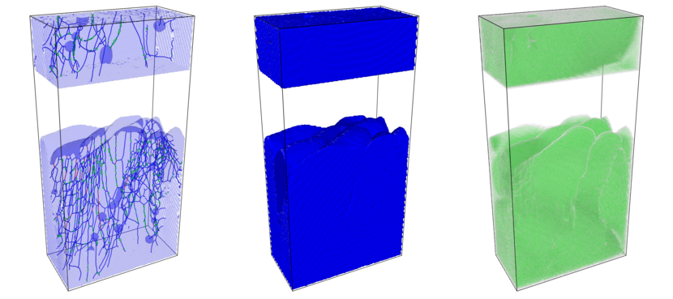

<!--
SPDX-FileCopyrightText: 2026 VTT Technical Research Centre of Finland Ltd
SPDX-License-Identifier: AGPL-3.0-or-later
-->

# OpenPFC

*Example result image; parameters, domain, and post-processing will differ in your own runs.*

## What OpenPFC is

**OpenPFC** is an open-source **C++ framework** for **phase-field crystal (PFC)** and related **spectral phase-field** models on structured grids. It is meant for **microstructure-focused simulation**: solidification, defects, and elastic fields at length scales where atomistic molecular dynamics is too costly, but you still want **crystal-level physics** beyond a plain diffuse-interface model. The code is **MPI-parallel**, uses **FFT-based** operators (via **HeFFTe** and friends), and ships both **JSON/TOML-driven applications** (for reproducible runs) and a **library** you can embed when you need a custom `App` or model.

If you arrived from a project web page, **this documentation is the narrative home** for the repository: what the software is, how to build and run it, and how the pieces fit together. The tables below are the full map; you do not need to read them top to bottom.

## Start here

| Goal | Open |
|------|------|
| **Install** (MPI, HeFFTe, optional CUDA/HIP, toolchains) | [`INSTALL.md`](../INSTALL.md) in the repository root |
| **First run in ~15 minutes** (clone → build → `mpirun` one example) | [`start_here_15_minutes.md`](start_here_15_minutes.md) |
| **Pick a track** (run apps, extend models, integrate the library) | [`learning_paths.md`](learning_paths.md) |

## Published API reference vs prose in `docs/`

| You need | Where it lives |
|-----------|----------------|
| **HTML class reference** (headers, Doxygen, `api/examples` snippets) | [Published dev docs](https://vtt-propertune.github.io/OpenPFC/dev/) — or build the `docs` target with `OpenPFC_BUILD_DOCUMENTATION=ON` (output under your build tree) |
| **Tutorials, install, JSON/`App` wiring, troubleshooting, HPC** | This **`docs/`** tree and root [`INSTALL.md`](../INSTALL.md) — not duplicated in the API-only site |

Pair the published HTML with [`quickstart.md`](quickstart.md) and this index so you do not land on Doxygen alone.

### First-time onboarding (pick one)

| Time | Goal | Open |
|------|------|------|
| ~15 min | Clone → build → `mpirun` one example | [`start_here_15_minutes.md`](start_here_15_minutes.md) |
| 20 min | Understand the spectral data-flow story | [`spectral_stack.md`](spectral_stack.md) |
| As needed | Copy-paste **recipes** (simulator, tungsten JSON, VTK/binary) | [`recipes/README.md`](recipes/README.md) |
| Before GPU | CPU vs CUDA/HIP decision + golden path | [`gpu_path_decision.md`](gpu_path_decision.md) |
| Clusters | Slurm, MPI-IO, profiling — one runbook index | [`hpc_operator_guide.md`](hpc_operator_guide.md) |

### Teaching, quality bar, and expectations

| Need | Document |
|------|----------|
| **API style** — free functions, data-centric types, when to use `virtual` / inheritance | [`styleguide.md`](styleguide.md#api-shape-free-functions-and-data-centric-types) · [`architecture.md`](architecture.md#design-ethos-laboratory-not-fortress) |
| Honest fit (“when not”) + **FD vs spectral** direction | [`when_not_to_use_openpfc.md`](when_not_to_use_openpfc.md) |
| Prose vs **release** tags | [`documentation_versioning.md`](documentation_versioning.md) |
| **Publication →** repo entry points | [`from_paper_to_run.md`](from_paper_to_run.md) |
| **Workshop** curriculum (three half-days) | [`workshop/README.md`](workshop/README.md) |
| **Architecture decisions** (ADRs) | [`adr/README.md`](adr/README.md) |
| **Symptom → fix** playbooks | [`operator_playbooks.md`](operator_playbooks.md) |
| **Numerics** / stability caveats | [`science_numerics_limits.md`](science_numerics_limits.md) |
| **Printable handbook** (optional `pandoc`) | [`handbook_build.md`](handbook_build.md) |
| **MkDocs + Material** preview (`uv`, root `mkdocs.yml`) | [`mkdocs_preview.md`](mkdocs_preview.md) |

## Where to go first

| If you want to… | Open |
|-----------------|------|
| **Fastest first run** (build + one `mpirun`) | [`start_here_15_minutes.md`](start_here_15_minutes.md) |
| Pick a guided track (run apps, extend models, or integrate the library) | [`learning_paths.md`](learning_paths.md) |
| Jump in by role (personas) | [`personas.md`](personas.md) |
| Figures and runnable entry points | [`showcase.md`](showcase.md) |
| Step-by-step tutorials (`docs/tutorials/`) | [`tutorials/README.md`](tutorials/README.md) |
| Named how-to **recipes** (simulator, tungsten, VTK/binary) | [`recipes/README.md`](recipes/README.md) |
| Get running in one pass (examples, app, or `find_package`) | [`quickstart.md`](quickstart.md) |
| Tutorials and the examples hub | [`getting_started/README.md`](getting_started/README.md) |
| Fix configure/MPI/HeFFTe issues | [`troubleshooting.md`](troubleshooting.md) |
| Short Q&A | [`faq.md`](faq.md) |
| Understand JSON/TOML → `Simulator` | [`app_pipeline.md`](app_pipeline.md) |
| Spectral `App` JSON/TOML key reference | [`spectral_app_config_reference.md`](spectral_app_config_reference.md) |
| Binary field MPI-IO file layout | [`binary_field_io_spec.md`](binary_field_io_spec.md) |
| Post-process raw `.bin` fields (Python / VTK-aware workflows) | [`postprocess_binary_fields.md`](postprocess_binary_fields.md) |
| Toolchain and dependency matrix | [`dependency_matrix.md`](dependency_matrix.md) |
| Tour of main types (`Model`, `App`, …) | [`class_tour.md`](class_tour.md) |
| Minimal custom `App` (CMake + JSON — **wiring**, not new physics) | [`tutorials/custom_app_minimal.md`](tutorials/custom_app_minimal.md) |
| Parameter validation for custom models | [`parameter_validation.md`](parameter_validation.md) |
| Run `ctest` / Catch2 | [`testing.md`](testing.md) |
| GPU (CUDA/HIP) build + `tungsten_cuda` / config backend | [`tutorials/gpu_app_quickstart.md`](tutorials/gpu_app_quickstart.md) |
| Compare logs to a reference shape | [`example_run_output.md`](example_run_output.md) |
| Edit or add markdown in this tree | [`contributing-docs.md`](contributing-docs.md) |
| Contribute code, tests, or changelog entries | [`../CONTRIBUTING.md`](../CONTRIBUTING.md) |
| See what changed between releases | [`../CHANGELOG.md`](../CHANGELOG.md) |

## Guides by topic

### Configuration and applications

| Topic | Document |
|--------|-----------|
| JSON/TOML sections, `plan_options` | [`configuration.md`](configuration.md), [`spectral_app_config_reference.md`](spectral_app_config_reference.md) |
| Validated `model.params` (custom apps) | [`parameter_validation.md`](parameter_validation.md) |
| Results writers (binary / VTK / PNG) | [`io_results.md`](io_results.md) |
| Shipped `apps/` programs | [`applications.md`](applications.md) |
| Runnable `examples/` (catalog + folder README) | [`examples_catalog.md`](examples_catalog.md), [`../examples/README.md`](../examples/README.md) |
| Doxygen `api/examples` reading order | [`api_examples_walkthrough.md`](api_examples_walkthrough.md) |
| Extend models and `App` | [`extending_openpfc/README.md`](extending_openpfc/README.md), [`class_tour.md`](class_tour.md) |
| Terminology | [`glossary.md`](glossary.md) |

### Build and tooling

| Topic | Document |
|--------|-----------|
| CMake options | [`build_options.md`](build_options.md) |
| **GPU vs CPU** — when to enable CUDA/HIP | [`gpu_path_decision.md`](gpu_path_decision.md) |
| CPU vs GPU build trees | [`build_cpu_gpu.md`](build_cpu_gpu.md) |
| Toolchain / optional stacks / doc QA scripts | [`dependency_matrix.md`](dependency_matrix.md) |
| Code style / API shape | [`styleguide.md`](styleguide.md) |

### Science and use-case notes

| Topic | Document |
|--------|-----------|
| Tungsten PFC (what the shipped app solves) | [`science_tungsten_quicklook.md`](science_tungsten_quicklook.md) |
| Cahn–Hilliard example vs Allen–Cahn app | [`science_cahn_hilliard_vs_allen_cahn.md`](science_cahn_hilliard_vs_allen_cahn.md) |
| Numerics limits (timestep, resolution, “pretty pictures”) | [`science_numerics_limits.md`](science_numerics_limits.md) |

### Architecture and numerics

| Topic | Document |
|--------|-----------|
| **Spectral stack** (FFT → model → simulator → writers) | [`spectral_stack.md`](spectral_stack.md) |
| Kernel / runtime / frontend | [`architecture.md`](architecture.md) |
| Halo exchange (FD vs FFT-safe) | [`halo_exchange.md`](halo_exchange.md) |
| Debugging, NaN checks | [`debugging.md`](debugging.md) |

### Profiling and HPC

| Topic | Document |
|--------|-----------|
| **HPC runbook index** (Slurm, MPI-IO, profiling, site notes) | [`hpc_operator_guide.md`](hpc_operator_guide.md) |
| Runtime profiling | [`performance_profiling.md`](performance_profiling.md) |
| Profiling export schema | [`profiling_export_schema.md`](profiling_export_schema.md) |
| LUMI-G (ROCm / Cray) | [`INSTALL.LUMI.md`](INSTALL.LUMI.md) |
| LUMI Slurm / tungsten jobs | [`lumi_slurm/README.md`](lumi_slurm/README.md) |
| Slurm batch day one (generic) | [`tutorials/hpc_slurm_day_one.md`](tutorials/hpc_slurm_day_one.md) |
| MPI / paths / binary I/O checklist | [`mpi_io_layout_checklist.md`](mpi_io_layout_checklist.md) |

## Tutorials (in-repo)

| Section | Document |
|---------|-----------|
| **Tutorials hub** (all `docs/tutorials/`) | [`tutorials/README.md`](tutorials/README.md) |
| End-to-end run → PNG or binary artifacts | [`tutorials/end_to_end_visualization.md`](tutorials/end_to_end_visualization.md) |
| VTK / ParaView from `examples/` | [`tutorials/vtk_paraview_workflow.md`](tutorials/vtk_paraview_workflow.md) |
| HeFFTe `plan_options` / FFT backend | [`tutorials/fft_heffte_plan_options.md`](tutorials/fft_heffte_plan_options.md) |
| Spectral sequence: `04` → `05` → `12` | [`tutorials/spectral_examples_sequence.md`](tutorials/spectral_examples_sequence.md) |
| World, decomposition, FFT, CMake “hello” | [`getting_started/01-basics/README.md`](getting_started/01-basics/README.md) |
| Functional IC/BC (`field::apply`, …) | [`getting_started/functional_field_ops.md`](getting_started/functional_field_ops.md) |
| Tour of main types and headers | [`class_tour.md`](class_tour.md) |
| Minimal out-of-tree `App` + JSON (what you build / why) | [`tutorials/custom_app_minimal.md`](tutorials/custom_app_minimal.md) |
| Parameter validation for `model.params` | [`parameter_validation.md`](parameter_validation.md) |
| GPU-enabled apps (CUDA/HIP, HeFFTe, JSON backend) | [`tutorials/gpu_app_quickstart.md`](tutorials/gpu_app_quickstart.md) |
| `ctest`, `openpfc-tests`, MPI test suites | [`testing.md`](testing.md) |
| What successful runs print | [`example_run_output.md`](example_run_output.md) |

## API examples (Doxygen)

C++ snippets under [`api/examples/`](api/examples/) are included in the Doxygen build (see [`CMakeLists.txt`](CMakeLists.txt)). Reading order and optional `BUILD_API_EXAMPLES` binaries: [`api_examples_walkthrough.md`](api_examples_walkthrough.md).

## Other

- Changelog / release history: [`CHANGELOG.md`](../CHANGELOG.md) (user-facing and developer-facing changes by version).
- Contributing (overview): [`CONTRIBUTING.md`](../CONTRIBUTING.md).
- Image / branding notes: [`image-prompts.md`](image-prompts.md) (prompts for project artwork; not required for simulation).

## Contributors and project internals

| Topic | Document |
|--------|-----------|
| Editing markdown, link checks | [`contributing-docs.md`](contributing-docs.md) |
| Planned structural refactors | [`refactoring_roadmap.md`](refactoring_roadmap.md) |
| Scalability experiment write-up (when submodule present) | [`experiments/scalability/docs/scalability_analysis_plan.md`](../experiments/scalability/docs/scalability_analysis_plan.md) — redirect note: [`scalability_analysis_plan.md`](scalability_analysis_plan.md) |

## Generated HTML (Doxygen)

With `OpenPFC_BUILD_DOCUMENTATION=ON`, configure and build the `docs` target; HTML output is under the build tree (see root [`README.md`](../README.md) and [`CMakeLists.txt`](CMakeLists.txt)). This complements—not replaces—the prose guides above.
