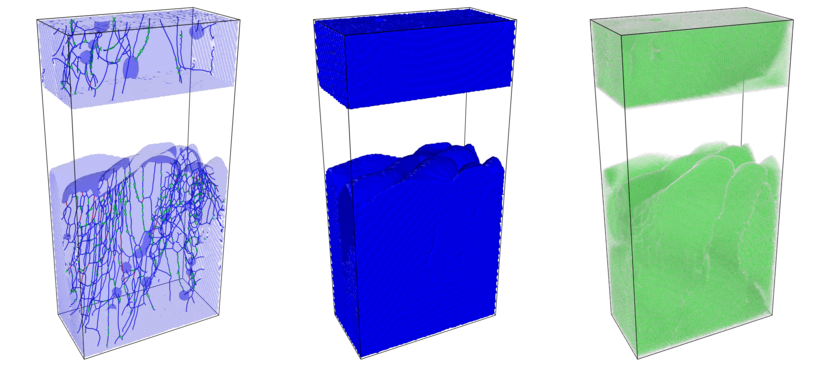

<!--
SPDX-FileCopyrightText: 2026 VTT Technical Research Centre of Finland Ltd
SPDX-License-Identifier: AGPL-3.0-or-later
-->

# OpenPFC documentation

OpenPFC is an MPI-parallel C++ framework for phase-field crystal and related
spectral phase-field models on structured grids. The framework can be used in
two ways:

- run one of the config-driven applications under `apps/`; or
- link the installed `OpenPFC::openpfc` library from another CMake project.

This is the maintained OpenPFC documentation site. Hand-written Markdown and
the [generated C++ API reference](api/index.md) share one navigation tree and
search index. Doxygen extracts source-level API information as XML; Sphinx,
MyST, and Breathe render the final site.

## Start by goal

| Goal | Start here | Continue with |
|------|------------|---------------|
| Verify a clone and dependency stack | [Start here](start_here_15_minutes.md) | [Quick start](quickstart.md) |
| Run an existing application | [Run simulations](learning_paths.md#i-want-to-run-simulations) | [Applications](user_guide/applications.md), [configuration](user_guide/configuration.md) |
| Add or change physics | [Extend the physics](learning_paths.md#i-want-to-extend-the-physics) | [Architecture](concepts/architecture.md), [extension guide](extending_openpfc/README.md) |
| Integrate the library | [Integrate the library](learning_paths.md#i-want-to-integrate-the-library) | [Quick-start CMake example](quickstart.md#link-openpfc-from-your-own-project), [API reference](api/index.md) |
| Run on a cluster | [HPC operator guide](hpc/operator_guide.md) | [Slurm day one](tutorials/hpc_slurm_day_one.md), [GPU decision guide](hpc/gpu_path_decision.md) |
| Decide whether OpenPFC fits | [When to use OpenPFC](when_not_to_use_openpfc.md) | [Numerical limits](science/numerics_limits.md) |

## Documentation structure

| Area | Purpose | Entry point |
|------|---------|-------------|
| `concepts/` | Stable mental models and architecture | [Architecture](concepts/architecture.md), [spectral stack](concepts/spectral_stack.md), [halo exchange](concepts/halo_exchange.md) |
| `tutorials/` | Guided, end-to-end learning | [Tutorials](tutorials/README.md) |
| `recipes/` | Short copy-paste procedures | [Recipes](recipes/README.md) |
| `user_guide/` | Running applications, configuration, and output | [Applications](user_guide/applications.md) |
| `hpc/` and `lumi_slurm/` | Cluster operation and site guidance | [HPC operator guide](hpc/operator_guide.md) |
| `extending_openpfc/` | Adding models and extension points | [Extension guide](extending_openpfc/README.md) |
| `reference/` | Lookup tables and file-format contracts | [Main types](reference/class_tour.md), [CMake options](reference/build_options.md) |
| `api/` | Generated declarations, overloads, namespaces, and source comments | [C++ API reference](api/index.md) |
| `science/` | Scientific context and model limitations | [Tungsten quicklook](science/tungsten_quicklook.md) |
| `development/` and `adr/` | Maintainer guidance and decisions | [Contributing to docs](development/contributing-docs.md), [ADRs](adr/README.md) |
| `workshop/` | Multi-session teaching material | [Workshop](workshop/README.md) |

## Canonical ownership

Documentation is easier to maintain when each fact has one primary home:

| Information | Canonical location |
|-------------|--------------------|
| Supported dependency and toolchain setup | [INSTALL.md](https://github.com/VTT-ProperTune/OpenPFC/blob/master/INSTALL.md) |
| First successful build and run | [`start_here_15_minutes.md`](start_here_15_minutes.md) |
| 0.1 → 0.2 API replacement list | [`MIGRATION_0.1_to_0.2.md`](MIGRATION_0.1_to_0.2.md) |
| Broad build/run/integration overview | [`quickstart.md`](quickstart.md) |
| Exact CMake option defaults | [`reference/build_options.md`](reference/build_options.md) |
| JSON/TOML configuration keys | [`reference/spectral_app_config_reference.md`](reference/spectral_app_config_reference.md) |
| Application inventory | [`user_guide/applications.md`](user_guide/applications.md) |
| Example inventory | [`reference/examples_catalog.md`](reference/examples_catalog.md) |
| Public API signatures | [`api/index.md`](api/index.md) and public headers |
| Common failures | [`troubleshooting.md`](troubleshooting.md) |
| Release-visible changes | [CHANGELOG.md](https://github.com/VTT-ProperTune/OpenPFC/blob/master/CHANGELOG.md) |

Other pages should link to these sources instead of copying long option lists,
API examples, or troubleshooting sections.

## Prose and generated API

Use narrative pages to understand workflows, concepts, trade-offs, and
operational procedures. Use the generated API section for exact declarations
and source-level Doxygen comments. The [type tour](reference/class_tour.md)
connects common names to their layer, header, runnable example, and generated
reference.

Both forms are rendered by Sphinx. MyST reads the Markdown tree, while Breathe
imports Doxygen XML into the same site. This gives users one navigation model,
one search index, one theme, and one published artifact.

## Versioning and reproducibility

The documentation on `master` describes the development branch. For a tagged
release, read the documentation from the same tag. Record the OpenPFC commit or
release tag together with the HeFFTe and MPI versions used for a reproducible
simulation. See [documentation versioning](development/documentation_versioning.md).

## Contributing

Code contributions are described in
[CONTRIBUTING.md](https://github.com/VTT-ProperTune/OpenPFC/blob/master/CONTRIBUTING.md).
Documentation-specific structure, preview commands, and checks are described in
[Contributing to documentation](development/contributing-docs.md).
