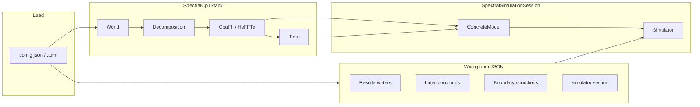

<!--
SPDX-FileCopyrightText: 2026 VTT Technical Research Centre of Finland Ltd
SPDX-License-Identifier: AGPL-3.0-or-later
-->

# Config-driven application pipeline (`App` → `Simulator`)

This page describes how a JSON or TOML file becomes a running simulation when you use `pfc::ui::App<YourModel>` (the pattern used by `apps/tungsten`, `apps/aluminumNew`, and several `examples/`). It ties together headers under `include/openpfc/frontend/ui/` and `simulation_wiring.hpp`.

For install and MPI setup, see [`INSTALL.md`](../INSTALL.md). For shared config vocabulary, see [`configuration.md`](configuration.md).

## Big picture

- `SpectralCpuStack` reads world, time, and `plan_options` (FFT) from the parsed document and constructs World → Decomposition → CpuFft → Time in a fixed order. CPU plan options and `fft::create` are factored through `spectral_cpu_stack_detail.hpp` (`cpu_spectral_plan_options_from_json`, `cpu_fft_from_json_and_decomposition`) so a future GPU JSON stack can reuse the same parsing surface. If `plan_options` omits `backend` but the document has a root-level `backend` string (same key as `from_json<fft::Backend>`), that value is merged into the plan slice for parsing; `backend: "cuda"` is rejected on this CPU-only path.
- GPU drivers that still need a host `pfc::FFT` for `Model` but build HeFFTe with cuFFT / ROCm should use `spectral_fft_stack_factory.hpp`: `merged_spectral_plan_options_json`, `cuda_spectral_plan_options_from_json`, or `hip_spectral_plan_options_from_json` so `plan_options` overlays match the CPU JSON surface without silently re-basing onto FFTW defaults. Reuse this path’s single `SpectralCpuStack` `CpuFft` for the `Model` reference; avoid constructing a second throwaway CPU FFT in app code (see Doxygen on `spectral_fft_stack_factory.hpp`).
- `SpectralSimulationSession` owns the stack, constructs `ConcreteModel(fft, world, comm)` (same `MPI_Comm` as the stack and simulator), then `Simulator(model, time, comm)`. The FFT object and world are referenced by the model; do not reorder or move these after construction. Custom models should forward the optional third `MPI_Comm` argument in their constructor (default `MPI_COMM_WORLD` keeps two-argument construction valid).
- `wire_simulator_from_settings` (on the session) calls `wire_simulator_and_runtime_from_json`, which attaches writers, `ICs`, `BCs`, and optional `simulator` subsection keys. `App` forwards the optional catalog from `set_field_modifier_catalog` when set; otherwise it uses `default_field_modifier_catalog()` (same singleton `SpectralSimulationSession` would default to).

## `App<ConcreteModel>::main()` order of operations

Implementation: `include/openpfc/frontend/ui/app.hpp` (settings load, MPI hints; `configure_spectral_json_driver_hooks` for `from_json` rank + NaN-check comm) and `include/openpfc/frontend/ui/app_spectral_run.hpp` (`SpectralJsonAppRun` — session through time loop).

**Optional, outside the library:** after loading the config file and **before** `App::main()`, application code may run `ParameterValidator` on `settings["model"]["params"]` (or your params subtree). OpenPFC does not call `ParameterValidator` automatically; ordering relative to `from_json` is described in [`parameter_validation.md`](parameter_validation.md#validation-vs-app-parsing-order).

| Step | What happens |
|------|----------------|
| 1 | Load settings from `argv[1]` via `load_settings_file` (JSON or TOML). |
| 2 | `SpectralSimulationSession::assemble(settings, comm, rank, nranks)` — builds stack + model + simulator. |
| 3 | If present, `from_json(settings["model"]["params"], model)` — fills model parameters after construction. |
| 4 | Profiling controller reads `[profiling]` / root keys as implemented in `app_profiling.hpp`. |
| 5 | `model.initialize(dt)` from session time. |
| 6 | Memory report (model + FFT allocations). |
| 7 | `wire_simulator_from_settings` — writers, ICs, BCs, `simulator` subsection (catalog: optional `set_field_modifier_catalog`, else process default). |
| 8 | Time integration loop (`app_integrator_loop`) + profiling finalize/export. |

Custom drivers can replicate subsets: build a `Simulator` yourself, then call `add_result_writers_from_json`, `add_initial_conditions_from_json`, `add_boundary_conditions_from_json`, and `apply_simulator_section_from_json` from `simulation_wiring.hpp` directly. Pass `JsonWiringContext{comm, mpi_rank, rank0}` (or the legacy per-argument overloads) so communicator and rank metadata stay grouped.

## JSON sections consumed by the default spectral path

Exact keys vary slightly by app and schema version; always treat `apps/tungsten/inputs_json/` and `examples/fft_backend_selection.toml` as ground truth. Typical `top-level` usage:

| Section / keys | Handled by | Role |
|----------------|------------|------|
| `Lx`, `Ly`, `Lz`, `dx`, `dy`, `dz`, `origin`, … | `SpectralCpuStack` / `from_json` for `World` | Grid and physical extent. |
| `t0`, `t1`, `dt`, `saveat` | `Time` | Integration interval and output cadence. |
| `plan_options` | HeFFTe `plan_options` | FFT backend (`backend`), `use_gpu_aware`, `reshape_algorithm`, etc. Root `backend` is merged when `plan_options` omits it (CPU `App` path only; `cuda` is rejected there). |
| `model.name`, `model.params` | Your `ConcreteModel` + `from_json` into params in `SpectralJsonAppRun::apply_model_params_` (step 3) | Physics coefficients; optional `ParameterValidator` in your `main` targets the same subtree—see [`parameter_validation.md`](parameter_validation.md). |
| `fields`, `saveat` | `add_result_writers_from_json` | If `saveat > 0`, each `fields[]` entry with `name` and `data` path gets a `BinaryWriter` (MPI-IO). |
| `initial_conditions[]` | `add_initial_conditions_from_json` | Each entry has `type`, optional `target`, type-specific fields. |
| `boundary_conditions[]` | `add_boundary_conditions_from_json` | Same pattern: `type`, `target`, … |
| `simulator` | `apply_simulator_section_from_json` | Optional `result_counter`, `increment`. |
| `profiling` | `AppProfilingController` | Export paths and regions; see [`performance_profiling.md`](performance_profiling.md). |

TOML uses the same logical sections (e.g. `[plan_options]`).

## `SimulationContext` and field modifiers

When `Simulator` applies initial or boundary modifiers, it passes a `SimulationContext` (MPI communicator, rank-0 flag) together with the `Model`. Modifier authors should read `include/openpfc/kernel/simulation/simulation_context.hpp`. This is separate from JSON but central to why IC/BC code can perform rank-aware I/O.

## Registration of JSON `type` strings

Initial/boundary entries use `"type": "<name>"`. Those names are resolved via `FieldModifierCatalog` (`field_modifier_registry.hpp`). Applications call `register_field_modifier<MyModifier>("my_type")` before constructing `App`. See `examples/10_ui_register_ic.cpp` and shipped apps’ `main`.

## See also

| Topic | Where |
|--------|--------|
| Spectral `App` JSON/TOML key reference | [`spectral_app_config_reference.md`](spectral_app_config_reference.md) |
| Layered architecture | [`architecture.md`](architecture.md) |
| Main types and headers (`Model`, `App`, …) | [`class_tour.md`](class_tour.md) |
| Minimal out-of-tree `App` + JSON | [`tutorials/custom_app_minimal.md`](tutorials/custom_app_minimal.md) |
| Validated `model.params` | [`parameter_validation.md`](parameter_validation.md) |
| FFT / `[plan_options]` examples | [`examples/fft_backend_selection.toml`](../examples/fft_backend_selection.toml) |
| Results formats (binary, VTK, PNG) | [`io_results.md`](io_results.md) |
| CMake options | [`build_options.md`](build_options.md) |
| Extending models | [`extending_openpfc/README.md`](extending_openpfc/README.md) |
