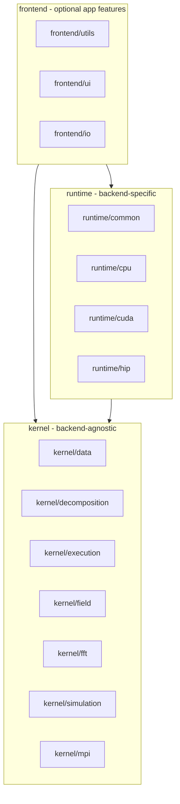

# OpenPFC Package Architecture

This document describes the logical structure of the OpenPFC library. The codebase is organized into three layers: **kernel**, **runtime**, and **frontend**. There is no directory or layer named "core"; the former "core" responsibilities are split into kernel subdirectories by responsibility.

## Dependency direction

- **Frontend** depends on kernel and runtime (optional for minimal applications).
- **Runtime** depends only on kernel.
- **Kernel** has no dependency on runtime or frontend (when CUDA is disabled). When built with CUDA, `kernel/decomposition/halo_exchange.hpp` may include `runtime/cuda/sparse_vector_ops.hpp` so that gather/scatter work for `SparseVector<CudaTag, T>`; the kernel itself contains no `#ifdef OpenPFC_ENABLE_CUDA` or CUDA-specific code.

Minimal applications can depend only on kernel + runtime and omit frontend (no UI, logging, or extra I/O helpers).

## Layer descriptions

### Kernel (backend-agnostic)

Code that defines data structures, execution abstraction, and simulation logic without backend-specific implementations. No `#ifdef OpenPFC_ENABLE_CUDA` for implementation details; only tags or policy types as needed. **Backend-agnostic** here means no CPU/CUDA/HIP conditionals in kernel code; the chosen FFT abstraction is HeFFTe, and kernel types (e.g. in `kernel/fft`, `kernel/decomposition`) may use HeFFTe types (e.g. `heffte::box3d<int>`) where that is the agreed interface.

| Directory | Contents |
|-----------|----------|
| **kernel/data** | World, Field, Box3D, coordinate system, types (world_types, model_types), strong types, multi-index, array, constants, discrete field; world_helpers, world_queries, world_factory. |
| **kernel/decomposition** | Decomposition, decomposition_neighbors, sparse_vector, exchange, halo_pattern; decomposition_factory. |
| **kernel/execution** | Execution/memory abstraction: execution_space, memory_space, policy, parallel_for, view, layout, backend_tags, memory_traits, databuffer; create_mirror, deep_copy. |
| **kernel/field** | Field operations and adapters (operations.hpp, legacy_adapter.hpp). |
| **kernel/fft** | FFT interface and k-space helpers (fft.hpp, kspace.hpp). No backend-specific FFT code. |
| **kernel/simulation** | Model, Simulator, Time, FieldModifier, ResultsWriter interface, boundary_conditions, initial_conditions, binary_reader. |
| **kernel/mpi** | MPI abstraction: communicator, environment, timer, worker, mpi.hpp. |

### Runtime (backend-specific)

Backend-specific implementations: CPU/OpenMP/CUDA/HIP execution and FFT, and GPU kernel sources.

| Directory | Contents |
|-----------|----------|
| **runtime/common** | Code shared by runtime backends (e.g. heffte_adapter.hpp for HeFFTe box conversion). |
| **runtime/cpu** | CPU FFT implementation (fft.cpp), serial/OpenMP execution if split. |
| **runtime/cuda** | CUDA FFT (fft_cuda.cpp), gpu_vector, kernels_simple. |
| **runtime/hip** | HIP FFT (fft_hip.cpp, fft_hip.hpp). |

### Frontend (optional app features)

Features that are useful for full applications but not required for minimal simulations: UI, logging, extra I/O.

| Directory | Contents |
|-----------|----------|
| **frontend/utils** | Logging, utils.hpp, toml_to_json, show, timeleft, nancheck, memory_reporter, field_iteration, typename, array_to_string. |
| **frontend/ui** | App, from_json, json_helpers, errors, parameter_validator, parameter_metadata, field_modifier_registry; ui.hpp redirect. |
| **frontend/io** | Results writer implementations (binary_writer, vtk_writer). |

## Include paths

After refactoring, public headers live under `include/openpfc/` with the structure above. Use explicit paths:

- `#include <openpfc/kernel/data/world.hpp>`
- `#include <openpfc/kernel/fft/fft.hpp>`
- `#include <openpfc/runtime/common/heffte_adapter.hpp>`
- `#include <openpfc/frontend/utils/logging.hpp>`

The convenience header `#include <openpfc/openpfc.hpp>` pulls in kernel, runtime, and frontend (full API). For **minimal applications** (kernel + runtime only), use `#include <openpfc/openpfc_minimal.hpp>` instead, or include only the headers you need (e.g. `kernel/...`, `runtime/...`). For faster compilation in general, prefer including specific headers over the convenience headers.

## Naming policy

Prefer directory names that clearly describe their contents. Avoid vague names like **"core"** or **"all"**, which tend to become catch-all junkyards. **"common"** is acceptable when it clearly means "shared by sibling components" (e.g. **runtime/common** for code shared across the cpu, cuda, and hip backends).

## Public API

Headers under `include/openpfc/` constitute the public API. Prefer including the specific headers you need. Avoid relying on internal layout or undocumented details. Headers in subdirs such as `detail/` or `internal/` (if introduced later) are not part of the supported API and may change without notice.

## API compatibility

Public **namespaces** (e.g. `pfc::core::`, `pfc::decomposition::`, `pfc::world::`) are unchanged. Only **include paths** and **file locations** change. Existing user code that updates includes to the new paths does not need to change namespace references.
