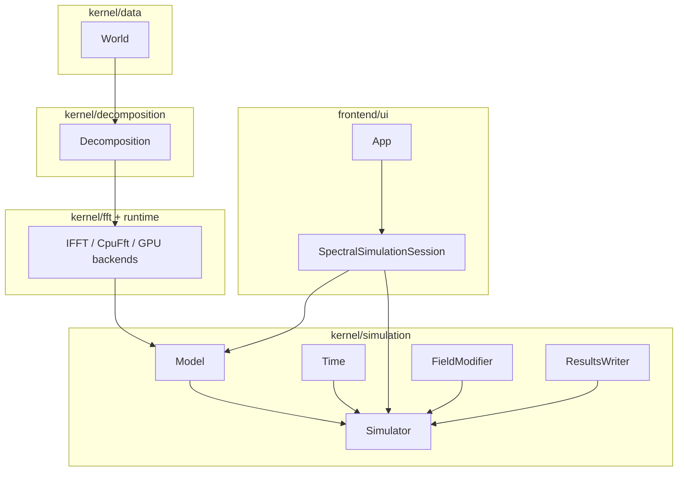

<!--
SPDX-FileCopyrightText: 2026 VTT Technical Research Centre of Finland Ltd
SPDX-License-Identifier: AGPL-3.0-or-later
-->

# Tour of main types

This page orients you to the primary classes and namespaces in OpenPFC: what each is for, where it lives, and where to see it in code. For layering rules, see [`architecture.md`](architecture.md). For the JSON-driven `App` path, see [`app_pipeline.md`](app_pipeline.md).

## How pieces connect (spectral / `App` workflow)

## Types at a glance

| Type / concept | Role | Primary headers | Example / app |
|----------------|------|-----------------|---------------|
| `World` | Global grid: sizes, spacing, origin, periodicity | `openpfc/kernel/data/world.hpp` | `examples/02_domain_decomposition.cpp` |
| `Decomposition` | MPI partition; per-rank inbox/outbox | `openpfc/kernel/decomposition/decomposition.hpp` | `examples/03_parallel_fft.cpp` |
| `IFFT` / `CpuFft` | Distributed FFT (HeFFTe); spectral operators | `openpfc/kernel/fft/fft.hpp`, `fft_fftw.hpp` | `examples/05_simulator.cpp` |
| `Model` | Physics: fields, `initialize()`, `step()` | `openpfc/kernel/simulation/model.hpp` | `examples/04_diffusion_model.cpp`, `12_cahn_hilliard.cpp` |
| `Time` | Time range, `dt`, output cadence | `openpfc/kernel/simulation/time.hpp` | Wired by `App` / `SpectralCpuStack` |
| `Simulator` | Runs the loop: ICs, BCs, `step`, writers | `openpfc/kernel/simulation/simulator.hpp` | `examples/05_simulator.cpp` |
| `FieldModifier` | Initial / boundary updates on fields | `openpfc/kernel/simulation/field_modifier.hpp` | `examples/10_ui_register_ic.cpp` |
| `SimulationContext` | MPI comm + rank context for modifiers | `openpfc/kernel/simulation/simulation_context.hpp` | Passed when applying modifiers |
| `ResultsWriter` / `ResultsWriterMap` | Persist fields (binary, VTK, …); `Simulator` holds `ResultsWriterMap` | `openpfc/kernel/simulation/results_writer.hpp`; implementations under `openpfc/frontend/io/` | `examples/11_write_results.cpp`, [`io_results.md`](io_results.md) |
| `ResultsWriterCatalog` | JSON `fields[].writer` → factory (`binary` built-in); inject for custom formats | `openpfc/frontend/ui/results_writer_catalog.hpp` | Same as `add_result_writers_from_json` ([`app_pipeline.md`](app_pipeline.md)) |
| `pfc::ui::App<Model>` | Load JSON/TOML, build stack, run | `openpfc/frontend/ui/app.hpp` | `apps/aluminumNew/`, `examples/10_ui_register_ic.cpp` |
| `SpectralCpuStack` | World → decomp → CPU FFT → time from JSON | `openpfc/frontend/ui/spectral_cpu_stack.hpp` | Used inside `SpectralSimulationSession` |
| `spectral_fft_stack_factory` | Merge `plan_options` + root `backend`; cuFFT / ROCm plan defaults + JSON overlay | `openpfc/frontend/ui/spectral_fft_stack_factory.hpp` | GPU tests / drivers alongside CPU stack helpers |
| `SpectralSimulationSession` | Owns stack + `Model` + `Simulator` | `openpfc/frontend/ui/spectral_simulation_session.hpp` | Constructed by `App` |
| `JsonWiringSession` | Bundles `JsonWiringContext` + `FieldModifierCatalog` for `wire_simulator_and_runtime_from_json` | `openpfc/frontend/ui/json_wiring_session.hpp` | Custom apps / tests injecting a modifier catalog |

## Execution and backends (advanced)

| Concept | Role | Headers |
|---------|------|---------|
| `DataBuffer`, `backend` tags | Host/device buffers; template dispatch | `kernel/execution/databuffer.hpp`, `runtime/cuda/*`, `runtime/hip/*` |
| `parallel_for`, views | Kokkos-style loops (CPU/GPU) | `kernel/execution/parallel.hpp`, `view.hpp` |

GPU FFT and device execution require the matching runtime headers and a build with `OpenPFC_ENABLE_CUDA` or `OpenPFC_ENABLE_HIP`.

## See also

| Document | Purpose |
|----------|---------|
| [`app_pipeline.md`](app_pipeline.md) | JSON/TOML → `Simulator` wiring order |
| [`parameter_validation.md`](parameter_validation.md) | Optional validated `model.params` |
| [`glossary.md`](glossary.md) | Terminology |
| [`tutorials/custom_app_minimal.md`](tutorials/custom_app_minimal.md) | Out-of-tree `App` + JSON **wiring** (goal/outcome first; physics in `step`) |
| [`extending_openpfc/README.md`](extending_openpfc/README.md) | Extension points checklist |
| [`examples_catalog.md`](examples_catalog.md) | All `examples/` executables (with curriculum) |
| [`api_examples_walkthrough.md`](api_examples_walkthrough.md) | Doxygen `docs/api/examples/` in reading order |
| [`learning_paths.md`](learning_paths.md) | Role-based documentation tracks |
