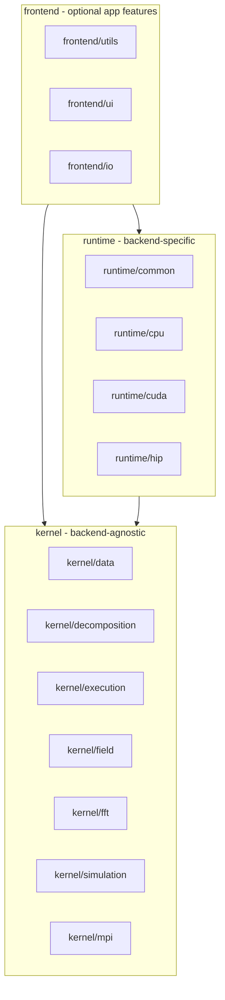

<!--
SPDX-FileCopyrightText: 2026 VTT Technical Research Centre of Finland Ltd
SPDX-License-Identifier: AGPL-3.0-or-later
-->

# OpenPFC Package Architecture

This document describes the logical structure of the OpenPFC library. The codebase is organized into three layers: kernel, runtime, and frontend. There is no directory or layer named "core"; the former "core" responsibilities are split into kernel subdirectories by responsibility.

## Dependency direction

- `Frontend` depends on kernel and runtime (optional for minimal applications).
- `Runtime` depends only on kernel.
- `Kernel` has no dependency on runtime or frontend. Backend tags (CpuTag only), execution spaces (Serial, OpenMP only), DataBuffer&lt;CpuTag,T&gt;, memory space/traits for host, view, parallel_for, and deep_copy are in kernel; GPU specializations of these and all CUDA/HIP code live in `runtime/cuda` and `runtime/hip`. No `#ifdef OpenPFC_ENABLE_CUDA/HIP` in kernel or frontend; backend choice is via templates and including the corresponding runtime headers.

**Include audit:** `include/openpfc/kernel/**` and `src/openpfc/kernel/**` must not `#include` `openpfc/frontend/*` headers. Occasional `rg 'openpfc/frontend' include/openpfc/kernel src/openpfc/kernel` should find no real includes (Doxygen comments may mention frontend types).

Minimal applications can depend only on kernel + runtime and omit frontend (no UI, logging, or extra I/O helpers).

## Spectral vs finite-difference workflows

- Spectral (FFT / k-space) is the primary, end-to-end path today: models, FFT via HeFFTe, and k-space helpers are wired through the kernel and runtimes (CPU, CUDA, HIP). See `kernel/fft` and application examples that use the simulator stack. FFT buffers must remain pure subdomain samples (`fft::get_inbox` / `decomposition::get_subworld` extents): do not run HeFFTe on an array that has had `in-place` ghost data written into its boundary slabs for multi-rank periodic FD unless you have a domain-specific guarantee.
- Finite differences use the same decomposition and halo machinery. Two layouts are supported (see `docs/halo_exchange.md` — *Halo policies*):
  - InPlace (traditional): `HaloExchanger` + `field::fd::laplacian_7point_interior` — ghosts live in the boundary layers of the same `nx×ny×nz` array; fast for FD-only use.
  - Separated (FFT-safe): `SeparatedFaceHaloExchanger` + `field::fd::laplacian_7point_interior_separated` — core stays contiguous for FFT; ghosts in separate face buffers.
- The flagship multi-rank heat example is `examples/15_finite_difference_heat.cpp` (separated halos + explicit heat equation). For halo design, policies, overlap, and persistent MPI options, see `docs/halo_exchange.md`.

## Layer descriptions

### Kernel (backend-agnostic)

Code that defines data structures, execution abstraction, and simulation logic. `Backend-agnostic`: kernel defines only `CpuTag`, `Serial`, `OpenMP`, `HostSpace`, and CPU implementations (e.g. `DataBuffer<CpuTag,T>`, host memory traits). CUDA and HIP tags, execution spaces, memory spaces, and GPU implementations live in `runtime/cuda` and `runtime/hip`; use templating to choose the backend. The chosen FFT abstraction is HeFFTe; kernel types may use HeFFTe types (e.g. `heffte::box3d<int>`) where that is the agreed interface.

| Directory | Contents |
|-----------|----------|
| `kernel/data` | World, Field, Box3D, coordinate system, types (world_types, model_types), strong types, multi-index, array, constants, discrete field; world_helpers, world_queries, world_factory. |
| `kernel/decomposition` | Decomposition, decomposition_neighbors, sparse_vector, exchange, halo_pattern, halo_mpi_types, `halo_policy.hpp`, `halo_face_layout.hpp`, `halo_exchange.hpp` (`HaloExchanger`), `separated_halo_exchange.hpp` (`SeparatedFaceHaloExchanger`), `halo_persistent.hpp` (`PersistentHaloExchanger`); decomposition_factory. |
| `kernel/execution` | Execution/memory abstraction: execution_space, memory_space, policy, parallel_for, view, layout, backend_tags, memory_traits, databuffer; create_mirror, deep_copy. CPU/host only; GPU specializations (CudaTag, HipTag, CudaSpace, HipSpace, parallel_for/fence/deep_copy for device) live in `runtime/cuda` and `runtime/hip`. |
| `kernel/field` | Field operations and adapters (operations.hpp, legacy_adapter.hpp); `finite_difference.hpp` (minimal FD Laplacian on local halos). |
| `kernel/fft` | FFT interface and k-space helpers (fft.hpp, fft_layout.hpp, kspace.hpp). No backend-specific FFT code. |
| `kernel/simulation` | Model, Simulator, Time, FieldModifier, ResultsWriter interface, boundary_conditions, initial_conditions, binary_reader; `simulator_results_dispatch.hpp` (per-field writer writes), `simulator_field_modifiers_dispatch.hpp` (IC/BC apply loop), `simulator_modifier_registration.hpp` (IC/BC registration validation). Optional forward declarations: simulation_fwd.hpp. |
| `kernel/mpi` | MPI abstraction: communicator, environment, timer, worker, mpi.hpp. |
| `kernel/profiling` | `ProfilingMetricCatalog`: ordered `/`-separated paths (defaults `communication`, `fft`, `gradient` plus config `regions`, or `from_paths_only`; `ensure_path` registers paths on first use). `ProfilingSession`: generic per-frame named scalars (`openpfc_frame_metrics.hpp` supplies OpenPFC defaults and `App` helpers), dense inclusive/exclusive seconds per path; thread-local `ProfilingContextScope`, `record_time`; `ProfilingTimedScope`, `ProfilingManualScope` (explicit stop / restart), macros `OPENPFC_PROFILE` / `PFC_PROFILE_SCOPE` when `OpenPFC_PROFILING_LEVEL` > 0. `finalize_and_export`: JSON and/or HDF5 (`OpenPFC_ENABLE_HDF5`), schema v2 (`docs/profiling_export_schema.md`); `print_profiling_timer`. Helpers: `measure_barriered`, `reduce_max_to_root`, `format_bytes`, RSS sampling. See `docs/performance_profiling.md`. |

### Runtime (backend-specific)

Backend-specific implementations: CPU/OpenMP/CUDA/HIP execution and FFT, and GPU kernel sources.

| Directory | Contents |
|-----------|----------|
| `runtime/common` | Code shared by runtime backends and host-side runtime helpers: heffte_adapter.hpp (HeFFTe box conversion), backend_from_string.hpp (FFT backend name → enum for UI), cpu_affinity.hpp (`reset_cpu_affinity_if_single_mpi_rank` so OpenMP scales when a single MPI rank is pinned by the launcher), mpi_timer.hpp (`MpiTimer` + `tic`/`toc` for `MPI_MAX` wall-clock of a parallel section). |
| `runtime/cpu` | CPU FFT implementation (fft.cpp), serial/OpenMP execution if split. |
| `runtime/cuda` | CUDA backend: backend_tags_cuda, execution_space_cuda, databuffer_cuda, memory_space_cuda, memory_traits_cuda; exchange_cuda, view_cuda, parallel_cuda, deep_copy_cuda; sparse_vector_ops, sparse_vector_cuda; FFT (fft_cuda.hpp, fft_cuda.cpp); gpu_vector, kernels_simple. |
| `runtime/hip` | HIP backend: backend_tags_hip, execution_space_hip, databuffer_hip, memory_space_hip, memory_traits_hip; exchange_hip, view_hip, parallel_hip, deep_copy_hip; sparse_vector_hip; FFT (fft_hip.hpp, fft_hip.cpp). |

### Frontend (optional app features)

Features that are useful for full applications but not required for minimal simulations: UI, logging, extra I/O.

| Directory | Contents |
|-----------|----------|
| `frontend/utils` | `logging.hpp` re-exports `kernel/utils/logging.hpp`; utils.hpp, toml_to_json, show, timeleft, nancheck, memory_reporter, field_iteration, typename, array_to_string. |
| `frontend/ui` | App, `app_spectral_run.hpp` (`SpectralJsonAppRun` — JSON spectral pipeline after settings are loaded), `spectral_json_driver_hooks.hpp` (`configure_spectral_json_driver_hooks`), `spectral_cpu_stack.hpp` (JSON → world/FFT/time stack), `spectral_cpu_stack_detail.hpp` (CPU plan/FFT helpers), `spectral_simulation_session.hpp`, `simulation_wiring.hpp` (umbrella; split into `simulation_wiring_writers.hpp`, `simulation_wiring_conditions.hpp`, `simulation_wiring_simulator_section.hpp`, `simulation_wiring_detail.hpp`), `simulation_wiring_context.hpp` (`JsonWiringContext`), `app_profiling.hpp` / `app_integrator_loop.hpp` (optional profiling lifecycle + time loop), `from_json.hpp` (umbrella over `from_json_fwd.hpp`, `from_json_log.hpp`, `from_json_heffte.hpp`, `from_json_fft_backend.hpp`, `from_json_world_time.hpp`, `from_json_field_modifiers.hpp`), json_helpers, errors, parameter_validator, parameter_metadata, field_modifier_registry; ui.hpp redirect. |
| `frontend/io` | Results writer implementations (binary_writer, vtk_writer). |

End-to-end flow from `JSON/TOML` to `Simulator` ( `SpectralCpuStack`, `SpectralSimulationSession`, `simulation_wiring` ) is described in `[`app_pipeline.md`](../user_guide/app_pipeline.md)`. Result file formats are summarized in `[`io_results.md`](../user_guide/io_results.md)`.

## Include paths

After refactoring, public headers live under `include/openpfc/` with the structure above. Use explicit paths:

- `#include <openpfc/kernel/data/world.hpp>`
- `#include <openpfc/kernel/fft/fft.hpp>`
- `#include <openpfc/runtime/common/heffte_adapter.hpp>`
- `#include <openpfc/kernel/utils/logging.hpp>`

The convenience header `#include <openpfc/openpfc.hpp>` pulls in kernel and frontend (full API). For minimal applications (kernel + minimal runtime, no frontend), use `#include <openpfc/openpfc_minimal.hpp>`; it includes the kernel and a minimal runtime set (e.g. `runtime/common/heffte_adapter.hpp` for HeFFTe conversion used by FFT and decomposition). For CUDA/HIP, include the corresponding runtime headers in addition. For faster compilation in general, prefer including specific headers over the convenience headers.

### Minimal app and runtime inclusion

Applications that use `FFT` or decomposition (e.g. `pfc::decomposition::Decomposition`, `pfc::FFT`) must include the minimal runtime so that HeFFTe box conversion and related types are available. Either:

- Use `#include <openpfc/openpfc_minimal.hpp>` (recommended for minimal apps), which already pulls in `runtime/common/heffte_adapter.hpp`, or  
- Include the needed runtime headers explicitly (e.g. `#include <openpfc/runtime/common/heffte_adapter.hpp>`).

For CPU-only FFT there is no need to include `runtime/cpu/fft.hpp`; the CPU FFT implementation is linked via the build and used through the kernel FFT interface. For CUDA or HIP FFT, include `openpfc/runtime/cuda/fft_cuda.hpp` or `openpfc/runtime/hip/fft_hip.hpp` as appropriate.

## Design ethos: laboratory, not fortress

The codebase aims to be easy to extend and inspect, not maximally locked down. In practice:

- Prefer free functions for many queries and operations on domain objects (e.g. `pfc::world::get_size`, and `get_world` overloads for `Decomposition` and `Field`) so call sites stay uniform and composable. When parallel access is added for a type that still uses member getters, add a free function and prefer it in new or refactored code.
- Prefer struct-like types with public data by default; use private state only when it protects real invariants. Full guidance and examples are in [styleguide.md](../development/styleguide.md) (section *API shape: free functions and data-centric types*).
- **Inheritance and `virtual` are intentional seams, not the default shape of the library.** Use abstract bases (`Model`, `FieldModifier`, `ResultsWriter`, …) where **out-of-tree** code must plug in through one stable boundary in C++. Prefer **thin overrides** that delegate to **free functions** and **data-centric helpers** (namespaced `pfc::…` / `pfc::ui::…`) so behavior stays easy to find and test. Avoid deep hierarchies and “logic sprouting” from many small virtual methods unless the extension point truly needs them.

Layer rules (kernel → runtime → frontend) are unchanged: this ethos governs *how* types expose their own state and helpers, not which layers may include each other.

## Naming policy

Prefer directory names that clearly describe their contents. Avoid vague names like "core" or "all", which tend to become catch-all junkyards. "common" is acceptable when it clearly means "shared by sibling components" (e.g. `runtime/common` for code shared across the cpu, cuda, and hip backends).

## Public API

Headers under `include/openpfc/` constitute the public API. Prefer including the specific headers you need. Avoid relying on internal layout or undocumented details. Headers in subdirs such as `detail/` or `internal/` (if introduced later) are not part of the supported API and may change without notice.

## API compatibility

Public namespaces (e.g. `pfc::core::`, `pfc::decomposition::`, `pfc::world::`) are unchanged. Only include paths and file locations change. Existing user code that updates includes to the new paths does not need to change namespace references.

## See also

- [`spectral_stack.md`](spectral_stack.md) — end-to-end **spectral** data-flow narrative (complements the layer diagram above).  
- [`app_pipeline.md`](../user_guide/app_pipeline.md) — JSON/TOML → `Simulator` for declarative apps.
