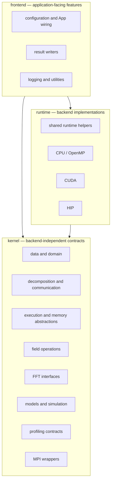
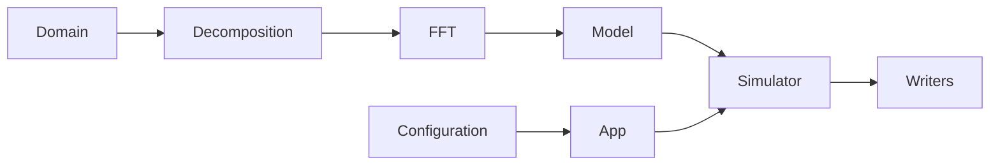

<!--
SPDX-FileCopyrightText: 2026 VTT Technical Research Centre of Finland Ltd
SPDX-License-Identifier: AGPL-3.0-or-later
-->

# Package architecture

OpenPFC is organized into three logical layers: **kernel**, **runtime**, and
**frontend**. The layer names describe dependency direction and extension
boundaries; they are more stable than individual headers or helper types.

There is no `core` layer. Responsibilities that older versions grouped under
that name now live in focused kernel subdirectories.

## Dependency direction


```mermaid
flowchart TB
  subgraph frontend [frontend — application-facing features]
    ui[configuration and App wiring]
    io[result writers]
    utilities[logging and utilities]
  end

  subgraph runtime [runtime — backend implementations]
    common[shared runtime helpers]
    cpu[CPU / OpenMP]
    cuda[CUDA]
    hip[HIP]
  end

  subgraph kernel [kernel — backend-independent contracts]
    data[data and domain]
    decomposition[decomposition and communication]
    execution[execution and memory abstractions]
    field[field operations]
    fft[FFT interfaces]
    simulation[models and simulation]
    profiling[profiling contracts]
    mpi[MPI wrappers]
  end

  frontend --> runtime
  frontend --> kernel
  runtime --> kernel
```

The rules are:

1. **Kernel does not depend on runtime or frontend.** It defines data types,
   backend-independent interfaces, simulation contracts, and host-side
   execution primitives.
2. **Runtime depends on kernel.** It supplies CPU, CUDA, and HIP
   implementations behind kernel contracts.
3. **Frontend depends on kernel and runtime.** It adds configuration-driven
   application wiring, result writers, and user-facing utilities.

A lightweight program may use kernel and runtime directly without the frontend.
A full application normally uses all three layers.

## Layer responsibilities

### Kernel

The kernel owns the concepts that should remain meaningful regardless of the
selected compute backend.

| Area | Responsibility |
|------|----------------|
| `kernel/data` | `Domain`, boxes, fields, strong types, and basic data containers |
| `kernel/decomposition` | MPI partitioning, neighbor relationships, and halo-exchange contracts |
| `kernel/execution` | execution spaces, memory spaces, views, buffers, and copy abstractions |
| `kernel/field` | field operations, finite-difference primitives, and iteration helpers |
| `kernel/fft` | FFT interfaces, layouts, and wave-number helpers |
| `kernel/simulation` | `Model`, `Simulator`, time integration, modifiers, writers, and solver contracts |
| `kernel/checkpoint` | backend-independent persistent-state and checkpoint contracts |
| `kernel/profiling` | metric catalogs, scopes, sessions, and export contracts |
| `kernel/mpi` | small MPI environment and communicator helpers |

Kernel headers must not include frontend headers. This can be checked with:

```bash
rg 'openpfc/frontend' include/openpfc/kernel src/openpfc/kernel
```

Real includes in that search indicate a dependency-direction violation.

### Runtime

Runtime code realizes backend-specific behavior.

| Area | Responsibility |
|------|----------------|
| `runtime/common` | shared adapters, MPI timing, affinity handling, and common launch helpers |
| `runtime/cpu` | CPU and OpenMP execution plus the CPU FFT implementation |
| `runtime/cuda` | CUDA memory, execution, kernels, exchange, and FFT support |
| `runtime/hip` | HIP memory, execution, kernels, exchange, and FFT support |

Backend selection is made through templates, execution/memory-space types, and
explicit runtime headers. CUDA and HIP implementation code should not leak into
backend-independent kernel interfaces.

### Frontend

Frontend code turns the lower layers into deployable applications.

| Area | Responsibility |
|------|----------------|
| `frontend/ui` | JSON/TOML loading, parameter validation, `App` wiring, catalogs, and simulation sessions |
| `frontend/io` | concrete binary, VTK, PNG, and related result writers |
| `frontend/utils` | application-facing logging, diagnostics, and convenience utilities |

The end-to-end configuration path is documented in
[`app_pipeline.md`](../user_guide/app_pipeline.md). Result formats and writer
selection are documented in [`io_results.md`](../user_guide/io_results.md).

## Primary workflows

### Spectral workflow

The spectral stack is the primary end-to-end path:


```mermaid
flowchart LR
  Domain --> Decomposition --> FFT
  FFT --> Model --> Simulator
  Configuration --> App --> Simulator
  Simulator --> Writers
```

HeFFTe performs distributed FFT work. Real-space fields are transformed to
wave-number space, updated by the model or time integrator, transformed back,
and passed to modifiers and writers as configured.

Read [`spectral_stack.md`](spectral_stack.md) for the data-flow narrative and
[`../reference/class_tour.md`](../reference/class_tour.md) for the stable type
map.

### Finite-difference workflow

Finite-difference applications use the same domain decomposition and MPI
infrastructure but choose an explicit halo layout:

- **In-place halos** reuse boundary slabs inside the main array.
- **Separated halos** keep ghost faces outside the FFT-compatible core array.
- **Padded bricks** store owned cells and a surrounding ghost ring in one
  contiguous allocation.

The correct layout depends on whether the same field must also remain a valid
FFT input. Do not pass an array containing in-place ghost values to HeFFTe
unless the application has explicitly restored a pure subdomain layout.

See [`halo_exchange.md`](halo_exchange.md) for policies, overlap, persistent
communication, and runnable examples.

## Ownership and extension boundaries

OpenPFC favors data-centric types and free functions for queries and operations.
Inheritance is reserved for stable out-of-tree extension seams such as
`Model`, `FieldModifier`, and `ResultsWriter`.

Use these rules when adding functionality:

- put backend-independent contracts and algorithms in kernel;
- put CUDA/HIP/CPU realization details in runtime;
- put configuration, user interaction, and concrete application I/O in
  frontend;
- keep virtual interfaces narrow and delegate implementation to testable free
  functions;
- avoid introducing a generic catch-all directory such as `core`, `common`, or
  `utils` unless its sharing boundary is explicit.

The API-shape conventions and examples are in
[`../development/styleguide.md`](../development/styleguide.md).

## Public headers and includes

Headers under `include/openpfc/` form the public source-level API. Prefer the
specific header that declares the functionality you use:

```cpp
#include <openpfc/kernel/data/domain.hpp>
#include <openpfc/kernel/decomposition/decomposition.hpp>
#include <openpfc/kernel/fft/fft.hpp>
```

The convenience headers serve broader use cases:

- `<openpfc/openpfc.hpp>` includes the full public stack, including frontend
  facilities;
- `<openpfc/openpfc_minimal.hpp>` includes the kernel and minimal runtime pieces
  needed by small programmatic applications.

CUDA and HIP applications also include the relevant runtime headers and must be
built with the matching CMake option and dependency stack.

Installed consumers link the exported CMake target:

```cmake
target_link_libraries(my_sim PRIVATE OpenPFC::openpfc)
```

See [`../quickstart.md`](../quickstart.md) for the complete downstream CMake
shape.

## Architecture documentation policy

This page documents stable responsibilities and dependency rules. It should not
become an exhaustive list of every header, test, or experimental helper.

Use instead:

- the [integrated C++ API reference](../api/index.md) for signatures and member
  documentation;
- [`../reference/class_tour.md`](../reference/class_tour.md) for the primary
  concepts;
- [`../reference/examples_catalog.md`](../reference/examples_catalog.md) for
  runnable code;
- [`../development/refactoring_roadmap.md`](../development/refactoring_roadmap.md)
  for implementation migration plans;
- [`../adr/README.md`](../adr/README.md) for accepted architecture decisions.

## See also

- [`spectral_stack.md`](spectral_stack.md) — spectral data flow
- [`halo_exchange.md`](halo_exchange.md) — distributed halo layouts
- [`../user_guide/app_pipeline.md`](../user_guide/app_pipeline.md) — JSON/TOML
  to `Simulator`
- [`../hpc/performance_profiling.md`](../hpc/performance_profiling.md) — runtime
  profiling
- [`../hpc/profiling_export_schema.md`](../hpc/profiling_export_schema.md) —
  profiling output contract
