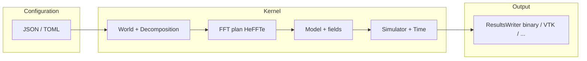

<!--
SPDX-FileCopyrightText: 2026 VTT Technical Research Centre of Finland Ltd
SPDX-License-Identifier: AGPL-3.0-or-later
-->

# The spectral stack (mental model)

This page is the **narrative spine** for OpenPFC’s primary path: **distributed FFT-based models** driven by `Simulator`, optionally from JSON/TOML through the spectral `App` frontend. It complements the **layer diagram** in [`architecture.md`](architecture.md) (kernel / runtime / frontend).

## One picture: data and control flow

Reading order for **declarative apps**:

1. **World + decomposition** — global grid and which ranks own which brick (`kernel/data`, `kernel/decomposition`).  
2. **FFT** — HeFFTe plan and backend (CPU / CUDA / HIP) must match how you built OpenPFC and HeFFTe ([`build_cpu_gpu.md`](build_cpu_gpu.md), [`tutorials/fft_heffte_plan_options.md`](tutorials/fft_heffte_plan_options.md)).  
3. **Model** — physics in Fourier or real space; registers fields and hooks the integrator ([`class_tour.md`](class_tour.md)).  
4. **Simulator** — owns time loop, calls modifiers, invokes writers at `saveat` boundaries.  
5. **Writers** — `ResultsWriter` implementations (MPI-IO binary, VTK, …) ([`io_results.md`](io_results.md)).

JSON/TOML wiring (spectral CPU stack, session, wiring helpers) is summarized in [`app_pipeline.md`](app_pipeline.md).

## Spectral vs finite differences

- **Spectral / FFT** — default “big” path for phase-field style models in this repo; k-space ops and HeFFTe are central.  
- **Finite differences** — share decomposition and halo machinery; see [`architecture.md`](architecture.md) §“Spectral vs finite-difference workflows” and [`halo_exchange.md`](halo_exchange.md).

## Where to go next

| Need | Document |
|------|-----------|
| First successful `mpirun` | [`start_here_15_minutes.md`](start_here_15_minutes.md) |
| Runnable “recipes” | [`recipes/README.md`](recipes/README.md) |
| Config keys for spectral `App` | [`spectral_app_config_reference.md`](spectral_app_config_reference.md) |
| API map (`Model`, `Simulator`, …) | [`class_tour.md`](class_tour.md) |
| Examples ladder | [`examples_catalog.md`](examples_catalog.md), [`tutorials/spectral_examples_sequence.md`](tutorials/spectral_examples_sequence.md) |
