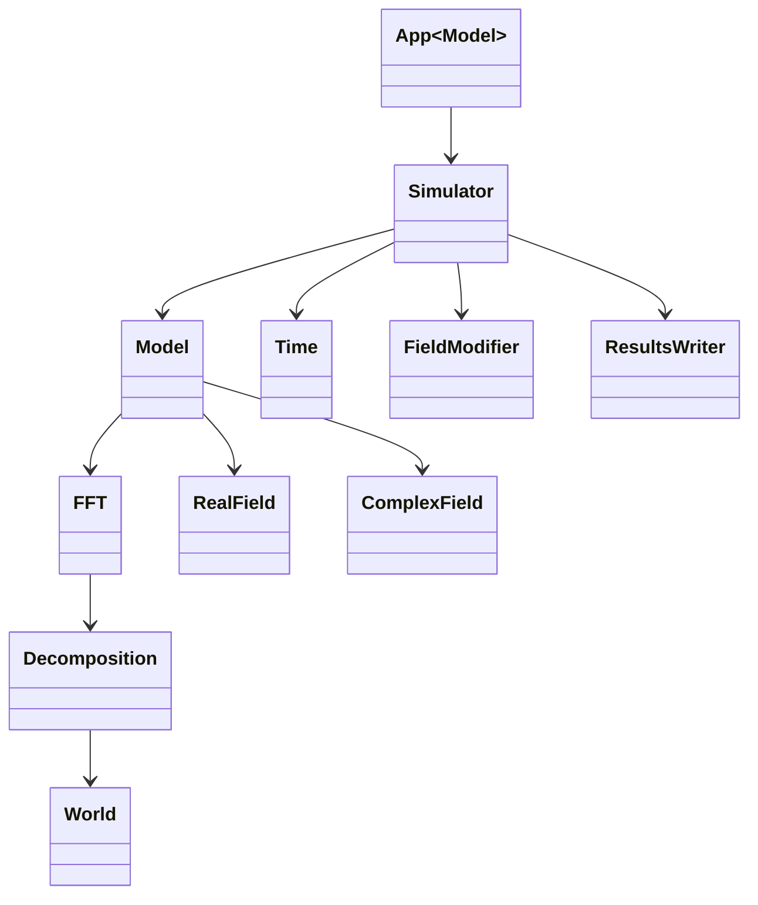
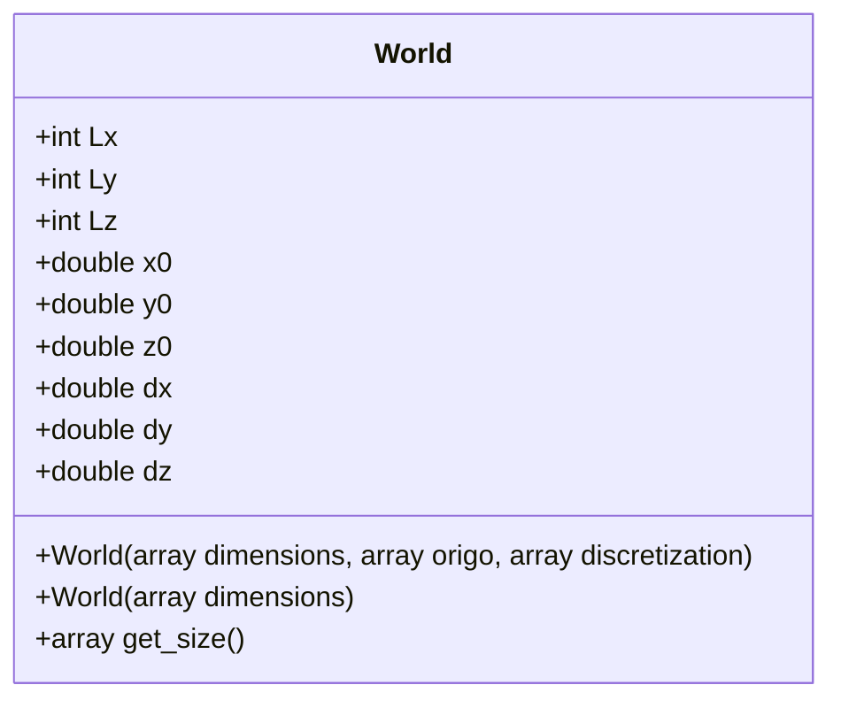

# Basics: world, domain decomposition and FFT

Hello, and welcome to the first part of the getting started tutorial of OpenPFC
software. The goal of this section is to familiarize the user with the lowest
layers of the software framework and to present how distributed computing is
done at a practical level. After this section, the user should be able to
compile a program with OpenPFC as a dependency and perform a simple calculation.

We start this tutorial by giving a brief description of the software framework
classes at a rough level. Not all classes are shown, but the most important
ones, to get overall understanding about the building blocks we are working
with.



The framework consists of building blocks that can be stacked on top of each
other from the bottom up. Starting from the bottom, we first want do define
calculation domain, decompose it into smaller parts, distribute it between MPI
processes and set up FFT. These operations are the responsibilities of classes
`World`, `Decomposition` and `FFT`.

The actual physics is introduced in class `Model`, which combines FFT and
real/complex fields. The responsiblities of `Model` is to perform model
initialization, which usually contains at least memory allocation for all
necessary data structures and construction of linear and non-linear operators,
as well as defining model time integration step, which depends on the model
physics. For example, a simple step for linear diffusion model would be
$\mathcal{F}^{-1}\lbrace L\cdot\mathcal{F}\lbrace\psi\rbrace\rbrace,$ where $L$
is precalculated linear operator, and the corresponding step function in actual
program code would be

```cpp
void step(double) override {
  FFT &fft = get_fft();
  fft.forward(psi, psi_F);  // Apply FFT
  for (size_t k = 0, N = psi_F.size(); k < N; k++) {
    psi_F[k] = opL[k] * psi_F[k];  // Apply linear operator opL
  }
  fft.backward(psi_F, psi);  // Apply inverse FFT
}
```

Going to higher level classes, next comes `Simulator`, which main responsibility
is to put all lower level objects together and control initial conditions and
boundary conditions as well as writing results to disk on certain time. That is,
simulator puts together `Model`, `Time`, `FieldModifier` and `ResultsWriter`.
Here, `FieldModifier` can be seen as an object that modifies the contents of the
data structures of model. Before the simulation starts, those are recognized as
initial conditions, and during the simulation, they are applied after each step
and recognized as boundary conditions. In a coarse level, simulator
responsibilities are:

1. initialize model
1. apply initial conditions
1. while not done:
    1. increment time
    1. apply boundary conditions
    1. perform timestep
    1. save results to disk

The relations between the classes are of the "has-a" type. On a practical level,
the object of interest is often the extension of the class `Model` with own
physics. Boundary conditions and initial conditions can be implemented with the
help of `FieldModifier` class.

The responsibility of designing the user interface lies with the user of the
software framework. The technical features of the user interface are contingent
upon the execution environment of the program code. Nonetheless, we have
presented one feasible rough-level user interface, whereby the program's input
is read from a JSON file, denominated as `App<Model>`. This methodology is
appropriate for HPC computing due to several reasons.

Primarily, computing environments on nodes are typically limited and lack
graphic libraries. Secondly, the simulation initiation process is usually
non-interactive and is carried out by running the simulation through a queuing
system (such as slurm) using a separate startup script. This form of program
execution is better suited to a command line user interface where the simulation
settings are defined declaratively with a separate configuration file. As the
simulation settings cannot be modified during the simulation or interactively at
the beginning of the simulation, the reproducibility of the results is
guaranteed, which is crucial for research purposes.

Let's examine the operation of these classes in smaller entities, starting with
classes World, Decomposition and FFT. It is the responsibility of the World
class to define the computational domain and its discretization. We can define
any point in the calculation area with linear interpolation:

```math
\begin{align}
x(i) &= x_0 + i \cdot \delta x \qquad i \in [0, L_x] \\
y(j) &= y_0 + j \cdot \delta y \qquad j \in [0, L_y] \\
z(k) &= z_0 + k \cdot \delta z \qquad k \in [0, L_z]
\end{align}
```



Like all other software projects, let's start this one with the traditional
["Hello, World!"][hello]-example, just to make sure that environment is working
as expected.

[hello]: https://en.wikipedia.org/wiki/%22Hello,_World!%22_program

```cpp
// hello.cpp
#include <iostream>
#include <openpfc/openpfc.hpp>

using namespace std;
using namespace pfc;

int main() {
  World world({32, 32, 32});
  cout << world << endl;
}
```

What follows is one of the most difficult questions in C++ development, namely
how to translate this into a working binary. OpenPFC is a header-only library
and in that sense compiling is basically easy by specifying the location of
header files to compiler with the `-I` flag (for example, `g++
-I/opt/OpenPFC/include -o hello hello.cpp`). In practice, however, in order to
be able to do something useful, additionally HeFFTe and some other libraries are
needed, which help e.g. making the FFT and distributing the calculation to the
computing nodes in a HPC cluster. And this is making things a bit more
complicated. Just so show, that *in principle*, one could manually compile the
command without any kind of build system, compiling the application with my own
development system would go as follows:

```bash
# compiling
/usr/bin/c++ -isystem /opt/openpfc/include -isystem /opt/heffte/2.3/include -isystem /usr/lib/x86_64-linux-gnu/openmpi/include/openmpi -isystem /usr/lib/x86_64-linux-gnu/openmpi/include  -mfma -mavx -pthread -o hello.o -c hello.cpp

# linking
/usr/bin/c++ -pthread hello.o -o hello -Wl,-rpath,/opt/heffte/2.3/lib:/usr/lib/x86_64-linux-gnu/openmpi/lib /opt/heffte/2.3/lib/libheffte.so.2.3.0 /usr/lib/x86_64-linux-gnu/libfftw3.so /usr/lib/x86_64-linux-gnu/libfftw3f.so /usr/lib/x86_64-linux-gnu/libfftw3_threads.so /usr/lib/x86_64-linux-gnu/libfftw3f_threads.so /usr/lib/x86_64-linux-gnu/libfftw3_omp.so /usr/lib/x86_64-linux-gnu/libfftw3f_omp.so /usr/lib/gcc/x86_64-linux-gnu/10/libgomp.so /usr/lib/x86_64-linux-gnu/libpthread.so /usr/lib/x86_64-linux-gnu/openmpi/lib/libmpi_cxx.so /usr/lib/x86_64-linux-gnu/openmpi/lib/libmpi.so
```

However, this would not make much sense, because the paths, versions and so on
would be different on the next computer. A significantly more sensible approach
to compiling a program is to use a build system. OpenPFC uses cmake, which takes
care of the details of compiling the program. When OpenPFC is configured and
built with cmake, it also generated so called pkg-config file, which tells the
necessary details for compiling programs that depends from OpenPFC. This
configuration file can be found from path
`<CMAKE_PREFIX_PATH>/lib/cmake/OpenPFC/OpenPFCConfig.cmake`, where
`CMAKE_PREFIX_PATH` is the path chosen during the configuration of the
framework. For a global install, `CMAKE_PREFIX_PATH` is empty, but very likely
it's nonempty, something like `/opt/OpenPFC` or `$HOME/opt/OpenPFC`, for
example, as regular users in general does not have write rights to `/usr/local`.

When the program is compiled, cmake will try to find this file. If the
installation is done in the default directory, the file is found automatically
(then it can be found in the file path
`/lib/cmake/OpenPFC/OpenPFCConfig.cmake`). However, this is usually not the
case, the program is installed somewhere in a specific location. It is useful to
[learn][cmake-tutorial] how to use cmake, but in-depth knowledge of it is by no
means necessary to compile simple programs. A minimalistic cmake file to compile
a program is:

[cmake-tutorial]: https://cmake.org/cmake/help/latest/guide/tutorial/index.html

```cmake
cmake_minimum_required(VERSION 3.15)  # define cmake minimum version
project(OpenPFC-basics)               # give some meaningful project name
find_package(OpenPFC REQUIRED)        # find OpenPFC and interrupt if not found (REQUIRE it)
add_executable(hello hello.cpp)       # create target `hello` from source `hello.cpp`
target_link_libraries(hello OpenPFC)  # link OpenPFC to target `hello`
```

The essential part of the `CMakeLists.txt` file is that the dependency is found
with the `find_package` command and linked to target `hello`. The project is
next configured with a command

```bash
cmake -S . -B build
```

Here, `-S` stands for the source code directory (it is assumed that the command
written in the same directory where the `hello.cpp` file is) and `-B build`
means that the program is compiled into the `build` directory, which is relative
to the current directory. It is very likely that the configuration is not
successful and the following message appears:

```text
CMake Error at CMakeLists.txt:3 (find_package):
  By not providing "FindOpenPFC.cmake" in CMAKE_MODULE_PATH this project has
  asked CMake to find a package configuration file provided by "OpenPFC",
  but CMake did not find one.

  Could not find a package configuration file provided by "OpenPFC" with any
  of the following names:

    OpenPFCConfig.cmake
    openpfc-config.cmake

  Add the installation prefix of "OpenPFC" to CMAKE_PREFIX_PATH or set
  "OpenPFC_DIR" to a directory containing one of the above files.  If
  "OpenPFC" provides a separate development package or SDK, be sure it has
  been installed.


-- Configuring incomplete, errors occurred!
```

This is because cmake can't find a file that tells you how OpenPFC should be
added to the project. The problem can be fixed in a couple of different ways.
The most recommended way is probably to give the requested `CMAKE_PREFIX_PATH`,
for example if OpenPFC is installed in `/opt/OpenPFC`, is given

```bash
export CMAKE_PREFIX_PATH=/opt/OpenPFC
cmake -S . -B build
```

or oneliner

```bash
CMAKE_PREFIX_PATH=/opt/OpenPFC cmake -S . -B build
```

There are also other options to tell cmake where to find the desired
configuration file. As mentioned in the error message, an alternative way is to
define `OpenPFC_DIR`, i.e.:

```bash
cmake -S . -B build -DOpenPFC_DIR=/opt/OpenPFC/lib/cmake/OpenPFC
```

The third option is to give the directory directly to the `CMakeLists.txt` file:

```cmake
cmake_minimum_required(VERSION 3.15)
project(OpenPFC-basics)
find_package(OpenPFC REQUIRED PATHS /opt/OpenPFC/lib/cmake/OpenPFC)
add_executable(hello hello.cpp)
target_link_libraries(hello OpenPFC)
```

However, this latter method in particular seems like a bad idea. The program
does compile in the developer's own development environment, but if OpenPFC is
installed on another machine in another directory, the program cannot be found
in the mentioned directory for understandable reasons.

After the configuration is successfully completed, the program can be compiled.
It can be done with a command

```bash
cmake --build build
```

After successful compilation, the executable will be in the directory
`./build/hello`, from where it can be executed:

```bash
./build/hello
```

```text
(Lx = 32, Ly = 32, Lz = 32, x0 = 0, y0 = 0, z0 = 0, x1 = 32, y1 = 32, z0 = 32, dx = 1, dy = 1, dz = 1)
```

Now the first program has been compiled and run! There is no program yet
particularly useful, but it can be used to ensure that the installation works.

In OpenPFC, the starting point for software design is that calculations must be
able to be done on a really large scale with the world's fastest supercomputers,
because materials science is a challenging field of science and the problems are
often computationally intensive. In practice, this means that the Fourier
transform and the inverse Fourier transform performed during time integration
must be spread over several computers.

There are several distributed FFT solutions, of which HeFFTe was selected for
use by OpenPFC. For those interested in the details, for example
[here][parallel-fft-algorithms] is a good source for how these parallel FFT
algorithms work in general. In short, the calculation domain is divided into
smaller parts (so-called domain decomposition), after which the FFT is performed
in each area separately. Among other things, this involves a lot of MPI traffic,
and it is known that distributed FFT is a [communication
bounded][fft-scalability-issues] problem. We will not go into these details of
distributed FFT algorithms, as OpenPFC focuses on applying the phase field
crystal method on a really large scale, and distributed FFT is seen as a tool to
enable this task. The details related to the FFT calculation, such as domain
decomposition and MPI traffic, are left to HeFFTe to take care of.

[parallel-fft-algorithms]: https://courses.engr.illinois.edu/cs554/fa2015/notes/13_fft.pdf

[fft-scalability-issues]: https://netlib.org/utk/people/JackDongarra/PAPERS/Ayala2021_Chapter_ScalabilityIssuesInFFTComputat.pdf

Let's expand the "hello-world" program next with Decomposition and FFT classes.
As the name suggests, the responsibility of the Decomposition class is to
distribute the calculation to several different calculation nodes. The
calculation domain can be divided, for example, into two separate parts as
follows:

```cpp
World world({16, 1, 1});
Decomposition decomp1(world, 0, 2);
Decomposition decomp2(world, 1, 2);
cout << decomp1 << endl;
cout << decomp2 << endl;
```

This program code spreads the calculation into two separate areas. Indices from
0  to 7 are in the calculation domain #0 and indices from 8 to 15 are in the
calculation domain #1. In OpenPFC, real-to-complex type Fourier transformation
is calculated, where for symmetry reasons it is enough to describe only half of
the space in the complex plane, so with the real-to-complex mapping calculation
domain #0 maps real indices from 0 to 7 to complex indices 0 to 4, and
calculation domain #1 maps real indices from 8 to 15 to complex indices from 5
to 9.

Typically, domain decomposition is done so that the calculation domain is
divided into as many parts as MPI processes have been started. Information about
it can be found from the MPI communicator `MPI_COMM_WORLD`:

```cpp
int comm_rank, comm_size;
MPI_Comm_rank(MPI_COMM_WORLD, &comm_rank);  // this particular process id
MPI_Comm_size(MPI_COMM_WORLD, &comm_size);  // number of mpi processes
World world({16, 1, 1});
Decomposition decomposition(world, comm_rank, comm_size);
cout << decomposition << endl;
```

This is so common, in fact, that OpenPFC has simplified domain decomposition so
that all you need to know is the size of the domain and the MPI communicator:

```cpp
World world({16, 1, 1});
Decomposition decomposition(world, MPI_COMM_WORLD);
cout << decomposition << endl;
```

When the domain decomposition has been done, and the calculation domain of the
process has been defined, an FFT class is still needed, which takes the domain
decomposition and the communicator as parameters:

```cpp
FFT fft(decomposition, MPI_COMM_WORLD);
```

After that, `fft.forward` and `fft.backward` commands are available for doing a
distributed FFT.

Now enough tools have been introduced to be able to do something remotely
resembling something useful. Let's conclude the first section of the
getting-started documentation with a practical application, where we calculate
the [derivative][derivative] of the function $f(x) = \sin(x)$ using the Fourier
transform.

[derivative]: https://medium.com/geekculture/numerical-differentiation-via-the-fft-algorithm-calculating-the-spectral-derivative-a8ab18e1abbe

As described above, the World, Decomposition and FFT are defined first:

```cpp
// initialize mpi
MPI_Init(&argc, &argv);
MPI_Comm comm = MPI_COMM_WORLD;

// define world
int Lx = 16;
double pi = 3.14159265358979323846;
double dx = 2 * pi / Lx;
double x0 = -0.5 * Lx * dx;
World world({Lx, 1, 1}, {x0, 0, 0}, {dx, 1, 1});

// define domain decomposition
Decomposition decomp(world, 0, 1);

// construct FFT object
FFT fft(decomp, comm);
size_t size_inbox = fft.size_inbox();
size_t size_outbox = fft.size_outbox();
```

Next, we need a bit of workspace. The amount of space depends on how the domain
division is done. If we only use one MPI process, then `size_inbox = Lx`, but in
general this is not the case. For example, if there are $N$ MPI processes, the
space requirement per one process is roughly $L_x / N$. Without symmetry it
would be `size_inbox = size_outbox`, but since we are doing an FFT
transformation between real and complex spaces, for symmetry reasons
`size_outbox = floor(size_inbox/2) + 1`.

```cpp
// allocate space for this particular mpi process:
// - size_inbox does not equal to Lx (in general)
// - size_outbox = floor(size_inbox/2) + 1 due to the symmetry
vector<double> y(size_inbox), dy(size_inbox);
vector<double> op(size_outbox);
vector<complex<double>> Y(size_outbox);
```

Calculating the derivative requires a differential operator.

```cpp
// get the lower and upper limits of outbox for this particular mpi process
array<int, 3> olow = decomp.outbox.low;
array<int, 3> ohigh = decomp.outbox.high;

// construct operator
const double fx = 2.0 * pi / (dx * Lx);
int idx = 0;
for (int i = olow[0]; i <= ohigh[0]; i++) {
  op[idx] = (i < Lx / 2) ? i * fx : (i - Lx) * fx;
  idx += 1;
}
```

Here too, you have to be careful with the indexes. Although the workspace index
starts from zero, the workspace is only a small part of the entire calculation
domain. Each MPI process calculates only its own part of the operator whose
indices are bounded between `low <= i,j,k <= high`, where `low` and `high`
depend on the MPI process. If, for example, the calculation domain with indices
from 0 to 16 is divided into two processes, the indexes of which are from 0 to 7
in the first and from 8 to 15 in the second, then in both processes there is a
workspace whose length is 8 and whose index starts from zero, but which reflects
a different part of the calculation domain! This may become more concrete when
calculating the output data $f(x)$:

```cpp
// get the lower and upper limits of outbox for this particular mpi process
array<int, 3> ilow = decomp.inbox.low;
array<int, 3> ihigh = decomp.inbox.high;

// generate data y = f(x)
idx = 0;
for (int i = ilow[0]; i <= ihigh[0]; i++) {
  double x = x0 + i * dx;
  y[idx] = sin(x);
  idx += 1;
}
```

When the calculation area has been filled with the output data, calculating the
derivative with FFT is straightforward:

```cpp
fft.forward(y, Y);  // calculate Y = fft(y)
// apply operator to Y
complex<double> im(0, 1);
for (int i = 0; i < size_outbox; i++) {
  Y[i] = im * op[i] * Y[i];
}
fft.backward(Y, dy);  // calculate dy = FFT^-1(Y)
```

The entire program code is listed in the file `derivative.cpp`, where a check
for the correctness of the result has also been added. In this particular case,
the result is completely accurate within the numerical representation accuracy
of the computer.

As you can see from this example, operating in a distributed computing
environment requires a bit of extra care when it comes to indexes. Although the
working memory of each process is indexed normally, each MPI process only
processes its own share of the data, which causes a little extra work with the
indexes. Future goals in OpenPFC are to try to hide these technical details from
the material model developer, as they are irrelevant details for the development
of the actual model. However, it is good to understand what happens under the
hood when the model is simulated in a high-performance computing environment
with tens or hundreds of computers.
