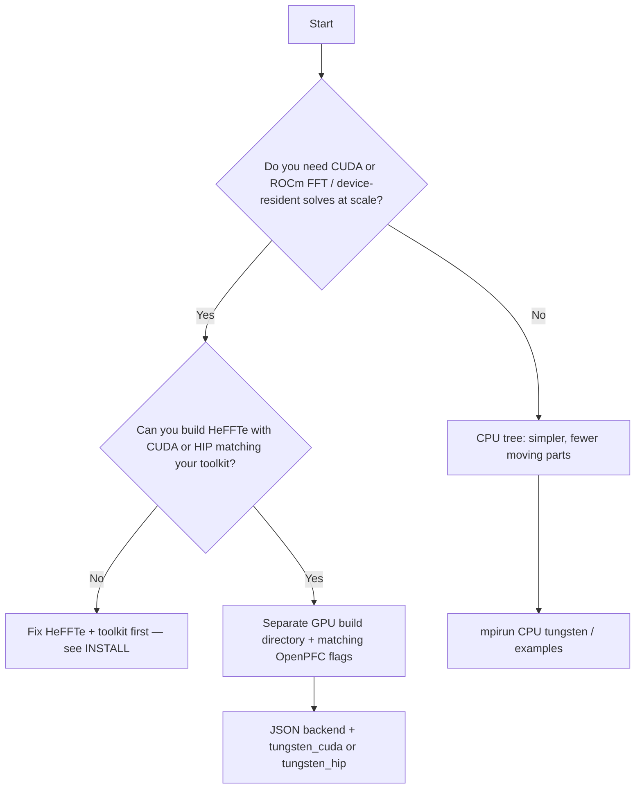

<!--
SPDX-FileCopyrightText: 2026 VTT Technical Research Centre of Finland Ltd
SPDX-License-Identifier: AGPL-3.0-or-later
-->

# GPU vs CPU: choose a path

Use this page to decide **whether you need a GPU build** and how to run **one** successful GPU-capable binary without mixing toolchains.

## Decision tree

- **Stick to CPU** if you are learning the framework, debugging physics, or your cluster does not expose GPUs consistently. The **same** spectral APIs exist; only the FFT backend and runtime differ.  
- **Move to GPU** when you have a **HeFFTe build** with CUDA or ROCm enabled that matches your `nvcc` / ROCm stack, and you use shipped GPU binaries (`tungsten_cuda`, `tungsten_hip`) or your own code paths that pull in device FFT.

## Preconditions (all must align)

| Piece | Rule |
|-------|------|
| MPI | Same implementation for OpenPFC, HeFFTe, and `mpirun` ([`INSTALL.md`](../../INSTALL.md)). |
| HeFFTe | GPU-enabled build (e.g. `2.4.1-cuda` / ROCm variant) on `CMAKE_PREFIX_PATH`. |
| OpenPFC | `-DOpenPFC_ENABLE_CUDA=ON` or `-DOpenPFC_ENABLE_HIP=ON` in a **fresh** GPU build dir ([`build_cpu_gpu.md`](build_cpu_gpu.md)). |

## Golden path (after CPU works)

1. Keep your working **CPU** tree (`build-cpu`).  
2. Create **`build-gpu`** (or `build-hip`) and configure with GPU flags + correct `CMAKE_PREFIX_PATH` to the GPU HeFFTe prefix ([`build_cpu_gpu.md`](build_cpu_gpu.md)).  
3. Run the GPU quickstart: [`tutorials/gpu_app_quickstart.md`](../tutorials/gpu_app_quickstart.md) (`backend` in JSON, `tungsten_cuda` / `tungsten_hip`).  
4. Compare log shapes to CPU: [`example_run_output.md`](../reference/example_run_output.md).

## See also

- [`build_options.md`](../reference/build_options.md) — CMake reference  
- [`INSTALL.LUMI.md`](INSTALL.LUMI.md) — ROCm / LUMI-G example  
- [`spectral_stack.md`](../concepts/spectral_stack.md) — where FFT sits in the stack  
