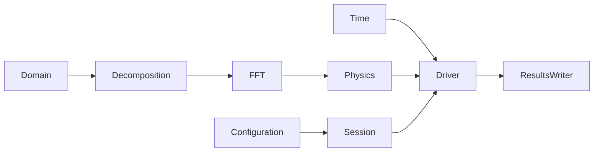

<!--
SPDX-FileCopyrightText: 2026 VTT Technical Research Centre of Finland Ltd
SPDX-License-Identifier: AGPL-3.0-or-later
-->

# Tour of main types

This page maps the primary OpenPFC concepts to their responsibilities, headers,
and runnable examples. It is a lookup-oriented bridge between tutorials and the
generated API reference, not an exhaustive inventory of implementation types.

For dependency rules, read
[`architecture.md`](../concepts/architecture.md). For configuration-driven
application wiring, read
[`app_pipeline.md`](../user_guide/app_pipeline.md).

## Core spectral workflow

The shortest useful mental model is:

1. `Domain` describes the global grid.
2. `Decomposition` partitions it across MPI ranks.
3. an FFT implementation transforms local field data;
4. physics callables / ETD systems define the update;
5. `pfc::sim::run` / `SimulationDriver` (or an ETD session) advances `Time` and writers;
6. JSON sessions (`TungstenETDSession`, `AluminumETDSession`, `make_simulation_session`) build that stack from configuration.

`World` remains as the deprecated A0 wrapper over `Domain` + `Box3i`. Virtual `Model`, `Simulator`, and `App<Model>` are deleted. Production apps and examples 04/05/10/12 do not subclass `Model`.

## Stable concepts at a glance

| Type or concept | Responsibility | Primary header | Start with |
|-----------------|----------------|----------------|------------|
| `Domain` | Global grid size, spacing, origin, and periodicity | `openpfc/kernel/data/domain.hpp` | `examples/02_domain_decomposition.cpp` |
| `Box3i` | Inclusive integer bounds for local or transformed regions | `openpfc/kernel/data/box.hpp` | `examples/02_domain_decomposition.cpp` |
| `Decomposition` | MPI partition and per-rank inbox/outbox geometry | `openpfc/kernel/decomposition/decomposition.hpp` | `examples/03_parallel_fft.cpp` |
| `IHostFFT` / `CPUFFT` | Distributed host forward/backward transforms through HeFFTe | `openpfc/kernel/fft/fft.hpp` | `examples/03_parallel_fft.cpp` |
| Physics / ETD system | Fields and the time-step update (no `Model` base) | `tungsten_physics.hpp`, `aluminum_physics.hpp`, `spectral_mean_field_etd.hpp` | `examples/04_diffusion_model.cpp` |
| `Time` | Start, stop, step size, current time, and save cadence | `openpfc/kernel/simulation/time.hpp` | `examples/time.cpp` |
| `pfc::sim::run` / `SimulationDriver` | Time loop over physics `step` plus optional IC/BC/save hooks | `openpfc/kernel/simulation/simulation_driver.hpp` | `examples/05_simulator.cpp` |
| Host-buffer IC | Initial conditions written onto `Field` (JSON or a callable) | app `*_field_modifiers.hpp` | `examples/10_ui_register_ic.cpp` |
| `ResultsWriter` | Stable interface for persisted simulation fields | `openpfc/kernel/simulation/results_writer.hpp` | `examples/11_write_results.cpp` |
| `FileResultsWriter` | File sink with increment path templating | `openpfc/frontend/io/file_results_writer.hpp` | `BinaryWriter`, `VTKWriter` |
| `World` | Deprecated A0 adapter around `Domain` | `openpfc/kernel/data/world.hpp` | `examples/world_strong_types_example.cpp` uses `Domain` |
| `SpectralCPUStack` | Owns the CPU domain, decomposition, FFT, and field stack | `openpfc/kernel/simulation/stacks/spectral_cpu_stack.hpp` | `user_guide/app_pipeline.md` |
| `GPUSpectralStack` | Device FFT stack; JSON `plan_options` overlay like CPU | `openpfc/runtime/gpu/gpu_spectral_stack.hpp` | `tungsten_cuda`, session-matrix-cuda |
| `SimulationSession<Stack>` | Method × backend session: selection, Time, and a stack | `openpfc/kernel/simulation/simulation_session.hpp` | `user_guide/app_pipeline.md` |
| JSON session factory | `make_simulation_session<Stack>` from `method`/`backend` JSON | `openpfc/frontend/ui/from_json_simulation_session.hpp` | `user_guide/app_pipeline.md` |

Use the [integrated C++ API reference](../api/index.md) for exact constructors,
overloads, namespaces, and member documentation.

## Data and execution

OpenPFC separates logical fields from execution and memory backends.

| Concept | Role | Location |
|---------|------|----------|
| `Field` / local field containers | Associate local values with domain and decomposition information | `kernel/data`, `kernel/field` |
| `DataBuffer` | Own host or device storage selected by backend type | `kernel/execution`, GPU specializations under `runtime/` |
| memory spaces | Express host versus device residency | `kernel/execution`, `runtime/gpu` |
| `deep_copy` (buffer fill) | Fill device `DataBuffer` without a host staging vector | `runtime/gpu/deep_copy_gpu.hpp` |

GPU execution requires a matching CUDA or HIP build and the corresponding
runtime headers. Build decisions are documented in
[`../hpc/gpu_path_decision.md`](../hpc/gpu_path_decision.md).

## Finite-difference types

Finite-difference applications choose a field/halo layout according to whether
the data must also remain FFT-compatible.

| Concept | Use |
|---------|-----|
| in-place halo exchange | Compact FD-only arrays whose boundary slabs may hold ghosts |
| separated halo exchange | FFT-safe core arrays with separate face buffers |
| `PaddedBrick<T>` | Owned cells plus a contiguous ghost ring for direct stencil indexing |
| sparse halo exchange | Explicit remote-index lists and structured separated halos |
| FD gradients and stencils | Per-cell differential operators and reusable coefficients |

Start with `examples/15_finite_difference_heat.cpp` and
[`../concepts/halo_exchange.md`](../concepts/halo_exchange.md).

## Configuration and extension catalogs

The frontend maps configuration names to concrete behavior through catalogs and
wiring helpers.

| Concept | Responsibility |
|---------|----------------|
| parameter metadata and validation | Check required keys, types, bounds, units, and typical values |
| field-modifier catalog | Map configuration names to initial/boundary modifier factories |
| results-writer catalog | Map `fields[].writer` names to writer factories |
| JSON wiring context/session | Hold the objects required to connect configuration to a simulator |
| spectral stack factory | Merge backend and HeFFTe plan options into a concrete FFT stack |

These are extension mechanisms rather than first-day concepts. Follow
[`../tutorials/custom_app_minimal.md`](../tutorials/custom_app_minimal.md) and
[`../extending_openpfc/README.md`](../extending_openpfc/README.md) before using
them directly.

## Advanced subsystems

OpenPFC also contains stable subsystem contracts that are best learned from
their focused documentation rather than from one expanding type table.

| Subsystem | Read |
|-----------|------|
| time integration and adaptive stepping | simulation stepper headers and generated API reference |
| solver contracts and spectral diagonal solves | solver headers under `kernel/simulation` and unit tests |
| checkpoint state and atomic publication | `docs/development/checkpoint_state_capture.md` and `checkpoint_publish.md` (`CheckpointService` loader) |
| external coupling | [`../extending_openpfc/external_coupling.md`](../extending_openpfc/external_coupling.md) |
| profiling sessions and export | [`../hpc/performance_profiling.md`](../hpc/performance_profiling.md) |
| profiling file schema | [`../hpc/profiling_export_schema.md`](../hpc/profiling_export_schema.md) |
| result formats | [`../user_guide/io_results.md`](../user_guide/io_results.md) |
| binary field layout | [`binary_field_io_spec.md`](binary_field_io_spec.md) |

Application-private workspaces and temporary migration adapters are intentionally
excluded from this page. They remain discoverable through their application
headers, tests, and generated API documentation without becoming part of the
core learning path.

## Find a runnable example

| Goal | Example or guide |
|------|------------------|
| inspect domain decomposition | `02_domain_decomposition` |
| perform a distributed FFT | `03_parallel_fft` |
| implement a small spectral model | `04_diffusion_model` |
| understand simulator orchestration | `05_simulator` |
| register a custom initial condition | `10_ui_register_ic` |
| write result files | `11_write_results` |
| inspect a Cahn-Hilliard workflow | `12_cahn_hilliard` |
| add a custom field initializer | `14_custom_field_initializer` |
| run finite differences with halos | `15_finite_difference_heat` |
| add a coordinate system | `17_custom_coordinate_system` |

The complete catalog and suggested curriculum are in
[`examples_catalog.md`](examples_catalog.md).

## See also

- [`../learning_paths.md`](../learning_paths.md) — role-based reading order
- [`../concepts/spectral_stack.md`](../concepts/spectral_stack.md) — spectral
  data flow
- [`../user_guide/app_pipeline.md`](../user_guide/app_pipeline.md) —
  configuration to `Simulator`
- [`api_examples_walkthrough.md`](api_examples_walkthrough.md) — curated API
  examples
- [`../getting_started/01-basics/README.md`](../getting_started/01-basics/README.md)
  — out-of-tree consumer tutorial
- [`../extending_openpfc/README.md`](../extending_openpfc/README.md) — extension
  checklist
