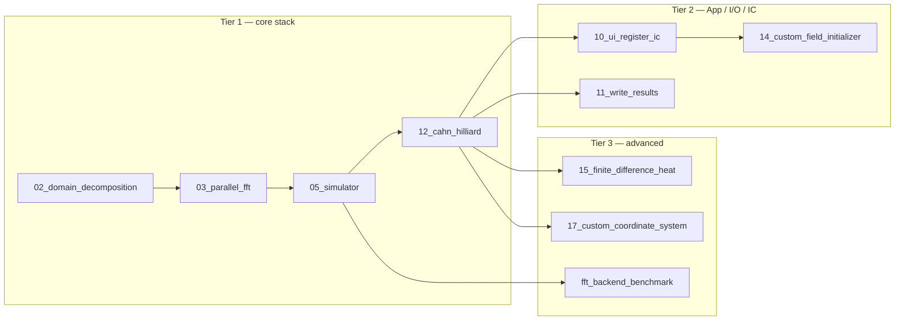

<!--
SPDX-FileCopyrightText: 2026 VTT Technical Research Centre of Finland Ltd
SPDX-License-Identifier: AGPL-3.0-or-later
-->

# Examples catalog

Executables are built when `OpenPFC_BUILD_EXAMPLES=ON` (default). Output directory is typically `<build>/examples/` (exact path depends on the CMake generator and multi-config toolchains).

Prerequisites: Most examples need MPI and a working HeFFTe-linked OpenPFC build. Run with at least `mpirun -n 1` unless the source states otherwise.

This page is for lookup and for choosing the next small executable to read. If you want a guided first run, use [`../start_here_15_minutes.md`](../start_here_15_minutes.md). If you want the examples in a teaching sequence with more context, use [`../tutorials/spectral_examples_sequence.md`](../tutorials/spectral_examples_sequence.md). The catalog below stays compact so it can answer “what is this target for?” without becoming another tutorial.

## Curriculum (suggested order)

Use the first tier on your first day, then branch by topic. The names are numbered because the source files are intended to be read in roughly that order, not because every user must run every target.

| Tier | Executables | Focus |
|------|-------------|--------|
| **1 — First week** | `02_domain_decomposition`, `03_parallel_fft`, `05_simulator`, `12_cahn_hilliard` | `World`, HeFFTe FFT, `Simulator`, spectral model (matches [`quickstart.md`](../quickstart.md)) |
| **2 — Wiring** | `10_ui_register_ic`, `11_write_results`, `14_custom_field_initializer`, `diffusion_model_with_custom_initial_condition` | JSON-style registration, writers, custom IC |
| **3 — FD / space / tools** | `15_finite_difference_heat`, `17_custom_coordinate_system`, `fft_backend_benchmark`, `profiling_timer_report` | Halos, coordinates, backends, timing |

Narrative companion: [`getting_started/01-basics/README.md`](../getting_started/01-basics/README.md). Ordered **Doxygen** snippets (separate tree): [`api_examples_walkthrough.md`](api_examples_walkthrough.md).

## Full catalog

| Executable | Source | What it demonstrates |
|------------|--------|----------------------|
| `fft_backend_benchmark` | `fft_backend_benchmark.cpp` | FFT backend benchmarking |
| `02_domain_decomposition` | `02_domain_decomposition.cpp` | `World`, `Decomposition`, MPI |
| `03_parallel_fft` | `03_parallel_fft.cpp` | Distributed FFT (HeFFTe) |
| `04_diffusion_model` | `04_diffusion_model.cpp` | Simple spectral diffusion `Model` |
| `05_simulator` | `05_simulator.cpp` | `Simulator`, `Time`, `FieldModifier` |
| `06_multi_index` | `06_multi_index.cpp` | Multi-index utilities |
| `07_array` | `07_array.cpp` | Array helpers |
| `08_discrete_fields` | `08_discrete_fields.cpp` | Discrete field types |
| `09_parallel_fft_high_level` | `09_parallel_fft_high_level.cpp` | Higher-level FFT usage |
| `10_ui_register_ic` | `10_ui_register_ic.cpp` | UI / registration patterns (JSON-oriented) |
| `11_write_results` | `11_write_results.cpp` | Writing simulation results |
| `12_cahn_hilliard` | `12_cahn_hilliard.cpp` | Cahn–Hilliard–style workflow |
| `fft_kspace_helpers_example` | `fft_kspace_helpers_example.cpp` | k-space helpers |
| `mpi_worker` | `mpi_worker.cpp` | MPI worker pattern |
| `mpi_worker_inside_class` | `mpi_worker_inside_class.cpp` | MPI worker encapsulated in a class |
| `mpi_timers` | `mpi_timers.cpp` | MPI timing |
| `profiling_timer_report` | `profiling_timer_report.cpp` | Profiling / timer reporting |
| `time` | `time.cpp` | Time-stepping utilities |
| `write_results` | `write_results.cpp` | Results I/O variant |
| `diffusion_model_with_custom_initial_condition` | `diffusion_model_with_custom_initial_condition.cpp` | Diffusion + custom IC |
| `json_read` | `json_read.cpp` | Standalone nlohmann JSON read (does not link `OpenPFC`) |
| `world_helpers_example` | `world_helpers_example.cpp` | `World` helpers |
| `14_custom_field_initializer` | `14_custom_field_initializer.cpp` | Custom field initializer |
| `15_finite_difference_heat` | `15_finite_difference_heat.cpp` | Finite-difference heat (separated halos); see [`halo_exchange.md`](../concepts/halo_exchange.md) |
| `16_strong_types_demo` | `16_strong_types_demo.cpp` | Strong typing demo |
| `17_custom_coordinate_system` | `17_custom_coordinate_system.cpp` | Custom coordinate setup |
| `world_strong_types_example` | `world_strong_types_example.cpp` | Strong types with `World` |

## Sources not built by default

`examples/01_hello_world/world.cpp` is used as a Doxygen tutorial source; the matching `add_executable` in `examples/CMakeLists.txt` is commented out. Other `.cpp` files may exist under `examples/` without a CMake target—check `examples/CMakeLists.txt` for the authoritative list.

## See also

- [`quickstart.md`](../quickstart.md) — suggested order for the first runs
- [`getting_started/01-basics/README.md`](../getting_started/01-basics/README.md) — narrative tutorial
- [`api_examples_walkthrough.md`](api_examples_walkthrough.md) — `docs/api/examples/` in reading order
- [`tutorials/README.md`](../tutorials/README.md) — VTK, HeFFTe `plan_options`, spectral sequence, …
- [`api/examples/`](../api/examples) — sources pulled into the HTML docs
