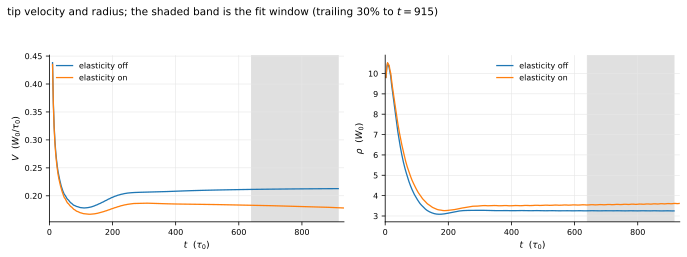

# Thermo-solutal-elastic dendritic solidification {#sec-alloy-dendrite}

`apps/alloy_dendrite_elastic` — a quantitative dilute-alloy phase field
coupled to solute, to temperature through latent heat, and to quasi-static
elasticity through a composition- and temperature-dependent eigenstrain, with
the elastic energy feeding back into the phase-field driving force.

Every other application in this report solves one physics with one
discretisation. This one solves four fields with two, and that is the reason
it is here: the local solidification dynamics run on high-order finite
differences with a halo exchange, while mechanical equilibrium — which is
elliptic and therefore global — is solved spectrally on the same
decomposition in the same time step. **Local FD physics and a global FFT
solve, coupled, in one application.**

## Physical setting

Pour a dilute aluminium–copper melt into a mould and cool it. Solid nucleates,
and because the solid dissolves less copper than the liquid does — the
partition coefficient is $k \approx 0.14$, so it takes about one atom in seven
— every advancing interface pushes copper ahead of itself. The rejected solute
depresses the local freezing point, which slows the interface, which is a
*stabilising* feedback for a flat front and a *destabilising* one for a bumpy
one: a protrusion reaches into melt that has not yet been enriched, so it
grows faster, so it protrudes further. That is the Mullins–Sekerka instability [@Mullins1964],
and dendrites are what it produces once the anisotropy of the interfacial
energy has selected which directions the arms point in.

Two further couplings matter, and both of them are usually left out.

**Latent heat.** Solidifying releases heat, the heat warms the melt the arm is
growing into, and the warmed melt is harder to solidify. In a dilute alloy at
these growth rates the solute field is the slower and therefore the
rate-controlling one, but the thermal field is not passive: it is the reason
the tip of a real dendrite is not simply the solutal prediction.

**Misfit stress.** This is the one that is almost always left out. Copper is
the smaller atom, so a copper-rich aluminium lattice is a *contracted*
lattice: the Vegard slope of the dilute fcc solid solution is about
$-0.0175$ Å per at% Cu against a lattice parameter of 4.05 Å. The solid that
freezes at a dendrite tip and the solid that freezes in the grooves between
arms therefore have different compositions, hence different natural lattice
spacings, hence they do not fit together. They are welded into one crystal
anyway, and the crystal carries the resulting stress. Thermal contraction adds
a second, co-located eigenstrain. The stored elastic energy is a real
contribution to the free energy of the solid, and a phase field that does not
account for it is asserting that it is negligible rather than measuring it.

Whether it is negligible is a quantitative question with a clean answer. One
unit of the dimensionless supersaturation $U$ is worth a chemical
free-energy density
$f_{\mathrm{ref}} = L\,\Delta T_0 / T_M \approx 1.4\times10^{7}\,\mathrm{J\,m^{-3}}$
for this alloy, four orders of magnitude below the elastic constants. Elastic
energy scales as $\tfrac{1}{2} C \varepsilon^{*2}$, so it reaches
$f_{\mathrm{ref}}$ at an eigenstrain of only
$\varepsilon^{*} \sim \sqrt{2 f_{\mathrm{ref}}/C} \approx 5\times10^{-4}$ —
well inside the range this alloy's solute partitioning produces. **The
coupling is not small, and the reason it is usually dropped is that solving
for it is expensive, not that it does not matter.**

The question this chapter asks is therefore: *does the elastic energy of the
solutal and thermal misfit measurably change a dendrite, and by how much?*

## Governing equations

The complete system, in the non-dimensionalisation of the quantitative
dilute-alloy phase field: lengths in the interface width $W_0$, times in the
relaxation time $\tau_0$. The fields are the phase field
$\phi \in [-1, 1]$ ($+1$ solid, $-1$ liquid), the dimensionless
supersaturation $U$, the dimensionless undercooling $\theta$, and the
displacement $\mathbf{u}$.

::: {.callout-note appearance="simple"}
Nothing below is abbreviated for presentation. This is the system the code
integrates, symbol for symbol; the mapping to the source is in
@tbl-ad-provenance.
:::

### Anisotropy

With $\mathbf{n} = \nabla\phi/|\nabla\phi|$ the interface normal, the cubic
($\langle 100 \rangle$) anisotropy function and the width and relaxation time
it modulates are

$$
a_s(\mathbf{n}) = (1 - 3\epsilon_4)
  \left[ 1 + \frac{4\epsilon_4}{1 - 3\epsilon_4}
     \left(n_x^4 + n_y^4 + n_z^4\right) \right],
\qquad
W(\mathbf{n}) = W_0\, a_s, \qquad
\tau(\mathbf{n}) = \tau_0\, a_s^2 .
$$ {#eq-ad-aniso}

The normalisation is load-bearing rather than cosmetic. In two dimensions
$n_x^4 + n_y^4 = (3 + \cos 4\vartheta)/4$, so @eq-ad-aniso collapses to
$a_s = 1 + \epsilon_4 \cos 4\vartheta$ *exactly*: $\epsilon_4$ is then the
anisotropy strength of the selection theory, $a_s$ averages to one over
orientation, and published values transfer directly. The un-normalised
$a_s = 1 + \epsilon_4 \sum n_i^4$ that an earlier revision of this application
used has an effective strength of $(\epsilon_4/4)/(1 + 0.75\epsilon_4)$ —
about a quarter of nominal — so the literature's $\epsilon_4 = 0.02$ behaves
like $0.005$ and grows a blob instead of a dendrite.

### Phase field

$$
\tau(\mathbf{n})\, \partial_t \phi =
   \nabla\!\cdot\!\left[ W(\mathbf{n})^2 \nabla\phi \right]
 + \sum_i \partial_i \left[ |\nabla\phi|^2\, W(\mathbf{n})
        \frac{\partial W}{\partial(\partial_i\phi)} \right]
 + \phi - \phi^3
 - \lambda\,(1-\phi^2)^2 \left( U + M_c\,\theta \right)
 - \lambda_{\mathrm{el}}\,(1-\phi^2)^2
        \frac{\partial f_{\mathrm{el}}}{\partial \phi} .
$$ {#eq-ad-phi}

The first two terms are the anisotropic gradient energy and the
Cahn–Hoffman flux that goes with it; the third is the double well; the fourth
is the chemical and thermal driving force; the fifth is the elastic feedback
this chapter exists to measure. The $(1-\phi^2)^2$ weight localises the
driving force to the interface and is what makes the bulk phases exact
solutions of the double well at any $U$ and $\theta$.

### Solute

Conserved form, with the anti-trapping current $\mathbf{j}_{\mathrm{at}}$ that
removes the spurious solute trapping a diffuse interface would otherwise
produce:

$$
\partial_t \left[ P(\phi)\, U \right]
  = \nabla\!\cdot\!\left[ D_l\, q(\phi) \nabla U
        + \mathbf{j}_{\mathrm{at}} \right]
    + \tfrac{1}{2}\, \partial_t \phi ,
$$ {#eq-ad-u}

$$
P(\phi) = \frac{(1+k) - (1-k)\phi}{2}, \qquad
q(\phi) = \frac{1-\phi}{2}, \qquad
\mathbf{j}_{\mathrm{at}} = \frac{W_0}{2\sqrt{2}}
    \left[ 1 + (1-k)U \right] \partial_t\phi \,
    \frac{\nabla\phi}{|\nabla\phi|} .
$$ {#eq-ad-at}

The pairing of the conservative left-hand side with the source
$\tfrac{1}{2}\partial_t\phi$ is not interchangeable with the
non-conservative form. Substituting
$\partial_t[PU] = P\,\partial_t U + U\,\partial_t P$ with
$\partial_t P = -\tfrac{1-k}{2}\partial_t\phi$ cancels the $(1-k)U$ term
that the non-conservative source carries. Running the mismatched pair — the
conservative left side with the non-conservative source — breaks solute
conservation by 10% and biases the effective partition coefficient by 15–34%.
That is a measurement made during development, not an argument.

### Temperature

$$
\partial_t \theta = D_{\mathrm{th}} \nabla^2 \theta
    + \tfrac{1}{2}\, \partial_t \phi .
$$ {#eq-ad-theta}

The source is the latent heat, normalised so that a full transformation
$\phi: -1 \to +1$ raises $\theta$ by exactly one. On a periodic domain
@eq-ad-theta integrates to
$\mathrm{d}\langle\theta\rangle/\mathrm{d}t
 = \tfrac12\,\mathrm{d}\langle\phi\rangle/\mathrm{d}t$:
**the box has no heat sink**: the melt warms in exact proportion to the
solidified fraction and the undercooling that drives growth is consumed as
growth proceeds. That is the reason the Stage-2 selection measurement below
is run isothermally, and @sec-ad-latent is what happens when the temperature
field is switched on.

### Mechanical equilibrium

Quasi-static: there is no time derivative, so the displacement is slaved to
the instantaneous $\phi$, $U$ and $\theta$.

$$
\nabla\!\cdot\!\boldsymbol{\sigma} = 0, \qquad
\boldsymbol{\sigma} = \mathsf{C}(\phi) :
   \left( \boldsymbol{\varepsilon}(\mathbf{u}) - \boldsymbol{\varepsilon}^{*} \right),
\qquad
\varepsilon_{ij}(\mathbf{u}) = \tfrac{1}{2}
   \left( \partial_i u_j + \partial_j u_i \right) ,
$$ {#eq-ad-equil}

with the eigenstrain and the interpolated stiffness

$$
\varepsilon^{*}_{ij} = h(\phi)
  \left[ \varepsilon_c \left( U - U_{\mathrm{ref}} \right)
       + \varepsilon_T \left( \theta - \theta_{\mathrm{ref}} \right) \right]
  \delta_{ij},
\qquad
h(\phi) = \frac{1+\phi}{2},
$$ {#eq-ad-eigen}

$$
\mathsf{C}(\phi) = \mathsf{C}_{\mathrm{solid}}\, h(\phi)
   + \mathsf{C}_{\mathrm{liquid}} \left( 1 - h(\phi) \right) .
$$ {#eq-ad-stiff}

The eigenstrain is purely dilatational and lives in the solid, which is what
$h(\phi)$ enforces: a liquid has no reference lattice to misfit against.

### Elastic energy and the feedback term

$$
f_{\mathrm{el}} = \tfrac{1}{2}
  \left( \boldsymbol{\varepsilon} - \boldsymbol{\varepsilon}^{*} \right) :
  \mathsf{C} :
  \left( \boldsymbol{\varepsilon} - \boldsymbol{\varepsilon}^{*} \right) ,
$$ {#eq-ad-fel}

$$
\frac{\partial f_{\mathrm{el}}}{\partial \phi}
  = -\,\boldsymbol{\sigma} : \frac{\partial \boldsymbol{\varepsilon}^{*}}{\partial \phi}
    + \tfrac{1}{2}
      \left( \boldsymbol{\varepsilon} - \boldsymbol{\varepsilon}^{*} \right) :
      \frac{\partial \mathsf{C}}{\partial \phi} :
      \left( \boldsymbol{\varepsilon} - \boldsymbol{\varepsilon}^{*} \right) .
$$ {#eq-ad-dfel}

Both terms are kept. The first is the transformation-work term and dominates;
the second is the modulus-contrast term, and it is the one that makes the
solve *inhomogeneous* and therefore iterative. Differentiating at frozen
strain is legitimate because the strain is at mechanical equilibrium, so
$\delta F/\delta \mathbf{u} = -\nabla\!\cdot\!\boldsymbol{\sigma} = 0$ and the
partial derivative is the total variational derivative; the unit tests check
that against a finite difference of the *re-converged* energy rather than
assuming it.

### How the elastic problem is actually solved

@eq-ad-equil with a $\phi$-dependent stiffness has no closed form. It is
solved by the Khachaturyan–Shatalov Fourier Green-operator method
[@Khachaturyan1983] extended to inhomogeneous moduli in the manner of Hu and
Chen [@Hu2001]. Choose a homogeneous
reference stiffness $\mathsf{C}_0$ (the Voigt average of solid and liquid) and
define the polarisation

$$
\boldsymbol{\tau}_{\mathrm{pol}}
  = \boldsymbol{\sigma} - \mathsf{C}_0 : \boldsymbol{\varepsilon}
  = \left( \mathsf{C} - \mathsf{C}_0 \right) :
    \left( \boldsymbol{\varepsilon} - \boldsymbol{\varepsilon}^{*} \right)
    - \mathsf{C}_0 : \boldsymbol{\varepsilon}^{*} .
$$ {#eq-ad-pol}

The second term is the drive and must not be dropped: without it the
polarisation vanishes identically when $\mathsf{C} = \mathsf{C}_0$, which
would predict zero strain for a misfitting inclusion in a homogeneous medium.
The fixed point is then

$$
\hat{\boldsymbol{\varepsilon}}(\mathbf{k})
  = -\,\hat{\boldsymbol{\Gamma}}(\mathbf{k}) :
     \hat{\boldsymbol{\tau}}_{\mathrm{pol}}(\mathbf{k})
  \quad (\mathbf{k} \neq \mathbf{0}),
\qquad
\hat{\boldsymbol{\varepsilon}}(\mathbf{0}) = \bar{\boldsymbol{\varepsilon}},
$$ {#eq-ad-fixed}

with $\bar{\boldsymbol{\varepsilon}}$ the applied macroscopic strain and
$\boldsymbol{\Gamma}$ the Green operator built from the acoustic tensor of the
reference medium,

$$
\left( G^{-1} \right)_{ik}(\mathbf{k}) = C_{0,ijkl}\, k_j k_l ,
\qquad
\Gamma_{ijkl} = \operatorname{sym}\!\left( k_j\, G_{ik}\, k_l \right) .
$$ {#eq-ad-green}

Each iteration is twelve real transforms (six symmetric components, forward
and back). The plain fixed point converges at a rate set by the modulus
contrast; the Eyre–Milton accelerated scheme [@Eyre1999] replaces that with
$(\sqrt{r}-1)/(\sqrt{r}+1)$ in the contrast $r$ and is the default.

That $\hat{\boldsymbol{\varepsilon}}(\mathbf{0})$ is a *choice* and not a
consequence deserves saying out loud. Setting it to zero clamps the periodic
cell at its mean strain, so a uniformly transforming body develops a uniform
stress whose size grows with the solid fraction and shrinks with the box
volume — which would make the elastic driving force depend on the domain size
and contaminate exactly the domain study @sec-ad-steady needs. The default
here is instead zero mean *stress*, $\bar{\boldsymbol{\varepsilon}} =
\langle \boldsymbol{\varepsilon}^{*} \rangle$, which is a genuinely free body
and is exact for a homogeneous modulus. Both are available and
@sec-ad-sensitivity reports the difference rather than asserting it is small.

### Provenance

Every piece of the system above is taken from the primary literature, not
re-derived.

| Piece | Source |
|---|---|
| Quantitative dilute-alloy phase field; anti-trapping current | @Echebarria2004 |
| Anti-trapping current; thin-interface asymptotics | @Karma2001 |
| Coupled heat and solute | @Ramirez2004 |
| Anisotropy function; thin-interface limit | @Karma1998 |
| Eigenstrain microelasticity; Fourier Green operator | @Khachaturyan1983 |
| Inhomogeneous-modulus iterative FFT solve | @Hu2001 |
| Accelerated fixed point | @Eyre1999 |
| Spherical-inclusion closed form (test oracle) | @Eshelby1957 |

: Provenance of the governing system. {#tbl-ad-provenance}

## Problem setup

Two binaries, one model. `alloy_dendrite_planar` runs the Stage-1 planar
front; `alloy_dendrite_growth` runs the 2-D and 3-D dendrite and the elastic
coupling. Both are `--key=value` driven, and an unknown key is an error rather
than a warning — a typo that silently reverts a parameter to its default is
exactly how a verification application produces a confident wrong answer.

| Item | Description |
|---|---|
| Use case | A single crystalline seed growing into an undercooled, supersaturated dilute alloy melt, with $\langle 100 \rangle$ cubic anisotropy selecting the arm directions and a solutal/thermal eigenstrain loading the solid |
| Domain | $N_x \times N_y \times N_z$ with $\Delta y = \Delta z = \Delta x$; $N_z = 1$ selects the 2-D slab and anything larger the full 3-D brick, from one templated stepper. The shipped 2-D case is $600^2$ at $\Delta x = 0.8\,W_0$, i.e. a $480\,W_0$ box |
| Boundary conditions | Periodic in every direction, for all four fields and for the elastic solve — the Green operator of @eq-ad-green *is* a periodic operator, so this is not a convenience but the condition under which @eq-ad-fixed is the solution |
| Initial condition | $\phi = \tanh\!\left[(R_{\mathrm{seed}} - r)/\sqrt{2}\,W_0\right]$ about the box centre, $U = -\Omega$ and $\theta = 0$ everywhere. $R_{\mathrm{seed}} = 8\,W_0$, comfortably above the critical nucleus $\sim d_0/\Omega$. Deterministic; no noise anywhere, which is what makes elastic-off against elastic-on a controlled experiment rather than two samples of an ensemble |
| Key physical parameters | $k = 0.15$, $D_l = 2$, $\lambda = D_l/a_2 = 3.1913$ (so the kinetic coefficient $\beta$ vanishes), $\Omega = 0.55$, $d_0/W_0 = a_1 a_2 / D_l = 0.277$ — the parameters of the Karma 2001 dilute-alloy benchmark. $\epsilon_4$ is scanned. Elastic constants and misfits are Al–4.5 wt% Cu; see @tbl-ad-material |
| Observables | Tip position, velocity and radius (parabola fit at four independent fit windows), the selection parameter $\sigma^{*} = 2 d_0 D_l / (V\rho^2)$, $V\rho$ against the Ivantsov relation [@Ivantsov1947], solute and enthalpy conservation residuals, and — with the coupling on — the elastic iteration count, $\int f_{\mathrm{el}}\,\mathrm{d}V$, $\max|\partial f_{\mathrm{el}}/\partial\phi|$ and the residual mean pressure |
| Model maturity | numerical verification: **analytical** at Stages 0 and 1 (Eshelby closed form; thin-interface planar relations) and **literature-comparative** at Stage 2 · physical completeness: **coupled** — four fields, two-way in every pair · calibration: **literature material data with stated provenance**, not fitted |

### Material data and how it becomes a dimensionless coupling

The two conversions below are where a coupled elastic phase field is most
easily wrong by orders of magnitude, so they are written out rather than
buried in a constant.

**Stiffness.** @eq-ad-phi is dimensionless. Matching the elastic term against
the chemical term $-\lambda(1-\phi^2)^2 U$ gives
$\lambda_{\mathrm{el}} = \lambda / f_{\mathrm{ref}}$ with
$f_{\mathrm{ref}} = L\,\Delta T_0/T_M$ and
$\Delta T_0 = |m|\, c_l^0 (1-k)$ the freezing range. Equivalently, and this
is how the code does it: **express every stiffness in units of
$f_{\mathrm{ref}}$, and then $\lambda_{\mathrm{el}} = \lambda$ is the
calibrated coupling.** A $\lambda_{\mathrm{el}} \neq \lambda$ is then an
explicit statement that the coupling is being scaled away from its calibrated
value — legitimate in a sensitivity scan, and impossible to do by accident.

**Eigenstrain.** $\varepsilon_c$ is $\partial\varepsilon^{*}/\partial U$, not
$\partial\varepsilon^{*}/\partial c$. One unit of $U$ is a composition change
of $(1-k)c_l^0$, so
$\varepsilon_c = a^{-1}(\mathrm{d}a/\mathrm{d}c)\,(1-k)\,c_l^0$. Omitting that
factor is a two-order-of-magnitude error in the elastic energy.
$\varepsilon_T = \alpha_L L/c_p$, because $\theta$ is scaled by the
hypercooling.

| Quantity | Value | Source |
|---|---|---|
| $T_M$ (pure Al) | 933.47 K | @Haynes2016 |
| $L$ (per mass / per volume) | $3.97\times10^{5}$ J kg⁻¹ / $9.43\times10^{8}$ J m⁻³ | @Haynes2016; $\rho = 2375$ kg m⁻³ from @Assael2006 |
| $c_p$ (liquid, near $T_M$) | $1.18\times10^{3}$ J kg⁻¹ K⁻¹ | @Assael2006 |
| $k$, $|m|$ | 0.14, 3.4 K per wt% Cu | Al–Cu phase diagram; the values used throughout the quantitative dilute-alloy literature [@Echebarria2004] |
| $c_0$ | 4.5 wt% Cu (1.97 at%) | alloy choice |
| $a$, $\mathrm{d}a/\mathrm{d}c$ | 4.0496 Å, $-0.0175$ Å per at% Cu | @Haynes2016; Vegard slope [@Vegard1921] **representative**, not assessed here (reported values span $-0.017$ to $-0.018$) |
| $C_{11}, C_{12}, C_{44}$ (300 K) | 108.2, 61.3, 28.5 GPa | @Kamm1964 |
| Softening at $T_M$ | $\times 0.5$ | **representative** extrapolation of @Kamm1964 to 933 K; running the 300 K constants would overstate $f_{\mathrm{el}}$ by about four |
| $\alpha_L$ (solid, near $T_M$) | $3.0\times10^{-5}$ K⁻¹ | **representative** near-melting value |

: Al–4.5 wt% Cu material data. Entries marked *representative* are not assessed for this alloy at this temperature; the elastic energy scales as the square of the Vegard slope, so its stated 6% band is a 12% band in $f_{\mathrm{el}}$. {#tbl-ad-material}

The derived dimensionless couplings are
$f_{\mathrm{ref}} = 1.40\times10^{7}$ J m⁻³,
$\varepsilon_c = -7.29\times10^{-3}$ per unit $U$ and
$\varepsilon_T = +1.01\times10^{-2}$ per unit $\theta$. The two misfits have
opposite sign, which is physically right and worth noticing: solute rejection
contracts the freezing solid while the latent heat it releases expands it.

### Numerics

- $\phi$, $U$ and $\theta$: high-order central finite differences (orders 2
  to 14 are available), halo width $\mathrm{order}/2$, **explicit Euler** in
  time. Euler is not a placeholder — it is what makes the discrete solute
  identity behind @eq-ad-u exact to round-off. A multi-stage scheme would need
  that identity re-derived per stage.
- Three limits bound $\Delta t$ and all three are enforced: the diffusive von
  Neumann limit on $D_l$ and $D_{\mathrm{th}}$, the phase-field relaxation
  $\tau(\mathbf{n})$, and the interface CFL $\Delta x / V$. The third is the
  one that is easy to miss, and it is what keeps the discrete
  $\partial_t\phi$ that drives the anti-trapping current resolved.
- Elasticity: HeFFTe on the **same decomposition** as the finite-difference
  stack. The application refuses to run if the FD owned box and the FFT
  real-space inbox differ, because the two are copied index-for-index and a
  mismatch would be invisible on one rank and wrong on every other.
- The elastic solve runs every `n_el_substep` phase-field steps. It is
  quasi-static — the acoustic time scale is ten or more orders of magnitude
  below $\tau_0$ for any metal — so lagging it is not a physical relaxation
  error at all, only a staleness of $\partial f_{\mathrm{el}}/\partial\phi$
  bounded by $N\Delta t\,|V|\,|\nabla(\partial f_{\mathrm{el}}/\partial\phi)|$.
  @sec-ad-cost measures what it costs and what it changes.

## Verification ladder {#sec-ad-ladder}

Five stages, each with an oracle that is not the code itself. The rung that
matters for believing the chapter's headline result is Stage 4, and it is
worth nothing without the four below it.

| Stage | What | Oracle | Where |
|---|---|---|---|
| 0 | The elastic solver alone | Closed forms: single-mode Green operator, dilatation identity, Eshelby sphere, $\nabla\!\cdot\!\boldsymbol{\sigma}=0$, $\partial f_{\mathrm{el}}/\partial\phi$ against a finite difference of the *re-converged* energy | `apps/common/tests/test_microelasticity.cpp` |
| 1 | Planar interface, isothermal | Thin-interface velocity, kinetic coefficient and boundary layer; $k_{\mathrm{eff}}$ flat in velocity | @sec-ad-stage1 |
| 2 | 2-D dendrite | Steady tip; box, grid and stencil convergence; $V\rho$ against Ivantsov [@Ivantsov1947] | @sec-ad-steady |
| 3 | 3-D and parallel | CPU/GPU parity; agreement across decompositions | @sec-ad-parallel |
| 4 | Elasticity off against on | A measured change in a dendrite observable, against the run-to-run and measurement noise of Stages 1–3 | @sec-ad-science |

### Stage 0: the elastic solver against closed forms

Thirteen test cases, every oracle derived in the comment above the test that
uses it. The three that are exact to round-off are the single Fourier mode
against the closed-form strain of a homogeneous isotropic medium
($\sim 10^{-14}$), the same against an independently coded $3\times3$
acoustic-tensor solve for cubic symmetry ($\sim 10^{-13}$), and the pointwise
dilatation identity for an arbitrary eigenstrain ($\sim 10^{-13}$). The
Eshelby sphere is limited only by how well a grid represents a sphere. A
homogeneous modulus converges in exactly one iteration — which is a test, not
an observation — and the accelerated scheme's advantage over the plain one
scales as $\sqrt{r}$ in the contrast, as @Eyre1999 predict.

Two of these are worth singling out because they are the ones that would let
a wrong coupling through. $\nabla\!\cdot\!\boldsymbol{\sigma} = 0$ is checked
*spectrally* on the returned stress, so it tests the solution rather than the
iteration that produced it. And $\partial f_{\mathrm{el}}/\partial\phi$ —
@eq-ad-dfel, the only quantity the phase field ever sees — is checked against
a finite difference of the energy **re-converged at the perturbed $\phi$**,
not against the stored strain. That is the difference between verifying the
term and verifying one's own algebra for it.

The liquid shear modulus is a regularisation, not a material property: a
liquid has no shear stiffness and the solve cannot take zero, because two
channels of the local stiffness then become singular and every fixed point in
this family has contraction factor one. Measured cost of the choice, cold
start, $\mathrm{tol} = 10^{-6}$:

| $\mu_l/\mu_s$ | 0.01 | **0.05** | 0.1 |
|---|---:|---:|---:|
| Eyre–Milton iterations | 32 | **16** | 12 |

The default is 0.05, and @sec-ad-sensitivity reports what moving it does to
the dendrite rather than asserting that it does nothing.

### Stage 1: the planar front against thin-interface asymptotics {#sec-ad-stage1}

Isothermal, $512\,W_0$ box, one-dimensional, $\lambda$ chosen so the kinetic
coefficient $\beta$ is deliberately *nonzero* — the thin-interface velocity
relation is vacuous at $\beta = 0$, where $\Omega = 1$ admits any $V$. Four
independent relations are checked at once: $U_i = -\beta V$ (interface
kinetics), $\ell = D_l/V$ (the outer diffusion field), $k_{\mathrm{eff}} = k$
(local equilibrium at the interface), and the steady-state mass balance
$U_\infty = k U_s - 1$. An error in any one term of the model breaks at least
one of them.

| $\Delta x / W_0$ | $V$ err | $\beta$ err | $\ell$ err | $k_{\mathrm{eff}}$ | $k_{\mathrm{eff}}$ err | solute drift | enthalpy drift |
|---:|---:|---:|---:|---:|---:|---:|---:|
| 1.6 | −58.54 % | +963 % | −38.70 % | 0.10835 | −27.76 % | 1.3e−14 | 5.0e−15 |
| 1.2 | −23.07 % | +120 % | −11.88 % | 0.12639 | −15.74 % | 1.4e−15 | 5.8e−15 |
| 0.8 | −1.65 % | +6.3 % | −0.74 % | 0.14927 | −0.49 % | 1.5e−14 | 1.7e−14 |
| 0.6 | −0.19 % | +0.1 % | −0.16 % | 0.15018 | +0.12 % | 3.2e−14 | 3.8e−14 |
| 0.4 | −0.02 % | −0.7 % | −0.09 % | 0.15023 | +0.16 % | 3.4e−13 | 2.6e−13 |

: Stage-1 grid convergence, fourth-order stencils. **Use $\Delta x \le 0.6\,W_0$.** {#tbl-ad-stage1}

The error collapses faster than fourth order between 1.2 and 0.6 because what
is being resolved there is the $\tanh$ interface profile, whose truncation
error in $W_0/\Delta x$ is exponential, not the stencil order. Raising the
order at fixed coarse spacing helps and does not substitute:

| FD order at $\Delta x = 1.2\,W_0$ | 2 | 4 | 6 | 8 |
|---|---:|---:|---:|---:|
| $V$ error | −59.9 % | −23.1 % | −14.7 % | −10.6 % |
| $k_{\mathrm{eff}}$ error | −24.9 % | −15.7 % | −13.2 % | −10.3 % |

#### The anti-trapping current is the sharpest test in the model

$k_{\mathrm{eff}} = k(1 + (1-k)U_s)/(1 + (1-k)U_i)$ is $c_s/c_l^i$ exactly, and
equals $k$ if and only if the freshly formed solid and the extrapolated outer
liquid are at the same chemical potential. There is no solute-drag term in
@eq-ad-u, so there is no Aziz-type [@Aziz1982] velocity-dependent trapping to compare
against: $k_{\mathrm{eff}}$ *is* $k$ by construction, and the test is that the
measured value stays flat as the velocity varies over an eightfold range.

| target $V$ | $\mathrm{at}=1$ (physical) | $\mathrm{at}=0$ (no current) | $\mathrm{at}=-1$ (sign flipped) |
|---:|---:|---:|---:|
| 0.05 | 0.15004 (+0.0 %) | 0.16223 (+8.2 %) | 0.17553 (+17.0 %) |
| 0.10 | 0.15018 (+0.1 %) | 0.17741 (+18.3 %) | 0.21558 (+43.7 %) |
| 0.20 | 0.15132 (+0.9 %) | 0.23686 (+57.9 %) | 0.53684 (+258 %) |
| 0.40 | 0.15260 (+1.7 %) | 0.24806 (+65.4 %) | 0.44469 (+197 %) |

: $k_{\mathrm{eff}}$ against velocity at $\Delta x = 0.6\,W_0$, three models. The columns share a *target* velocity, not a measured one — switching the current off changes the kinetics too, so at a target of 0.20 the measured velocities are 0.199, 0.335 and 0.809. {#tbl-ad-at}

With the current on, $k_{\mathrm{eff}}$ is flat to under 2 % over an
eightfold range in velocity. Without it, $k_{\mathrm{eff}}$ climbs
monotonically with $V$ — the textbook signature of spurious solute trapping.
With the sign flipped it climbs faster still, and one of those runs tripped
the $|\phi| > 1.5$ instability guard. **This is the single most diagnostic
measurement in the model, and it says the current is right.**

The residual is the interface Péclet number $W_0 V / D_l$ showing through.
The thin-interface asymptotics is an expansion in exactly that quantity, so
the residual should be linear in it, and it is:

| $V$ | 0.20 | 0.30 | 0.40 |
|---|---:|---:|---:|
| $W_0 V / D_l$ | 0.10 | 0.15 | 0.20 |
| $k_{\mathrm{eff}}$ bias | +0.88 % | +1.41 % | +1.73 % |
| bias / Péclet | 8.8 | 9.4 | 8.7 |

: The residual partition-coefficient bias is the expansion parameter, not an error. {#tbl-ad-peclet}

#### One box-size trap, since it cost a wrong number

The $V = 0.40$ row above needs a $853\,W_0$ box, and a first pass ran it in
$512\,W_0$ and measured $k_{\mathrm{eff}} = 0.13546$, i.e. $-9.7\%$ — the
wrong *sign* for solute trapping, which is what gave it away. The cause is
not the solute boundary layer, which at $V = 0.40$ is only $D_l/V = 5\,W_0$
and fits anywhere. It is that the front travels $V\,t_{\mathrm{end}} =
240\,W_0$ during the run, and in a $512\,W_0$ periodic box the two fronts
have then consumed most of the melt between them. Re-run at $853$, $1707$ and
$3413\,W_0$ the answer is $0.15260$ in all three, to five digits, and at
$t_{\mathrm{end}} = 150$, $300$ and $600$ it is $0.15238$, $0.15255$ and
$0.15260$. **Size the box by how far the front travels, not by the boundary
layer.**

#### Conservation is a discrete identity, not an approximation

Total solute $\sum [P(\phi)/(1-k) + P(\phi)U]$ and the enthalpy balance
$\sum\theta - \tfrac12\sum\phi$ are exact identities of the scheme, which is
what the explicit Euler step buys. Measured drift over $3\times10^4$ to
$5\times10^5$ steps is $10^{-15}$ to $7\times10^{-13}$ relative — round-off in
a sum over $10^3$–$10^5$ cells, growing with cell count and step count exactly
as a floating-point sum should and with no systematic trend. The same holds in
3-D and for models that are physically *wrong* (the $\mathrm{at}=0$ column
above), because conservation is a property of the discretisation rather than
of the physics. It is therefore a check on the implementation and not
evidence that the model is right — which is worth saying, because a
conservation plot is often presented as though it were the latter.

### Stage 2: a steady tip, and what it takes to get one {#sec-ad-steady}

A selection parameter is only worth quoting if the tip it comes from has
stopped changing, if the box it grew in is not setting the answer, and if the
grid resolves the tip. Those are three separate conditions and the first
revision of this application met none of them.

**The box.** Fixing $\epsilon_4 = 0.02$, $\Delta x = 0.8\,W_0$, fourth order,
and varying the box:

| box ($W_0$) | 320 | 480 | 640 | 800 |
|---|---:|---:|---:|---:|
| $V$ | 0.09001 | 0.08758 | 0.087936 | 0.087936 |
| $\rho$ | 9.852 | 10.044 | 10.0155 | 10.0155 |
| $\mathrm{d}V/V$ over the fit window | −10.3 % | −3.9 % | −2.0 % | −2.0 % |

: Box convergence. 640 and 800 $W_0$ agree to six digits, so the box is not the answer above $640\,W_0$. {#tbl-ad-box}

It is the *reservoir* that sets the box size, not the diffusion length. The
tip radius is $10\,W_0$ and the solute diffusion length $D_l/V \approx 23\,W_0$,
both tiny next to 640; but four arms keep rejecting solute into a closed
domain, and `omega_eff` — the far-field supersaturation the tip actually sees
— is what has to stop moving.

**Steadiness.** At $\epsilon_4 = 0.02$ the residual velocity drift is −2 %
even in a converged box: the tip is still slowly relaxing at $t = 2000$.
Raising the anisotropy fixes it, because a sharper tip reaches its steady
state sooner:

| $\epsilon_4$ | 0.010 | 0.015 | 0.020 | 0.025 | 0.030 | 0.040 | 0.050 |
|---|---:|---:|---:|---:|---:|---:|---:|
| $\mathrm{d}V/V$ | −12.5 % | −6.8 % | −3.9 % | −1.1 % | −0.27 % | **+0.15 %** | +0.15 % |

: Velocity drift across the trailing 30 % of a $t = 2000$ run. $\epsilon_4 \ge 0.03$ is steady. {#tbl-ad-steady}

Everything below therefore uses $\epsilon_4 = 0.04$, which is 4 % anisotropy
in the normalised convention of @eq-ad-aniso and is a physically ordinary
value for a cubic metal.

**Resolution, and why high-order stencils are the cheap way to get it.** In a
$640\,W_0$ box at $\epsilon_4 = 0.04$, refining the grid and raising the
stencil order are two routes to the same converged answer, and they do not
cost the same. Wall times are for a matched $t = 50$ run on 16 ranks of one
`standard` node, so they are directly comparable.

| $\Delta x/W_0$ | order | $V$ | $\rho$ ($1\rho$ window) | $\sigma^{*}$ | wall | relative cost |
|---:|---:|---:|---:|---:|---:|---:|
| 0.80 | 4 | 0.194243 | 3.8983 | 0.37531 | 9.0 s | 1.0 |
| 0.80 | 6 | 0.208537 | 3.6508 | 0.39860 | 9.1 s | 1.0 |
| 0.80 | 8 | 0.212221 | 3.5913 | 0.40475 | 11.0 s | 1.2 |
| 0.80 | 10 | 0.213529 | 3.5704 | 0.40699 | 12.3 s | 1.4 |
| 0.80 | 12 | **0.214104** | 3.5618 | 0.40787 | 13.2 s | **1.5** |
| 0.65 | 4 | 0.208069 | 3.6123 | 0.40805 | 15.7 s | 1.8 |
| 0.50 | 4 | 0.212722 | 3.3960 | 0.45158 | 51.9 s | 5.8 |
| 0.40 | 4 | **0.214287** | — | — | 147.1 s | **16.4** |
| 0.32 | 4 | — | — | — | 399.3 s | 44.5 |

: Grid spacing against stencil order at fixed $640\,W_0$ box, $\epsilon_4 = 0.04$. Wall times are a matched $t = 50$ run on 16 ranks of one `standard` node, at the corrected step limit. {#tbl-ad-order}

Two things read off this.

First, **fourth order at $\Delta x = 0.8\,W_0$ is 10 % wrong in the tip
velocity** — the quantity a selection measurement is built from — and nothing
about the run looks wrong. The drift is 0.09 %, the conservation residual is
$10^{-13}$, the tip is a clean parabola, the anti-trapping current is doing
its job. Resolution error in this model does not announce itself, and the
only way to find it is to refine something and look.

Second, the two routes to convergence cost very differently. Order 12 at
$\Delta x = 0.8$ gives $V = 0.21410$; order 4 at $\Delta x = 0.4$ gives
$0.21429$, agreeing to 0.09 %. The first costs $1.5\times$ the baseline run
and the second $16.4\times$ — an **11-fold saving for the same answer**. The
reason is dimensional: halving $\Delta x$ multiplies the cell count by $2^d$
and the step count by 4, while widening the stencil multiplies neither. For a
model whose expensive length scale is the *interface* rather than the domain,
**buy resolution with the stencil, not with the grid.** (@sec-scal-methods
makes the same comparison against a spectral solve on a different model; the
crossover there and the saving here are the same arithmetic seen twice.)

::: {.callout-warning appearance="simple"}
## The step limit was not order-aware, and the cost table above is why it matters

`explicit_dt_limit` returned the second-order von Neumann bound
$\Delta x^2/(2 d D)$ for every stencil. That bound corresponds to a Nyquist
eigenvalue of 4, which is the order-2 Laplacian's; the true eigenvalue of the
order-$p$ central second derivative rises with $p$ — 4, 5.33, 6.04, 6.42,
6.68, 6.87 for orders 2 to 12, tending to $\pi^2$ — so at order 12 the
function authorised a step 1.7 times larger than the scheme can take.

No number in this chapter is affected: every run used a safety factor of 0.2,
so even at order 12 the effective factor was 0.34. But a user at
$\mathrm{safety} = 0.8$ and order 12 would have diverged while the guard said
the step was legal. It is fixed, computed from the same coefficient table the
stepper differentiates with so that it cannot drift out of sync, and the
consequence for @tbl-ad-order is that order 12 now takes 1.7 times as many
steps — which narrows the high-order advantage without reversing it.
:::

**And the tip radius is ambiguous, honestly so.** At $\epsilon_4 = 0.04$ the
tip radius is about $3.6\,W_0$, and the fit windows at 0.5, 1, 1.5 and 2 tip
radii disagree by 36–54 %. That spread does *not* shrink under grid
refinement (48.9 % at $\Delta x = 0.5$, 49.0 % at 0.4, while $V$ converges to
0.7 %), which is how one knows it is not a discretisation error: a
high-anisotropy tip simply stops being a paraboloid within about one radius
of the apex, and the two-radius window is already on the flank.

The consequence is stated rather than hidden: **$\sigma^{*}$ from this
application carries a systematic uncertainty of order $\pm$50 % from the
radius definition alone**, because $\sigma^{*} \propto \rho^{-2}$. What it
does *not* carry is a run-to-run uncertainty — the model is deterministic and
two runs of the same case agree bitwise — which is why the Stage-4 comparison
below, which is a ratio of two $\sigma^{*}$ measured the same way, is
meaningful to far better than 50 %.

### Stage 3: three dimensions, and the same answer on any decomposition {#sec-ad-parallel}

**Decomposition consistency.** The finite-difference fields are bitwise
rank-independent: the stencil is evaluated in the same order everywhere and
the halo carries exact copies, so $\phi$, $U$ and $\theta$ from a one-rank
run are byte-for-byte the files from a four-rank run. The elastic fields
cannot be, and it is worth being precise about why: HeFFTe composes a
different sequence of transforms and transposes for each process grid, so the
same answer is reached by a different rounding path. A byte comparison
therefore reports every elastic file as differing and tells one nothing. What
matters is the size of the difference and *where* it sits.

| field | $\phi$ | $U$ | $f_{\mathrm{el}}$ | $\partial f_{\mathrm{el}}/\partial\phi$ | $\mathrm{tr}\,\sigma/3$ | $\sigma_{\mathrm{vM}}$ |
|---|---:|---:|---:|---:|---:|---:|
| rel. max-norm, 1 rank vs 4 | 1.7e−15 | 9.9e−15 | 1.7e−14 | 2.7e−14 | 2.7e−14 | 7.6e−15 |

: Decomposition consistency over 375 coupled steps. Every maximum sits on the interface, not on a subdomain boundary — which is the other half of the statement, and is what separates round-off from a seam bug. {#tbl-ad-decomp}

**A symmetry the code was never told about.** The model is invariant under
$x \leftrightarrow y$, and nothing in the implementation enforces it: the
stencils are applied axis by axis, the r2c transform treats $x$ as the
half-complex axis and $y$ as a full one, and the MPI decomposition is a slab
that is manifestly not symmetric under the exchange. After 160 000 coupled
steps the 2-D solution satisfies $\max|\phi - \phi^{\mathsf{T}}| =
9\times10^{-14}$, and the four arms reach 398 cells in all four directions.
That is an independent check on the whole coupled chain — the anisotropy
flux, the anti-trapping current, the Green operator's Nyquist handling and
the halo exchange all have to be right for it to hold — and it is the kind of
check that is free to run and easy to forget to make.

**Three dimensions.** The same templated stepper, `nz > 1`. The largest case
is $512^3$ — 134 million cells, four fields plus a six-component strain,
stress and polarisation tensor each — on 16 `standard` nodes, 2048 MPI ranks,
with the coupled elastic solve running every twentieth step and converging in
12.9 Green-operator applications on average.

| case | ranks | $t_{\mathrm{end}}$ | $V$ | $\rho$ | $\int f_{\mathrm{el}}$ | elastic iterations |
|---|---:|---:|---:|---:|---:|---:|
| $128^3$, off | 128 | 60 | 0.36004 | 6.290 | — | — |
| $128^3$, on | 128 | 60 | 0.33332 | 7.428 | 542 | 12.65 |
| $256^3$, off | 512 | 120 | 0.47139 | 4.971 | — | — |
| $256^3$, on | 512 | 120 | 0.44311 | 4.962 | 1712 | 12.82 |
| $512^3$, on | 2048 | 150 | 0.44313 | 5.462 | 2941 | 12.86 |

: 3-D coupled runs on LUMI `standard`. {#tbl-ad-3d}

Two things to take from this and one not to. The tip velocity at $256^3$ and
$512^3$ agrees to $6\times10^{-5}$ — a $102\,W_0$ box and a $410\,W_0$ box,
an eightfold change in cell count and a fourfold change in rank count give
the same number — so the 3-D tip velocity is box- and decomposition-converged
even though these are short runs. And the elastic iteration count is
essentially independent of problem size (12.65, 12.82, 12.86), which is what
a well-conditioned fixed point should do and is the reason the coupled solve
is affordable at all at $512^3$.

What *not* to take from it: $128^3$ disagrees with both larger boxes by 24 %
in $V$, and $t_{\mathrm{end}} = 150$ is early — @fig-ad-3d shows a rounded
$\langle 100 \rangle$ cross, not a developed dendrite with side branches.
**The 3-D runs demonstrate that the coupled machinery works, scales and stays
consistent at LUMI scale. They are not a 3-D dendrite science result, and the
quantitative claims in this chapter are all 2-D.**

{#fig-ad-3d}

### Stage 4: what the elasticity actually does {#sec-ad-science}

Everything above exists so that this comparison means something. The
reference and the coupled run are the same binary, the same grid
($960^2$ at $\Delta x = 0.5\,W_0$, a $480\,W_0$ box), the same $\epsilon_4 =
0.04$, the same deterministic seed, the same $t_{\mathrm{end}} = 1000$, and
the same code path — the reference is `--elastic=1 --lambda-el=0`, so it runs
the elastic solve and discards its result rather than skipping it. There is
no noise to average over: the model has no stochastic term, and two runs of
the same case agree bitwise.

{#fig-ad-tip}

**At the calibrated coupling the elastic energy of the solutal misfit slows
the dendrite tip by 16.7 % and fattens it by 11.0 %.**

| run | $\lambda_{\mathrm{el}}/\lambda$ | $V$ | $\Delta V/V$ | $\rho$ | $\Delta\rho/\rho$ | $\sigma^{*}$ | $\int f_{\mathrm{el}}$ |
|---|---:|---:|---:|---:|---:|---:|---:|
| off | — | 0.212722 | — | 3.3960 | — | 0.45158 | 0 |
| solve, no feedback | 0 | 0.212722 | +0.00 % | 3.3960 | +0.00 % | 0.45158 | 440 |
| | 0.25 | 0.202754 | −4.69 % | 3.4962 | +2.95 % | 0.44702 | 443 |
| | 0.5 | 0.193325 | −9.12 % | 3.5865 | +5.61 % | 0.44551 | 443 |
| **calibrated** | **1** | **0.177228** | **−16.69 %** | **3.7678** | **+10.95 %** | **0.44032** | **416** |
| | 2 | 0.152673 | −28.23 % | 4.3138 | +27.02 % | 0.38995 | 355 |
| | 4 | 0.118399 | −44.34 % | 5.5564 | +63.61 % | 0.30308 | 278 |

: The elastic coupling ladder. Monotone in $\lambda_{\mathrm{el}}$, smooth, and the zero-coupling row reproduces the reference to every printed digit. {#tbl-ad-science}

{#fig-ad-effect}

{#fig-ad-fields}

#### Four checks that the number is the model's and not the code's

**The solve runs and does nothing when told to.** `--lambda-el=0` with the
elastic solve active reproduces the reference to all 10 printed digits of
$V$ and $\rho$ while reporting $\int f_{\mathrm{el}} = 440$ and 10.5
Green-operator applications per solve. The elasticity is being computed and
is not leaking into the answer through any path but the intended one.

**Doubling the stiffness equals doubling the coupling.** $f_{\mathrm{el}}$ is
quadratic in the eigenstrain and linear in $\mathsf{C}$, so running at the
unsoftened 300 K elastic constants ($2\times$ the stiffness) must give
exactly the dynamics of $\lambda_{\mathrm{el}} = 2\lambda$ at the softened
ones, with exactly twice the stored energy. Measured: $V = 0.152673$ and
$\rho = 4.3138$ in both cases — identical — and $\int f_{\mathrm{el}} =
709.2$ against $354.6$, a ratio of $2.0000$. That is the unit bookkeeping of
@tbl-ad-material and @eq-ad-pol verified end to end.

**Zeroing the misfit zeroes the effect.** With $\theta \equiv 0$ in the
isothermal case, $\varepsilon_c = 0$ leaves no eigenstrain at all, and the
run reproduces the reference exactly ($\int f_{\mathrm{el}} = 0$, one
iteration). Symmetrically, $\varepsilon_T = 0$ changes nothing, because the
thermal eigenstrain was already contributing nothing. **The entire effect in
@tbl-ad-science is solutal**, which is worth stating plainly rather than
leaving a reader to infer it from a model that has a thermal term in it.

**Lagging the solve is a controlled approximation.** The elastic problem is
quasi-static, so re-solving every $N$-th step is a staleness error, first
order in $N\Delta t$. Measured against $N = 5$ on a matched shorter run:

| $N$ | 5 | 10 | 20 | 50 | 100 |
|---|---:|---:|---:|---:|---:|
| $V$ | 0.1656571 | 0.1656177 | 0.1655413 | 0.1652764 | 0.1648165 |
| change from $N=5$ | — | −0.024 % | −0.070 % | −0.230 % | −0.507 % |
| elastic solves | 3126 | 1563 | 782 | 313 | 157 |
| iterations per solve (warm start) | 9.19 | 10.27 | 11.51 | 13.20 | 14.54 |

: Staleness is linear in $N$, as the quasi-static argument says it must be. {#tbl-ad-lag}

At the $N = 20$ used throughout Stage 4 the lag error is **0.07 %**, against
an effect of 16.7 %: a factor of 240. The iteration count rising with $N$ is
the warm start losing its advantage, and it is why the saving from lagging
saturates — going from $N=5$ to $N=100$ cuts solves by 20 but iterations only
by 12.6.

#### The elasticity moves the tip along the solvability curve

$\sigma^{*} = 2 d_0 D_l/(V\rho^2)$ changes by **−2.5 %** while $V$ changes by
−16.7 % and $\rho$ by +11.0 %. That is not a coincidence and it is the most
informative number in the table: solvability theory [@Karma1998] says $\sigma^{*}$ is set
by the anisotropy and the interface physics, while $V$ and $\rho$
*individually* are set by the driving force. An extra energy penalty on the
solid should therefore slide the operating point along the $\sigma^{*}$
contour rather than move the contour, and it does.

The shift can be read as an effective undercooling. On the coarser matched
pair, $V\rho$ falls 5.3 %, which inverting the 2-D Ivantsov relation [@Ivantsov1947] makes an
equivalent supersaturation drop of $\Delta\Omega = 0.0084$ — 1.7 % of
$\Omega$, and 23 % of the *peak* $|\partial f_{\mathrm{el}}/\partial\phi|$ of
0.0369. A factor of about four between a peak and an interface-weighted
effective value is what one should expect from the $(1-\phi^2)^2$ weight in
@eq-ad-phi. **The elastic energy acts on this dendrite as a small, spatially
structured reduction in the available driving force** — and the reason it is
not negligible is the one given in @sec-alloy-dendrite: $f_{\mathrm{ref}}$
for a dilute alloy is four orders of magnitude below an elastic constant.

At $2\lambda$ and $4\lambda$, $\sigma^{*}$ falls by 14 % and 33 %: past the
calibrated coupling the elastic term stops being a perturbation on the
driving force and starts changing the selection itself. The calibrated point
is inside the regime where the interpretation above holds, which is
convenient and was not arranged.

#### Thermo-solutal: the two misfits partly cancel {#sec-ad-latent}

Turning the temperature field on ($M_c = 0.5$, Lewis number 10) makes the
thermal eigenstrain act. Copper contracts the aluminium lattice and the
latent heat expands it, so $\varepsilon_c < 0$ and $\varepsilon_T > 0$, and
the two eigenstrains oppose each other in the same place at the same time.

| run | $\varepsilon_c$ | $\varepsilon_T$ | $V$ | $\Delta V/V$ | $\int f_{\mathrm{el}}$ |
|---|---|---|---:|---:|---:|
| off | — | — | 0.121417 | — | 0 |
| solutal only | $-7.29\times10^{-3}$ | 0 | 0.113783 | −6.29 % | 55.5 |
| thermal only | 0 | $+1.01\times10^{-2}$ | 0.118994 | −2.00 % | 11.9 |
| **both** | $-7.29\times10^{-3}$ | $+1.01\times10^{-2}$ | 0.120033 | **−1.14 %** | **18.8** |

: The two eigenstrains together do *less* than the solutal one alone. {#tbl-ad-thermosolutal}

Together they store $18.8$, against $55.5$ for the solutal misfit by itself:
**adding a second source of misfit reduces the elastic energy by a factor of
three.** For two co-located scalar eigenstrains the energies would combine as
$(a \pm b)^2$; from the single-source runs $|a| = 7.45$ and $|b| = 3.45$, so
same sign predicts 118.9 and opposite sign predicts 16.0 against a measured
18.8. The cancellation is not perfect because $\theta$ diffuses ten times
faster than $U$ and the two fields therefore have different spatial shapes,
so they cancel where they overlap and not elsewhere — which is why 18.8 sits
just above 16.0 rather than on it.

This is the kind of statement the chapter exists to be able to make. It is
not available to a model with one field, it is not available to a model that
couples elasticity to composition alone, and it inverts the naive
expectation that more physics means more stress.

## What the coupling costs {#sec-ad-cost}

The elastic solve is twelve real transforms per Green-operator application
and about ten applications per solve, against a finite-difference step that
is four stages and three halo exchanges. Measured on `standard`, $600^2$,
32 ranks, $t = 20$:

| | elastic off | elastic on, every step |
|---|---:|---:|
| wall | 1.52 s | 62.93 s |

so **one elastic solve costs about 41 finite-difference steps** at this size,
rising to roughly 166 at $1280^2$ on 64 ranks as the FFT's all-to-all takes a
larger share. That is the number that makes `n_el_substep` not an
optimisation but the thing that makes the application runnable: at $N = 20$
the coupled run is about 3 times the cost of the uncoupled one rather than
41, and @tbl-ad-lag prices the accuracy.

The elastic solve's own scaling from 1 to 32 ranks is $12.8\times$ — 40 %
efficiency, which is what a global all-to-all on a $600^2$ grid gives and is
much worse than the finite-difference part. **This is the honest cost of
putting a global solve inside a local time loop**, and it is the reason the
lagging matters more than any constant-factor optimisation would.

What does *not* degrade is the iteration count: 12.65, 12.82 and 12.86 Green
applications per solve at $128^3$, $256^3$ and $512^3$ (@tbl-ad-3d). The
fixed point's conditioning is set by the modulus contrast, not by the problem
size, so the coupled application inherits the FFT's scaling and nothing
worse.

## Sensitivity, and the one parameter that is not a material property {#sec-ad-sensitivity}

Three choices in @eq-ad-stiff to @eq-ad-fixed are not measurements, and all
three move the answer.

| choice | $V$ | $\Delta V/V$ vs off | $\int f_{\mathrm{el}}$ |
|---|---:|---:|---:|
| reference (no coupling) | 0.212722 | — | 0 |
| **default**: free body, $\mu_l/\mu_s = 0.05$ | 0.177228 | **−16.69 %** | 416 |
| clamped cell, $\bar{\boldsymbol\varepsilon} = 0$ | 0.164579 | −22.63 % | 892 |
| $\mu_l/\mu_s = 0.02$ | 0.191819 | −9.83 % | 360 |
| $\mu_l/\mu_s = 0.10$ | 0.163671 | −23.06 % | 456 |
| $\mu_l/\mu_s = 0.001$ | 0.205785 | −3.26 % | 266 |

: Sensitivity of the Stage-4 result to the three non-material choices. {#tbl-ad-sensitivity}

**The macroscopic strain condition** is worth 6 percentage points of the
17 %. Clamping the cell at zero mean strain stores $2.1\times$ the energy,
because a uniformly transforming body that cannot expand carries a uniform
stress on top of the structured one. The free-body condition is the default
because a dendrite growing into a large melt is not clamped, and because the
clamped answer depends on the box size while the free one does not — but the
difference is a real modelling choice and it is this large.

**The liquid shear modulus does not merely perturb the magnitude — it sets
it.** A liquid supports no shear; the solve cannot take zero, because two
channels of the local stiffness become singular and every fixed point in
this family then has contraction factor one. $\mu_l/\mu_s$ is therefore a
regularisation, and the honest thing to do with a regularisation is to scan
it until it stops mattering. It does not stop mattering:

| $\mu_l/\mu_s$ | 0.001 | 0.002 | 0.005 | 0.010 | 0.030 | 0.050 | 0.100 | 0.200 |
|---|---:|---:|---:|---:|---:|---:|---:|---:|
| $\Delta V/V$ | −3.26 % | −3.61 % | −4.69 % | −6.50 % | −12.57 % | **−16.69 %** | −23.06 % | −28.60 % |
| $\int f_{\mathrm{el}}$ | 266 | 272 | 291 | 317 | 388 | 416 | 456 | 507 |
| iterations | 45.0 | 33.2 | 23.3 | 17.4 | 12.0 | 10.3 | 7.4 | 5.3 |

: The Stage-4 effect against the liquid-shear regularisation, over a 200-fold range. Every run converged; none hit the iteration cap. {#tbl-ad-mu}

Two things are visible and only one of them is comfortable. The effect
**falls by a factor of nine** as the liquid is softened towards a real
liquid, and it is still falling at $\mu_l/\mu_s = 0.001$, which at 45 Green
applications per solve is about as soft as this fixed point can afford. An
$A + B\sqrt{\mu_l}$ form fits the eight points with $R^2 = 0.996$ and
extrapolates to under 1 %, but the two smallest points sit above that fit,
so **the data does not determine the inviscid limit.** What it does
determine is that the limit is *small*: of order a few per cent, not
seventeen.

The stored energy behaves quite differently, falling only from 507 to 266 —
a factor of two — across the same 200-fold range. So the regularisation is
not controlling how much elastic energy there is; it is controlling how much
of that energy reaches the tip as a driving force.

**The consequence for the headline must be stated plainly.** The 16.7 %
quoted throughout this section is the effect *at a conventionally chosen
regularisation*, and a substantial part of it is the regularisation rather
than the alloy. A reader should take from @tbl-ad-science that the coupling
is real, signed, monotone and large enough to matter, and should not take
the number 16.7 % as a prediction about Al–4.5 wt% Cu.

What survives the whole scan unchanged is everything qualitative: the sign,
the monotonicity in $\lambda_{\mathrm{el}}$, the near-invariance of
$\sigma^{*}$, and the partial cancellation of the two eigenstrains.

This is a limitation of the eigenstrain-microelasticity formulation rather
than of the implementation: a phase-field description of a solid growing into
a genuinely inviscid liquid needs either a different treatment of the liquid
(a pressure-only constitutive branch) or a solver that tolerates a singular
local stiffness. Neither is a small change, and neither is in scope here.

**The material data** contributes a smaller and better-characterised band.
The Vegard slope is representative to about 6 %, and $f_{\mathrm{el}}$ goes
as its square, so 12 % on the energy; the softening factor at $T_M$ is an
extrapolation, and doubling it is exactly equivalent to doubling
$\lambda_{\mathrm{el}}$ (verified above), which @tbl-ad-science prices at
−28 % rather than −17 %. These are stated in @tbl-ad-material rather than
buried.

## Limitations {#sec-ad-limits}

Stated plainly, because a chapter this long that ended on the result would be
overselling it.

1. **The quantitative claims are 2-D.** The 3-D runs demonstrate that the
   coupled machinery works and scales to 2048 ranks with a size-independent
   iteration count. They are too short and, at $128^3$, too small to support
   a number.
2. **$\sigma^{*}$ is not quotable to better than tens of percent.** The tip
   radius depends on the fit window by 36–54 % at $\epsilon_4 = 0.04$ and the
   spread does not shrink under refinement, because a sharp tip is not a
   paraboloid past about one radius. The *ratios* in @tbl-ad-science are far
   better than that, because they are the same measurement twice.
3. **$\rho$ is not grid-converged where $V$ is.** Between $\Delta x = 0.65$
   and $0.5$ at eighth order, $V$ moves 0.3 % and $\rho$ moves 3.2 %.
   $\sigma^{*} \propto \rho^{-2}$ inherits that twice over.
4. **The liquid shear regularisation sets the magnitude, not just its
   uncertainty.** Over a 200-fold scan the effect falls ninefold and is
   still falling at the softest liquid the solve can afford
   (@tbl-ad-mu). The inviscid limit is small — a few per cent — and the
   16.7 % headline is substantially a property of the regularisation. The
   qualitative results are unaffected.
5. **Lewis number 10, not $10^3$.** An explicit scheme's step is set by the
   fastest diffusivity, so a metal's real thermal-to-solutal diffusivity
   ratio costs three orders of magnitude more. The thermo-solutal results in
   @tbl-ad-thermosolutal are qualitatively right about the cancellation and
   are not a quantitative alloy prediction.
6. **No plasticity, no grain boundaries, no melt convection, no
   nucleation.** The elasticity is linear and the crystal is single. A real
   Al–Cu casting relieves misfit stress by dislocation activity long before
   it reaches the levels computed here.
7. **CPU only.** The device twin of the finite-difference step exists; the
   elastic solve is host-side. Measurements on a GPU build put the host
   round-trip at 0.3 % of the coupled step but the host *solve* at 500–3000
   times the device step, so a GPU coupled run is not currently worth doing.
   A device Green operator over rocFFT is the obvious next step and is
   started but not finished.
8. **The eigenstrain is purely dilatational.** A real solidification front
   also carries a deviatoric misfit from anisotropic thermal expansion and
   from coherency at a curved interface. The formulation admits a general
   $\boldsymbol\varepsilon^{*}$; only the dilatational case is calibrated.

## Why this one is harder than the others

Every other application in this report has one field family and one
discretisation, and its verification is one comparison. This one has four
fields, two discretisations, a solve inside a solve, and a verification
ladder whose rungs are not interchangeable.

Concretely, the things that had to be true simultaneously for
@tbl-ad-science to mean anything: the anti-trapping current has to make
$k_{\mathrm{eff}}$ velocity-independent (@tbl-ad-at), or the interface
composition — which *is* the eigenstrain — is wrong; the conservative solute
form has to be paired with its own source, or conservation breaks by 10 %;
the anisotropy has to be normalised, or a literature $\epsilon_4$ arrives a
factor of four too weak; the padded finite-difference box and the HeFFTe
inbox have to describe the same cells, or the coupling is wrong on every rank
but zero; the polarisation has to keep its eigenstress term, or a misfitting
inclusion in a homogeneous medium produces no strain; $\partial
f_{\mathrm{el}}/\partial\phi$ has to be checked against a *re-converged*
energy, or one verifies one's own algebra; and the tip has to actually be
steady, in a box that is not setting the answer, on a grid that resolves it.

Each of those was wrong at some point during development, and each was found
by a measurement rather than by inspection. That is the real content of the
ladder in @sec-ad-ladder: not that the model is right, but that there is a
sequence of checks each of which would have caught a specific way of being
wrong.

And the architectural point the application was built to make: **the local
physics runs on high-order finite differences with a halo exchange, the
elliptic mechanical equilibrium runs spectrally on the same decomposition,
and they exchange fields every step inside one time loop.** OpenPFC's FD and
FFT stacks were built separately and for different applications; this chapter
is the demonstration that they compose.
