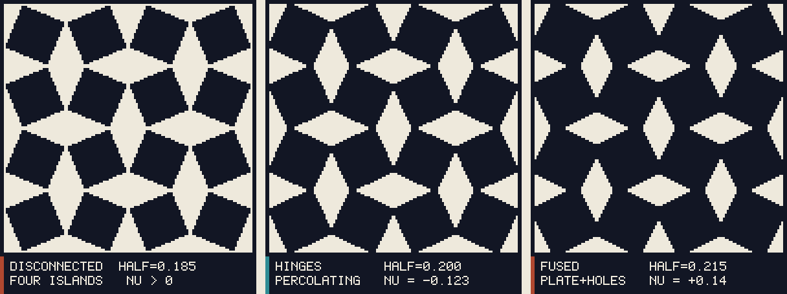
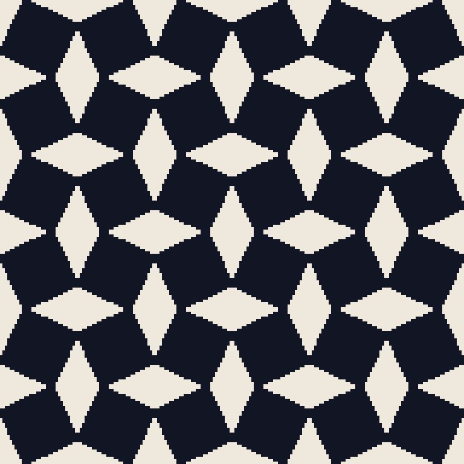
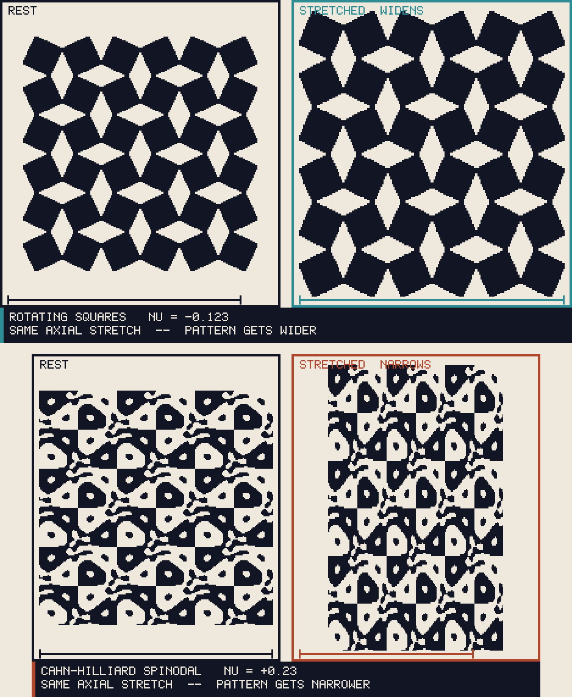
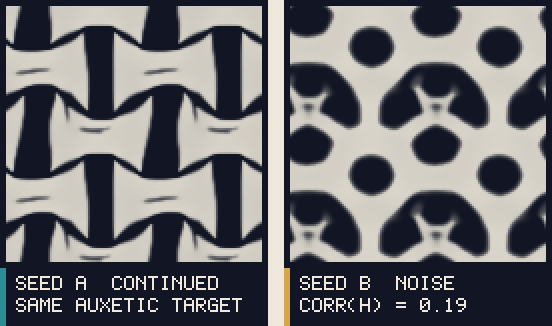
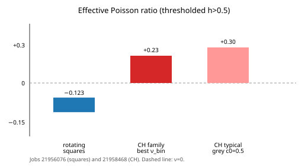
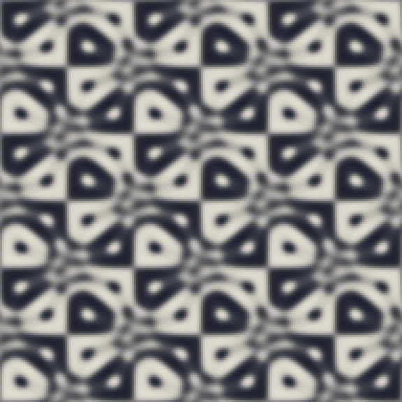
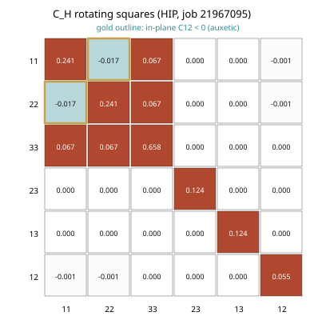
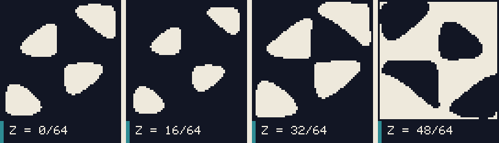
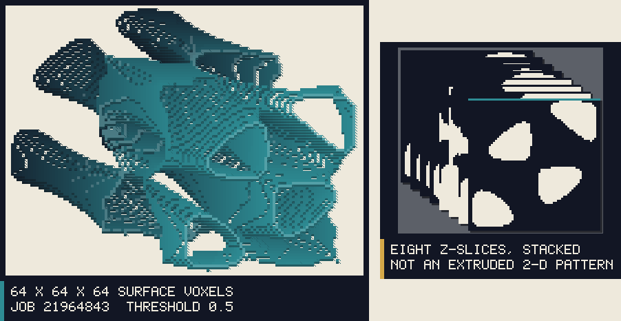

# Inverse homogenization {#sec-inverse-homogenization}

`apps/inverse_homogenization` — **sixteenth application, explicit catalog exception.**
This is PDE-constrained inverse design on the existing periodic FFT
microelasticity stack, not another evolution demo and not a licence to add a
seventeenth app.

## Physical setting

The forward problem of periodic homogenization is: given a two-phase unit cell
$h(\mathbf{x})\in[0,1]$, compute the effective stiffness $\mathbf{C}_H$. The
inverse problem is: given a target $\mathbf{C}_{\mathrm{target}}$, find an $h$
whose $\mathbf{C}_H$ matches it, with physically plausible (and optionally
manufacturable) morphology.

That is **microstructure inverse design** [@Sigmund1994], not
minimum-compliance topology optimization of a loaded macroscopic part. The
inverse map is non-unique: many $h$ can share nearly the same $\mathbf{C}_H$
[@Milton2002].

The scientific question that is *not* a generic TO demo is Stage 6:

> How much effective-property performance is lost when inverse homogenization
> is restricted from arbitrary (or mechanism) topology to
> Cahn–Hilliard / process-reachable microstructures?

## Problem setup

| Item | Value |
|---|---|
| Use case | Match $\mathbf{C}_{\mathrm{target}}$ on a periodic unit cell |
| Domain | Periodic structured grid; 2-D slabs $n_z=1$ and genuine 3-D $n_x=n_y=n_z$ |
| Solver | Existing `EigenstrainMicroelasticity` (Khachaturyan Green operator, Eyre–Milton). Zero eigenstrain; macroscopic strain is `applied_strain`. **No second elasticity, no FEM** |
| Design variable | Scalar $h$; SIMP $p\ge 1$ optional. Process family: CH parameters $(c_0,\kappa,t,a_y)$ |
| Optimizer | Takezawa-style Allen–Cahn gradient flow [@Takezawa2010], not MMA-only |
| Observable | Engineering-Voigt $\mathbf{C}_H$, $\nu=C_{12}/(C_{11}+C_{12})$, grey fraction, percolation, opening loss |
| Model maturity | numerical verification: **homogeneous + laminate oracles and a finite-difference gradient check** · physical completeness: **reduced** — linear two-phase elasticity, ersatz void, no finite strain · calibration: **none** |

Device Green-operator elasticity is issue #157 and is **not** in this
application. Stage 8 timings below are **CPU/MPI on LUMI-C `standard`**, not a
GPU claim.

## Governing workflow

$$
h \;\to\; \mathbf{C}(h)
  \;\to\; \text{six (3-D) or three (2-D) periodic elasticity solves}
  \;\to\; \mathbf{C}_H[h]
  \;\to\; J
  \;\to\; \delta J/\delta h
  \;\to\; \text{Allen–Cahn step or CH process map}
  \;\to\; h_{\mathrm{new}}.
$$ {#eq-invhom-loop}

## Homogenization

Periodic equilibrium with imposed macroscopic strain $\bar{\boldsymbol\varepsilon}^{(\alpha)}$
[@Moulinec1998]:

$$
\nabla\cdot\boldsymbol\sigma^{(\alpha)}=0,\qquad
\boldsymbol\sigma^{(\alpha)}
  =\mathbf{C}(h):\bigl(\bar{\boldsymbol\varepsilon}^{(\alpha)}
    +\boldsymbol\varepsilon(\mathbf{u}^{\#(\alpha)})\bigr).
$$ {#eq-invhom-cell}

The engineering Voigt matrix (order $11,22,33,23,13,12$, $\gamma=2\varepsilon$)
is the matrix of mean-stress columns. Shear loads impose tensor strain $1/2$.
A homogeneous isotropic cell must report $C_{44}=\mu$, not $2\mu$.

Linear interpolation $\mathbf{C}(h)=h\mathbf{C}_s+(1-h)\mathbf{C}_l$ is the
physical two-phase law. SIMP uses $\mathbf{C}(h^p)$ during the loop; the
**reported** $\mathbf{C}_H$ at the end is always the linear law on $h$ (and on
the thresholded $h>0.5$ binary).

## Objective and sensitivity

$$
J[h]
=\tfrac12\bigl\lVert W\odot\bigl(\mathbf{C}_H[h]
  -\mathbf{C}_{\mathrm{target}}\bigr)\bigr\rVert_F^2
+\lambda_v(\langle h\rangle-\bar h)^2
+\lambda_r\mathcal{R}[h].
$$ {#eq-invhom-J}

$\mathcal{R}$ is the phase-field perimeter
$\int\bigl(\varepsilon/2\lvert\nabla h\rvert^2+\varepsilon^{-1}W_{\mathrm{dw}}(h)\bigr)\,dV$
with $W_{\mathrm{dw}}=h^2(1-h)^2$.

Linear elastic homogenization is self-adjoint. After the six unit-cell solves,

$$
\frac{\partial (C_H)_{\alpha\beta}}{\partial h_e}
=\frac1N\,
\boldsymbol\varepsilon^{(\alpha)}_e
:\frac{\partial\mathbf{C}}{\partial h}
:\boldsymbol\varepsilon^{(\beta)}_e.
$$ {#eq-invhom-sens}

Catch2 checks this against central finite differences on random $h$ (relative
error $<10^{-4}$). Decreasing $J$ is not a substitute for that check.

The elastic gradient is RMS-normalised so $\Delta t$ is a step size; volume and
$W'$ stay in physical units. Normalising the *total* $g$ crushed the double well
(job 21950094 stayed fully grey).

## Auxetic geometry

Random Fourier noise never produced $C_{12}<0$. A Grima rotating-square seed
[@Grima2000] does, **if the squares share a hinge and do not fuse**:

| half-side | morphology | $\nu$ | job |
|---|---|---|---|
| 0.185 | 4 disconnected squares | $>0$ | 21955691 |
| 0.215 | fused plate with holes | $+0.14$ | 21955873 |
| **0.200** | one percolating network | **$-0.123$** | **21956076** |

Catch2 requires $C_{12}<0$ on the $48^2$ rotating-square seed. Inverse from that
seed stayed auxetic ($\nu_{\mathrm{bin}}=-0.080$ after 80 steps).

@fig-invhom-hinges is the geometry result as a picture: too small a square and
the cell is four islands; too large and the squares fuse into a plate with
holes; only the hinge width is auxetic. @fig-invhom-rotating tiles that
working cell.

{#fig-invhom-hinges}

{#fig-invhom-rotating}

The kinematic signature of auxeticity is a **lateral expansion under stretch**.
@fig-invhom-stretch applies the same vertical stretch to a $3\times 3$ tile:
the rotating-square network widens; the CH spinodal narrows. The Poisson
effect is drawn at $5\times$ so the *sign* is visible; the measured $\nu$ is
in the label. This is an affine display, not a finite-strain solve.

{#fig-invhom-stretch}

{#fig-invhom-seeds}

## Stage 6 — process restriction

Semi-implicit spectral Cahn–Hilliard [@Cahn1958] on the same FFT, parameters
$(c_0,\kappa,t,a_y)$. Job 21958468, $64^2$, twelve process cells:

| Family | $\nu$ | $\nu$ of $h>0.5$ |
|---|---|---|
| Rotating squares | $-0.123$ | $-0.123$ |
| CH, all $(c_0,\kappa,a_y)$ | $+0.29$–$+0.31$ | best **$+0.23$** (none negative) |

@fig-invhom-nu is that table as a bar chart. Restricting inverse design to
CH/spinodal morphologies **drops the auxetic quadrant**. That is a result, not
a failed run.

{#fig-invhom-nu}

{#fig-invhom-spinodal}

{#fig-invhom-CH}

## Manufacturability (Stage 7)

Not AM process simulation. Periodic wrap-aware components, island volume, and
morphological opening loss. Job 21959215:

| Geometry | solid comps | percolate | island solid | opening $r=1$ | $\nu$ |
|---|---|---|---|---|---|
| Rotating squares | 1 | $x,y$ | 0 | 0 | $-0.123$ |
| Disconnected squares | 4 | none | 0.75 | 0.009 | $+0.22$ |
| Spinodal $c_0=0.5$ | 7 | $x$ only | 0.27 | 0.013 | $+0.29$ (grey 0.83) |

## 3-D (Stage 8)

A 2-D extrusion is not a 3-D case. 3-D work uses $n_z=n_x$ spinodal / inverse
loops. Device Green (#157) is open: timings are CPU/MPI on `standard`, never
claimed as GPU. Grid, ranks, loads per step (6), wall time per iteration, and
`VmHWM` are printed by `openpfc_inverse_homogenize`.

{#fig-invhom-3d}

{#fig-invhom-3d-iso}

## Verification (Stage 1 and 4)

- Homogeneous cell recovers the interpolated stiffness.
- Smooth $z$-laminate matches the 1-D Backus average of $\mathbf{C}(h(z))$.
- Sharp laminate matches two-phase Postma within FFT Gibbs error.
- Gradient: directional finite differences vs the mutual-energy formula.

## Limitations

- Linearised two-phase elasticity; ersatz void, not true zero-stiffness holes.
- 3-D Green operator on $n_z=1$ is extruded 3-D elasticity, not plane-stress 2-D.
- Grey linear $\mathbf{C}(h)$ cannot be auxetic; SIMP from noise did not enter
  the rotating-square basin.
- Re-entrant honeycomb on this grid was **not** auxetic; only rotating squares
  were.
- No GPU elasticity in this app (#157).
- Catalog stays closed after this sixteenth app.

## Provenance

| Job | What |
|---|---|
| 21949136 | Forward $C_H$ Catch2 |
| 21949295 | Allen–Cahn inverse Catch2 |
| 21954505 / 21954959 | 2-D inverse, two seeds, $\mathrm{corr}(h)=0.19$ |
| 21956076 | Rotating-square $\nu=-0.123$ |
| 21958468 | CH family, none auxetic |
| 21959215 | Percolation / islands / opening |
| 21964843 | 3-D $64^3$ inverse, 1 rank: 12 steps, 6 solves/step, 7.7–4.7 s/step, VmHWM 224 MB. 8 ranks: 1.05–0.62 s/step. Genuine $n_z=64$ spinodal, not a 2-D extrusion. CPU/`standard`. |
| 21967096 | $128^3$ spinodal $\mathbf{C}_H$, 8 ranks, 237 MB/rank. MPI_Finalize/HeFFTe order fixed. |
| 21967095 | HIP (1 GCD): homogeneous $C_{11}=1.346153846$ matches CPU; rotating-square $32^2$ $\nu=-0.075$; $64^3$ homogeneous 7.59 s wall. |
