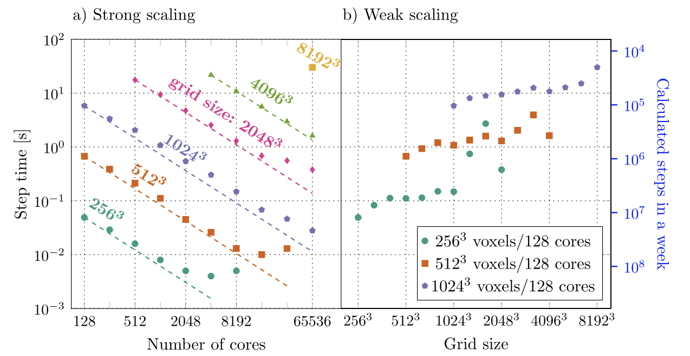

<!--
SPDX-FileCopyrightText: 2026 VTT Technical Research Centre of Finland Ltd
SPDX-License-Identifier: AGPL-3.0-or-later
-->

# Showcase

This page ties **figures** you may see in the repository or publications to **runnable** entry points. Build and run instructions: [`quickstart.md`](quickstart.md), [`applications.md`](applications.md), [`examples_catalog.md`](examples_catalog.md).

## Tungsten solidification (3D)

*Representative large-scale solidification and defect structure (from project materials; parameters may differ from your run).*

| | |
|---|---|
| **Typical app** | [`apps/tungsten`](../apps/tungsten/README.md) — JSON/TOML configs under [`apps/tungsten/inputs_json/`](../apps/tungsten/inputs_json/README.md) |
| **Concepts** | 3D PFC, boundary conditions, MPI + spectral FFT stack |
| **Further reading** | [`app_pipeline.md`](app_pipeline.md), [`io_results.md`](io_results.md), root [`README.md`](../README.md) (science overview) |

## Scalability (strong / weak scaling)

*Illustrative scaling results; your hardware and problem size will differ.*

| | |
|---|---|
| **Context** | HPC campaigns on large grids (e.g. LUMI); see [`performance_profiling.md`](performance_profiling.md), [`lumi_slurm/README.md`](lumi_slurm/README.md) |
| **Typical app** | Same [`apps/tungsten`](../apps/tungsten/README.md) family with performance-oriented inputs (e.g. `tungsten_performance.json` — large domain; use for scaling studies, not first debug) |

## Cahn–Hilliard–style dynamics (`examples/`)

| | |
|---|---|
| **Runnable** | `examples/12_cahn_hilliard` (see [`examples_catalog.md`](examples_catalog.md)) |
| **VTK / ParaView** | Walkthrough: [`tutorials/vtk_paraview_workflow.md`](tutorials/vtk_paraview_workflow.md) |
| **Concepts** | Spectral model + `Simulator` workflow |

## Quick 2D PNG snapshots (Allen–Cahn)

The **Allen–Cahn** demo can write **grayscale PNG** snapshots (optional final, or initial + final). No JSON `App` — CLI arguments only.

| | |
|---|---|
| **Runnable** | [`apps/allen_cahn`](../apps/allen_cahn/README.md) — e.g. `mpirun -n 4 ./apps/allen_cahn/allen_cahn 128 128 500 … initial.png final.png` |
| **Concepts** | 2D explicit interface, FD + halos; PNG via [`io_results.md`](io_results.md) |

End-to-step commands and expected files: [`tutorials/end_to_end_visualization.md`](tutorials/end_to_end_visualization.md).

## See also

- [`science_tungsten_quicklook.md`](science_tungsten_quicklook.md) — what tungsten runs represent  
- [`science_cahn_hilliard_vs_allen_cahn.md`](science_cahn_hilliard_vs_allen_cahn.md) — CH example vs Allen–Cahn app  
- [`learning_paths.md`](learning_paths.md) — ordered tracks by role
- [`class_tour.md`](class_tour.md) — how types in the figures map to headers and examples
