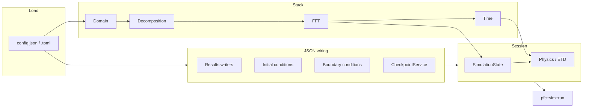

<!--
SPDX-FileCopyrightText: 2026 VTT Technical Research Centre of Finland Ltd
SPDX-License-Identifier: AGPL-3.0-or-later
-->

# Config-driven application pipeline

This page describes how a JSON or TOML file becomes a running 0.2 simulation.
Shipped tungsten and aluminumNew binaries are instances of the one generic
`pfc::ui::SpectralETDSession<Physics, Stack>`
(`json_spectral_etd_session.hpp`). Other drivers use
`pfc::ui::make_simulation_session<Stack>` and `pfc::sim::run`. Headers live
under `include/openpfc/frontend/ui/` (`simulation_wiring_conditions.hpp`,
`simulation_wiring_writers.hpp`, `json_checkpoint.hpp`).

The 0.1 `pfc::ui::App<Model>` / `Simulator` path is gone. See
[`MIGRATION_0.1_to_0.2.md`](../MIGRATION_0.1_to_0.2.md).

For install and MPI setup, see [`INSTALL.md`](../../INSTALL.md). For shared
config vocabulary, see [`configuration.md`](configuration.md).

## Big picture

- `make_simulation_session<SpectralCPUStack>` reads domain, time, `method`/`backend`, and `plan_options` (FFT) and constructs `pfc::sim::stacks::SpectralCPUStack`. CPU plan options live in `spectral_fft_stack_factory.hpp`.
- `make_simulation_session<GPUSpectralStack<CUDASpace/HIPSpace>>` overlays the same JSON `plan_options` keys onto cuFFT / rocFFT defaults.
- `SpectralETDSession` on a `GPUSpectralStack` uses the same overlay. GPU-aware MPI, pencils, and reshape algorithm apply to multi-rank device FFTs.
- ICs, BCs, and writers are parsed from the `FieldModifier` and `ResultsWriter` catalogs (`parse_initial_conditions_from_json`, `parse_boundary_conditions_from_json`, `parse_result_writers_from_json`). `SpectralETDSession` applies ICs once through `pfc::apply_field_modifier` (host or device `Field`), BCs in the `pfc::sim::run` apply hook, and writers on `on_save`; a modifier without `target` acts on the physics' primary field.
- `pfc::ui::make_checkpoint_service` + `CheckpointService::restore_from_config` / `maybe_save` own restart. `restart_from` cannot mix with `simulator.increment` / `simulator.result_counter`.

## Driver order of operations

`pfc::ui::SpectralETDSession<Physics, Stack>` (tungsten, aluminum):

| Step | What happens |
|------|----------------|
| 1 | Load settings from `argv[1]` via `load_settings_file` (JSON or TOML). |
| 2 | `from_json<Domain>` / `from_json<Time>` / `from_json<SessionSelection>`; build the stack. |
| 3 | `Physics::from_json(settings["model"]["params"], domain, inbox)`. |
| 4 | `declare_fields` on `SimulationState`; apply catalog ICs (`apply_field_modifier`). |
| 5 | Parse catalog BCs; configure writers from field geometry; `make_checkpoint_service` + `restore_from_config<MemorySpace>`; construct `SpectralETDSystem`. |
| 6 | `pfc::sim::run`: start/BC hooks, `system.step(t)` (profiled when `profiling` is set), `maybe_save<MemorySpace>`, writers. |

Custom drivers can parse subsets with `parse_result_writers_from_json`,
`parse_initial_conditions_from_json`, `parse_boundary_conditions_from_json`,
and `apply_simulator_section_from_json(time, settings)`. Pass
`JsonWiringContext{comm, mpi_rank, rank0}` and explicit catalogs
(`default_field_modifier_catalog()`, `default_results_writer_catalog()`).
`JsonWiringSession` bundles context with both catalogs for
`parse_runtime_from_json(time, settings, session)`.

## JSON sections consumed by the default spectral path

Exact keys vary slightly by app and schema version; always treat
`apps/tungsten/inputs_json/` as ground truth. Typical top-level usage:

| Section / keys | Handled by | Role |
|----------------|------------|------|
| `Lx`, `Ly`, `Lz`, `dx`, `dy`, `dz`, `origin`, … | `from_json` for `Domain` / `make_simulation_session` | Grid and physical extent. |
| `t0`, `t1`, `dt`, `saveat` | `Time` | Integration interval and output cadence. |
| `plan_options` | HeFFTe `plan_options` | FFT backend (`backend`), `use_gpu_aware`, `reshape_algorithm`, etc. |
| `model.name`, `model.params` | App-local physics params | Physics coefficients. |
| `fields`, `saveat` | `parse_result_writers_from_json` | If `saveat > 0`, each `fields[]` entry with `name` and `data` path gets a writer from `ResultsWriterCatalog` (default `writer`: `"binary"`). |
| `initial_conditions[]` | `parse_initial_conditions_from_json` | Each entry has `type`, optional `target`, type-specific fields. |
| `boundary_conditions[]` | `parse_boundary_conditions_from_json` | Same pattern: `type`, `target`, … |
| `simulator` | `apply_simulator_section_from_json` | Optional `increment`, `integrator.method`. Mutually exclusive with `restart_from`. |
| `checkpoint`, `restart_from` | `CheckpointService` | Periodic save and restore of `SimulationState` + `Time`. |
